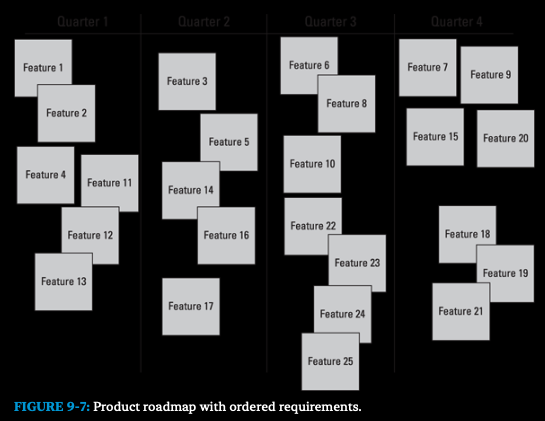

### Creating a Product Roadmap

Is an overall view of the product's requirements and a valuable
tool for planning and organizing the journey of product development.
Use the product roadmap to categorize requirements, prioritize them,
identify gaps and dependencies, and determine a sequence for releasing
to the customers.

The product owner creates the product roadmap with help  from the 
development team and stakeholders. 

To create your product roadmap, you do the following:

* Identify stakeholders.
* List product requirements and visualize them.
* Arrange the product requirements based on value, risk, and dependencies.
* Estimate the development effort at a high level and prioritize the product's requirements.
* Determine high-level time frames for releasing groups of functionality to the customer.

TIP

Your product roadmap can be as simple as sticky notes
arranged on a physical or virtual whiteboard, which makes
updates as easy as moving a sticky note from one section of
the whiteboard to another.

### Step 1: Identifying product stakeholders

Consider including the following people:

* Marketing department
* Customer service department
* Sales department
* Legal department
* Additional customers

### Step 2: Establishing product requirements

#### Decomposing Requirements

Throughout product development, you'll break down requirements into 
smaller, more manageable parts using a process called *decomposition*, or
**progressive elaboration**. You can break down requirements into the following sizes.

* **Themes:** A theme is a logical group of features and is also a 
  requirement at its highest level. You may group feature into themes in your product roadmap. 
* **Features:** Features are parts of products at a very high level. Features
  describe a new capability the customers will have once the feature is 
  complete.
* **Epic user stories:** Epics are medium-sized requirements that are
  decomposed from a feature and often contain multiple actions or channels 
  of value. 
* **User stories:** User stories are requirements that contain a single 
  action or integration and are small enough to start implementing into
  functionality.
* **Tasks:** Tasks are the execution steps required to develop a 
  requirement into working functionality and generally mirror your definition of
  done as well as the tasks necessary to accomplish the story's acceptance criteria.

### Step 3: Arranging product features

After you identify your prouct features, you work with the stakeholders
to group them into *themes* - common, logical groups of
features. A stakeholder meeting works well for grouping features,
just like it works for creating requirements. You can group features
by usage flow, technical similarity, or business need.

Here are questions to consider when grouping and ordering your 
requirements:

* How would customers use our product?
* If we offered this requirement, what else would customers need
to do? What else might they want to do?
* Can the development team identify technical  affinities or dependencies?

### Step 4: Estimating efforts and ordering requirements

A few terms you need to be familiar with:

* *Effort* is the ease or difficult of creating functionality from a
  particular requirements.
* An *Estimate*, as a noun, can be the number or description you 
  use to express the estimated effort of a requirement.
* *Estimating* a requirement, as a verb, means to come up with and
  approximate idea of how easy or hard(how much effort) that 
  requirement will be to create.
* **Ordering or prioritizing** a requirement means to determine that
  requirement's value and risk in relation to other requirements,
  and in what order you will implement them.
* **Value** means how beneficial a product requirements might be to 
  the customer and therefore the organization creating that product
* **Risk** refers to the negative effect a requirement can have due to
  customer uncetainty or on product development.

To estimate and assign effort values to your requirements, you work
with two different groups of people:

* The development team determines the effort to implement the
  functionality for each requirement. Only the people who will do
  the work should provide effort estimates. The development
  team also provides critical feedback to the product owner for
  understanding how technical risks affect the ordering of the
  product backlog.
* The product owner, with support from the stakeholders, determines
  the value and risk of the requirement to the customer
  adn the business.

##### Estimating effort
To order requirements, the developmet team must first estimate
the effort for each requirement relative to all other requirements.

**Relative estimating** is a self-correcting mechanism that allow scrum
teams to be more accurate because it's much easier to be right 
when comparing one requirement against another and determining
whether one is bigger than another, and by roughly how much.

To order your requirements, you also want to know any dependencies.
**Dependencies** mean that one requirement is a predecessor for
another requirement.

#### Assessing business value and risk
Similar to effort estimates, values or risks can be assigned to each
product roadmap item. For example, you might assign value using
monetary ROI amounts or, for an internally used product, assign
value or risk by using high, medium, or low.

Effort, business value, and risk estimates inform the product owner's
prioritization decisions for each requirement. The highest value
and risk items should be at the top of the product roadmap. High
risk items should be explored and implemented first to avoid reloading
risk.

After you have your value, risk, and effort estimates, you can determine
the relative priority, or order, of each requirement.

* A requirement with high value or high risk(or both) and low
  effort will have a high relative priority. The product owner
  might order this item at the top of the roadmap.
* A requirement with low value or low risk(or both) and high
  effort will have a lower relative priority. This item will likely end
  up towards the bottom of the roadmap or, better yet, be
  removed. 

##### Prioritizing requirements

To determine the overall priority for our requirements, answer the
following questions:

* What is the relative priority of the requirement?
* What are the prerequisites for any requirement?
* What set of requirements belong together and will constitute a 
* solid set of functionalities you can release to the customer?

Your prioritized list of requirements is called a *product backlog*.

With a product backlog in hand, you can start adding target 
releases to your product roadmap.

#### Step 5: Determining high-level time frames
When you create your product roadmap, your time frames for
releasing product requirements are at a very high level.

For the initial roadmap, choose a logical time increment 
for your product development, such as a certain number 
of days, weeks, months, quarters(three-mont periods), or
even larger increments.

### Completing the Product Backlog

The product roadmap contains high-level features and some tentative 
release timelines. The requirements on your product roadmap
are the first version of your *product backlog*.

The product backlog is the list of all requirements associated with 
the product. The product owner is responsible for creating and
maintaining the product backlog by updating(adding, changing,
removing) and prioritizing requirements. The scrum team uses the
prioritized product backlog throughout development to plan its
work each release and each sprint.

Figure 9-8 shows a sample product backlog. When
creating your product backlog, be sure to do the following:

* Include a description of your requirement.
* Order the requirements based on priority.
* Add the effort estimate.

We also like to include the type of backlog item as well as the status.
Teams will work mainly on developing features as described in
the words of the user(user stories). But there may be a need for
other types of product backlog items, such as overhead items
(things the team determines are needed but don't contribute to the
functionality), maintenance items(design improvements that need
to be done to the product or system but don't directly increase 
value to the customer), or improvement items(action item for
process improvements identified in the sprint retrospective).

The user stories in your product backlog will change throughout
development in several ways. For example, as the team completes
user stories, you mark those stories as complete in the backlog. You
also record any new user stories. Some user stories will be updated
with new or clarified information, broken down into smaller user
stories, or refined in other ways.

The total number of story points in the product backlog - all user
story points added together - is your current *product 
backlog estimate*. 

### CHAPTER 10
## Planing Releases and Sprints

### Refining requirements and estimates

One clear, effective pattern for defining product requirements is the
user story.

### What is a user story?

The *user story* is a simple description of a product requirements in
terms of what that requirements must accomplish for whom.

You user story will have, at a minimum, the following parts:

Title (recognizable name for the user story)
As a (type of user)
I want to (take this action)
so that (I get this benefit)

The user story should also be supported by a list of
validation steps (acceptance criteria) to take so you can confirm
whether the working requirement for the user story is correct.
Acceptance criteria follows this pattern:

When I (take this action), (this happens)

User story may also include the following:

* **A user story ID:** A unique identifying number to differentiate
from other user stories in the *product backlog*.
* **The user story value and effort estimate:** *Value* is how beneficial
a user story might be to the organization creating that 
product. *Effort* is the ease or difficulty in creating that user
story.
* **The name of the person who thought of the user story:**
Anyone can create a user story.

It is not the sole
responsibility of the product owner to write user 
stories. The development team and other stakeholders are
also involved in creating and decomposing user stories 
to ensure clarity and shared understanding across the 
scrum team.

### Steps to create a user story

When creating a user story, follow these steps:

* **Identifying the stakeholders.**
* **Identifying who will use the product.**
* **Working with the stakeholders, write down, in a 
user story format, what the product will need to 
do.**

#### Identifying product stakeholders

Anyone involved with, affected by, or
who can affect the product and its creation. Stakeholders
provide valuable feedback about every product
increment you deliver each sprint.

You will work with stakeholders also when you 
create the product vision and product roadmap.

#### Identifying users

Know who your users are, so you can develop features they'll actually use.

Suppose that you're the product owner for the XYZ Bank's mobile banking product. You're responsible for the department that will
bring the product to market, preferably in the next sis months. You have the following ideas about the application's users:

* The customers (the end users of the application) probably want quick access to up-to-date information about their balances and 
  recent transactions.
* Maybe the customer are about to buy a large-ticket item, and they want to make sure they can charge it.
* Maybe the customers' ATM cards were just refused, but they have no idea why, and they want to check recent transactions for
  possible fraudulent activities.
* Maybe the customers just realized that they forgot to pay their credit card bill and will have penalty charges if they don't pay
  the card today.

Who are you personas for this application? Here are a few examples:

* **Personas #1:** Jason is a young, tech-savvy executive who travels a lot. When he has a spare moment, he wants to handle per-
  sonal business quickly. He carefully invest his money in high-interest portfolios. He keeps his available cash low.
* **Persona #2:** Carol is a small-business owner who stages properties when clients are trying to sell their home. She shops at con-
  signment centers and often finds furnishings she wants to buy for the clients.
* **Persona #3:** Nick is a student who lives on student loans and a part-time job. He knows he can be flaky with money because 
  hi´s flaky with everything else. He just lost his checkbook.

Your product stakeholders can help you create personas. Find people ho are experts on the day-to-day business for your 
product. Those stakeholders will know a lot about your potential customers.

### Determining product requirements and creating user stories

Have the stakeholders write down as many requirements as they can think of, using the user story format. One user story for the 
product and personas from the previous sections might be as follows:

* From side of card:
  * **Title** See bank account balance
  * **As** Jason,
  * **I want to** see my checking account balance on my smartphone
  * **so that** I can decide whether I have enough money in my account to make a transaction
* Back side of card:
  * **When I** sign into the XYZ Bank mobile application, my checking account balance appears.
  * **When I** sign into the XYZ Bank mobile application after making a purchase or a deposit, my checking account balance reflects that purchase or deposit.

Be sure to continuously add and prioritize new user stories to your product backlog. Keeping your product backlog up-to-
date will help you have the highest-priority user stories when it is time to plan your sprint.

## Breaking down requirements

You refine requirements many times throughout development. For example:

* When you create the product roadmap, you create *features* (capabilities your customers will have after you
  develop the features), as well as *themes* (logical groups of features). Although features are intentionally large, we require fea-
  tures at the product roadmap level to be no larger than 144 story points on the Fibonnaci scale. Both features and themes are considered 
  large by a development team.
* When you plan releases, you break down the features into more concise user stories. User stories at the release plan level can 
  be either *epics*, very large user stories with multiple actions, or individual user stories, which contain a single action. For our 
  clients, user stories at the release plan level should be no larger than 34 story points.
* When you plan sprints, you break down requirements even further. User stories are broken down to eight points or fewer.

To decompose requirements, you'll want to think about how to break down the requirement into individual actions. *Table 10-1*
shows a requirements from the XYZ Bank application introduced in **Cahpter 9** that is decomposed from the theme level down to the 
user story level.

## USER STORIES AND THE INVEST APPROACH
You may be asking, just how decomposed does a user story have to be? Bill Wake, in his blog at XP123.com, describes the INVEST approach to 
ensure quality in user stories. We like his methods so much we include it here.

Using the INVEST approach, user stories should be
* **Independent:** To the extent possible, a user story should need no other user sotires to implement the feature that the story describes.
* **Negotiable:** Not overly detailed. The user story has room for discussion and an expansion of details.
* **Valuable**: The user story demonstrates product value to the customer. It describes features, not technical tasks to implement it. The user
  story is in the user's language and is easy to explain. The people using the product or system can understand the user story.
* **Estimable:** The story is descriptive, accurate, and concise, so the developers can generally estimate the work necessary to create the
  functionality in the user story.
* **Small:** It is easier to plan and accurately estimate small user stories. A good rule of thumb is that the development team can complete 6-10
  user stories in a sprint.
* **Testable:** You can easily validate the user story, and the results are definitive.
