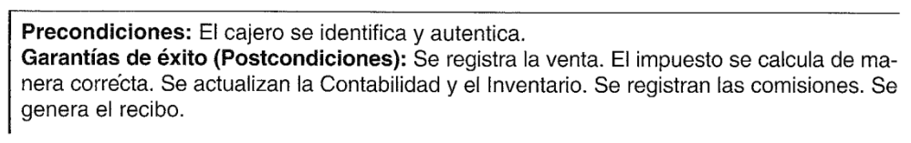
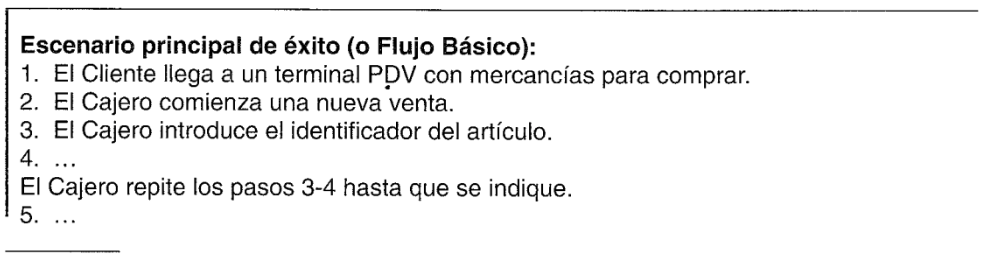
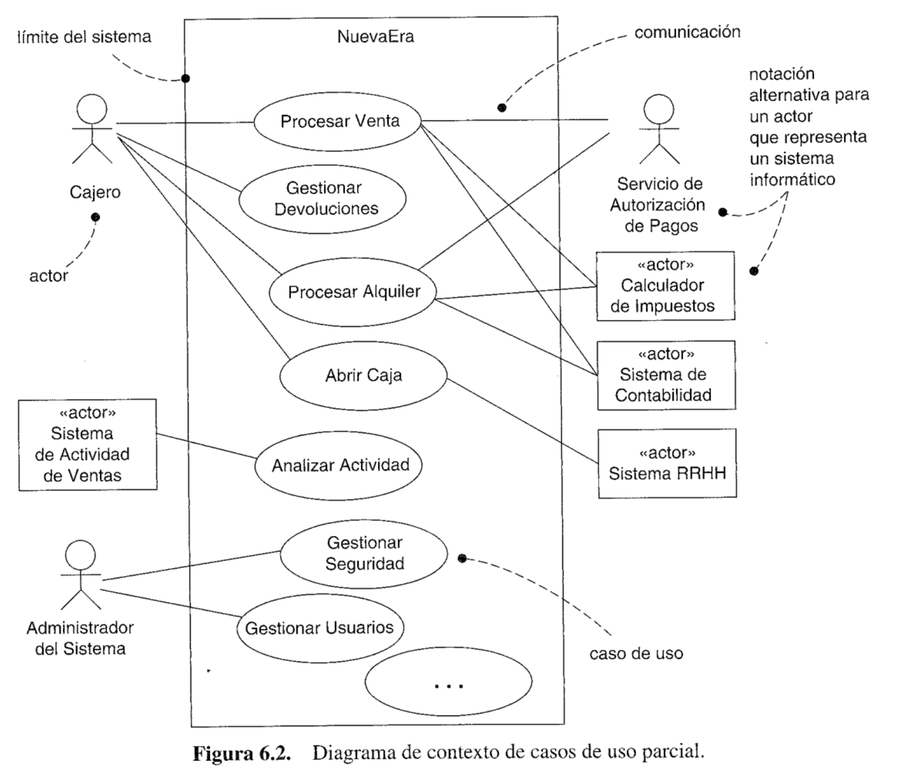

# CAPITULO  1
# ANALISIS Y DISEÑO ORIENTADO A OBJETOS

###### El cambio de enfoque (a patrones) tendra un efecto profundo y duradero en el modo en el que escribimos los programas
Ward Cunningham y Ralph Johnson

#### ¿Qué es análisis y diseño?

El **Análisis** pone énfasis en una *investigación* del problema y los requisitos, en vez de
ponerlo en una solución.

*"Análisis"* es un temino amplio, es más adecuado calificarlo, como *análisis de requisitos*
(un estudio de los requisitos) o *análisis de objetos* (un estudio de los objetos del 
dominio).

El **Diseño** pone énfasis en una *solución conceptual* que satisface los requisitos, en
vez de ponerlo en la implementación.

Es más apropiado califiar el término como *diseño de objetos* o *diseño de bases de datos*.

#### ¿Qué son el analisis y el diseño orientado a objetos?

Durante el **análisis orientado a objetos**, se presta especial atención a encontrar y describir
los objetos --o conceptos-- en el dominio del problema. Por ejemplo, *Libro*, *biblioteca*, y *Socio*.

Durante el **diseño orientado a objetos**, se presta especial atención a la definición de
los objetos software y en cómo colaboran para satisfacer los requisitos. Por ejemplo, 
un objeto software *Libro* podría tener un atributo *titulo* y un método *obtenerCapitulo*

Durante la implementación o programación orientada a objetos, los objetos
de diseño se implementan, como la clase Java *Libro*.

# CAPITULO 6
# MODELO DE CASOS DE USO: ESCRITURA DE REQUISITOS EN CONTEXTO

### Casos de uso y valor añadido

De manera informal, son historias del uso de un sistema para alcanzar los objetivos.

**Procesar Venta**: Un cliente llega a una caja con artículos para comprar. El 
cajero utiliza el sistema PDV para registrar cada artículo comprado. El sistema
presenta una suma parcial y detalles de cada linea de venta. El cliente introduce los
datos del pago, que el sistema valida y registra. El sistema actualiza el inventario.
El cliente recibe un recibo del sistema y luego se va con los artículos.

Un **actor** es algo con comportamiento, como una persona (identificada por un rol), sistema
informatizado u organización; por ejemplo, un cajero.

Un **escenario** es una secuencia específica de acciones e interacciones entre los actores
y el sistema objeto de estudio; también se denomina **instancia de caso de uso**. Por ejemplo, 
el escenario de éxito de compra de actículos con pago en efectivo, o el escenario
de fallo al comprar debido al rechazo de la transacción de pago con la tarjeta de
crédito.

###### Gestionar Devoluciones

*Escenario principal de éxito*: Un cliente llega a una caja con artículos para
devolver. El cajero utiliza el sistema PDV para registrar cada uno de los articulos
devueltos...

*Escenarios alternativos*:

Si se pagó con tarjeta de crédito, y se rechaza la transacción de reembolso a su
cuenta, informar al cliente y pagarle en efectivo.

Si el identificador del artículo no se encuentra en el sistema, notificar al Cajero y
sugerir la entrada manual del código de identificación (quizá esté alterado).

Si el sistema detecta fallos en la comunicación con el sistema de contabilidad externo...

#### Tipos de caso de uso y formatos

##### Casos de uso de caja negra y las responsabilidades del sistema

**Los casos de uso de caja negra** describen el sistema en base a las *responsabilidades* 
que tiene, que es una metáfora común y unificadora en el pensamiento orientado a objetos. 

Es posible especificar *qué* debe hacer el sistema (los requisitos funcionales) sin decidir
*cómo* lo hará (el diseño).

#### Tipos de formalidad

* Breve. resumen conciso de un parrafo.
* Informal. multiples parrafos que comprenden varios escenarios.
* Completo. se describen con detalle todos los pasos y variaciones, y
  hay secciones de apoyo como precondiciones y garantías de éxito.

#### Ejemplo completo: Procesar Venta

##### Caso de uso UC1: Procesar Venta

**Actor principal**: Cajero.
**Personal involucrado e intereses**:
* Cajero: Quiere entradas precisas, rápidas, y sin errores de pago, ya que las pérdidas se
  deducen de su salario.
* Vendedor: Quiere que las comisiones de las ventas estén actualizadas.
* Compañia: Quiere registrar las transacciones con presición y satisfacer los intereses de
  los clientes. Quiere asegurar que se registran los pagos aceptados por el Servicio de 
  Autorización de Pagos. Quiere cierta tolernacia a fallos que permita capturar las ventas
  incluso si los componentes del servidor (ej. validación remota de crédito) no están 
  disponibles. Quiere actualización automática y rápida de la contabilidad y el inventario.
* Agencia Tributaria del Gobierno: quiere recopilar los impuestos de cada venta. Podrían 
  ser multiples agencias: nacional, provincial y local.
* Servicio de Autorización de Pagos: Quiere recibir peticiones de autorización digital con el 
  formato y protocolo correctos. Quiere registrar de manera precisa las cuentas por cobrar 
  de la tienda.
* **Precondiciones**: El cajero se identifica y autentica.
* **Garantias de éxito (Postcondiciones)**: Se registra la venta. El impuesto se calcula de 
  manera correcta. Se actualizan la contabilidad y el inventario. Se registran las comisiones. Se
  genera el recibo. Se registran las autorizaciones de pago aprobadas.

**Escenario principal de éxito (o Flujo Básico)**:
1. El cliente llega a un terminal PDV con mercancias y/o servicios que comprar.
2. El cajero comienza una nueva venta
3. El cajero introduce el identificador del artículo.
4. El Sistema registra la linea de la venta y presenta la descripción del árticulo, precio y
   suma parcial. El precio se calcula a partir de un conjunto de reglas de precios.
*El cajero repite los pasos 3-4 hasta que se indique*.
5. El Sistema presenta el total con los impuestos calculados.
6. El Cajero le dice al Cliente el total y pide que le pague.
7. El Cliente  paga y el Sistema gestiona el pago.
8. El Sistema registra la venta completa y envía la información de la venta y el pago al
   Sistema de Contabilidad externo (para la contabilidad y las comisiones) y al sistema de 
   Inventario (para actualizar el inventario)
9. El Sistema presenta el recibo.
10. El cliente se va con el recibo y las mercancias (si es el caso).

**Extensiones (o Flujos Alternativos)**:
* a. En cualquier momento el Sistema falla:
   Para dar soporte a la recuperación y registro correcto, assegura que todos los estados y
   eventos significativos de una transacción pueda recuperarse desde cualquier paso 
   del excenario.
   * 1.El cajero reinicia el Sistema, inicia la sesión, y solicita la recuperación al estado 
      anterior.
   * 2.El sistema reconstruye el estado anterior.
      * 2a.El sistema detecta anomalias intentando la recuperación:
          * 1.El sistema informa del error al Cajero, registra el error, y pasa a un estado
             limpio.
          * 2.El cajero comienza una nueva venta.
      * 3a.Identificador no válido:
          * 1.El sistema señala el error y rechaza la entrada.
      * 3b.Hay muchos artículos de la misma categoria y tener en cuenta una única identidad del
          artículo no es importante (ej. 5 paquetes de hamburguesas vegetales):
          * 1.El Cajero puede introducir el identificador de la categoria del artículo y la cantidad.
      * 3-6a. El cliente le pide al Cajero que elimine un artículo de la compra:
          * 1.El Cajero introduce el identificador del artículo para eliminarlo de la compra.
          * 2.El sistema muestra la suma parcial actualizada.
      * 3-6b. El Cliente le pide al Cajero que cancele la venta:
          * 1.El Cajero cancela la venta en el Sistema.
      * 3-6c. El Cajero detiene la venta:
          * 1.El sistema registra la venta paa que esté disponible su recuperación en cualquier
               terminal PDV
      * 4a. El sistema genera el precio de un artículo que no es el deseado (ej. el Cliente se queja
          por algo y se le ofrece un precio más bajo):
          * 1.El cajero introduce el precio alternativo.
          * 2.El Sistema presenta el precio nuevo.
      * 5a. El sistema encuentra algún fallo para comunicarse con el servicio externo del sistema 
          de cálculo de impuestos.
          * 1a.El Sistema detecta que el servicio no se reinicia.
            * 1.El Sistema señala el error.
            * 2.El Cajero podría calcular e introducir manualmente el impuesto, o cancelar la
                 venta.
      * 5b. El Cliente dice que le son aplicables descuentos (ej. empleado, cliente preferente):
        * 1.El Cajero señala la petición de descuento.
        * 2.El Cajero introduce la identificación del Cliente.
        * 3.El Sistema presenta el descuento total, basado en las reglas de descuento.
      * 5c. El Cliente dice que tiene crédito en su cuenta, para aplicar a la venta:
        * 1.El Cajero señala la petición de crédito.
        * 2.El Cajero introduce la identificación del Cliente.
        * 3.El Sistema aplica el crédito hasta que el precio = 0, y reduce el crédito que queda.
      * 6a. El cliente dice que su intención era pagar en efectivo pero que no tiene suficiente:
        * 1a.El Cliente utiliza un método de pago alternativo.
        * 1b.El Cliente le dice al Cajero que cancele la venta. El Cajero cancela la venta en el
              Sistema.
      * 7a. Pago en efectivo:
        * 1.El Cajero introduce la cantidad de dinero en efectivo entregada.
        * 2.El Sistema muestra la cantidad de dinero a devolver y abre el cajón de caja.
        * 3.El Cajero deposita el dinero entregado y devuelve el cambio al Cliente.
        * 4.El Sistema registra el pago en efectivo.
      * 7b. Pago a crédito:
        * 1.El Cliente introduce la información de su cuenta de crédito.
        * 2.El Sistema envía la petición de autorización del pago al Sistema externo de Servicio
             de Autorización de Pagos, y solicita la aprobación del pago.
          * 2a. El Sistema detecta un fallo en la colaboración con el sistema externo:
            * 1.El Sistema señala el error al Cajero.
            * 2.El Cajero le pide al Cliente un modo de pago alternativo.
        * 3.El Sistema recibe la aprobación del pago y lo notifica al Cajero.
          * 3a.El Sistema recibe la denegación del pago:
            * 1.El Sistema señala la denegación al Cajero.
            * 2.El Cajero le pide al Cliente un modo de pago alternativo.
        * 4.El Sistema registra el pago a crédito, que incluye la aprobación del pago
        * 5.El Sistema presenta el mecanismo de entrada para la firma del pago a crédito.
        * 6.El Cajero le pide al Cliente que firme el pago a crédito. El Cliente introduce la firma.
      * 7c. Pago con cheque...
      * 7d. Pago a cuenta...
      * 7e. El Cliente presenta cupones:
        * 1.Antes de gestionar el pago, el Cajero recoge cada cupón y el Sistema reduce el
             pago como sea oportuno. El Sistema registra los cupones utilizados por razones de contabilidad.
          * 1a.El cupón introducido no es válido para ninguno de los artículos comprados
            * 1.El Sistema señala el error al Cajer.
      * 9a. Hay rebajas en lo artículos:
        * 1.El Sistema presenta los formularios de rebaja y los recibidos de descuento para 
             cada artículo con una rebaja.
      * 9b. El Cliente solicita un vale-regalo (sin precio visible):
        * 1.El Cajero solicita el vale-regalo y el Sistema lo proporciona.

**Requisitos especiales**:

* Interfaz de Usuario con pantalla táctil en un gran monitor de pantalla plana. El texto debe 
  ser visible a un metro de distancia.
* Tiempo de respuesta para la autorización de crédito de 30 segundos al 90% de las 
  veces.
* De algún modo, queremos recuperación robusta cuando falla el acceso a servicios
  remotos, como el sistema de inventario.
* Internalización del lenguaje del texto que se muestra.
* Reglas de negocio que se puedan añadir en tiempo de ejecución en los pasos 3 y 7.
* ...

**Lista de tecnología y variaciones de datos**:

3a. El identificador del artículo se introduce mediante un escáner láser de código de barras
   (si está presente el código de barras) o a través del teclado.
3b. El identificador del artículo podría ser cualquier esquema de código UPC, EAN, JAN o SKU.
7a. La entrada de la información de la cuenta de crédito se lleva a acabo mediante un lector
    de tarjetas o el teclado.
7b. La firma de los pagos a crédito se captura en un recibo de papel. Pero en dos años,
    pronosticamos que muchos clientes querrán que se caputre la firma difital.

**Frecuencia**: Podría ser casi continuo.

**Temas abiertos**:

* ¿Cuáles son las variaciones de la ley de impuestos?
* Explorar las cuestiones de recuperación de servicios remotos.
* ¿Cuál es la adaptación que se tiene que hacer para diferentes negocios?
* ¿Un cajero debe llevarse el dinero de la caja cuando salga del sistema?
* ¿Puede utilizar el cliente directamente el lector de tarjetas o tiene que hacerlo el cajero?

#### Importante: Personal involucrado y lista de intereses

El [sistema] funciona siguiendo un contrato entre el personal involucrado, donde los
casos de usos detallan la parte del comportamiento del contrato... El caso de uso, como
contrato de comportamiento, captura *todo* y *sólo* el comportamiento relacionado con la
satisfacción de los intereses del personal involucrado.

#### Precondiciones y garantías de éxito (postcondiciones)

Las **precondiciones** establecen lo que *siempre debe** cumplirse antes de comenzar un 
escenario en el caso de uso. *No* se prueban en el caso de uso, sino que son condiciones
que se asumen que son verdad.

Las **garantías de éxito** (o **postcondiciones**) establecen qué debe cumplirse cuando el
caso de uso se completa con éxito.

#### Escenario principal de éxito y pasos (o Flujo Básico)

También recibe el nombre de escenario "Flujo Básido". 
Describe el camino de éxito típico que satisface los intereses del personal involucrado.

#### Extensiones (o Flujos Alternativos)

Indican todos los otros escenarios o bifurcaciones,
tanto de éxito como de fracaso.

Los escenarios de extensión son bifurcaciones del escenario principal de éxito y, por
tanto, pueden ser etiquetados de acuerdo con él. Por ejemplo, en el Paso 3 del escenario
principal podría haber un identificador de artículo inválido, bien porque no se introdujo 
correctamente o bien porque el sistema no lo conoce. Una extensión se etiqueta como
"3a"; primero identifica la condición y despúes la respuesta. Una extensión alternativa al
Paso 3 se etiqueta como "3b" y así sucesivamente.

#### Requisitos especiales

Incluye cualidades tales como rendimiento, fiabilidad y facilidad de uso, y 
restricciones de diseño que son obligados o se consideran probables.

#### Lista de tecnología y variaciones de datos

Encontramos variaciones técnicas en *cómo* se debe hacer algo, pero no en
qué, y es importante registrarlo en el caso de uso.

#### Casoso de uso para los procesos del negocio elementales

Para el análisis de requisitos de una aplicación informática, céntrese en los casos de uso
al nivel de **procesos del negocio elementales** (EBPs, Elmentary Business Processes).

Se defino como:

Una tarea realizada por una persona en un lugar, en un instante, como respuesta
a un evento del negocio, que añade un valor cuantificable para el negocio y
deja los datos en un estado consistente, ej. Autorizar Crédito, o Solicitar Precio.

#### Ejemplo: aplicación de la guía EBP

Un analista de sistemas responsable del descubrimiento de los requisitos del sistema
NuevaEra, está investigando los objetivos de usuario.

**Analista de sistemas**: "¿Cuáles son algunos de sus objetivos en el contexto de uso
de un sistema PDV?"

**Cajero**: "Uno, iniciar la sesión rápidamente. También, capturar las ventas."

**Analista de sistemas**: "¿Cuál cree que es el objetivo del nivel más alto que motiva el
inicio de sesión?"

**Cajero**: "Intento identificarme en el sistema, de este modo puede validar que estoy
autorizado para utilizar el sistema que captura ventas y otras tareas."

**Analista de sistemas**: "¿Más alto que ése?"

**Cajero**: "Evitar robos, alteración de datos, y mostrar información privada de la 
compañia."

#### Objetivos y casos de uso de subfunción

Aunque "identificarme y ser validado" se ha eliminado como
objetivo de usuario, es un objetivo de nivel más bajo, denominado **objetivo de subfunción**

El motivo válio, más común para representar un objetivo de subfunción como un 
caso de uso, es cuando la subfunción se repite o es una precondición en muchos casos de
uso de nivel de objetivo de usuario. Este hecho se cumple probablemente en el caso de 
"identificarme y ser validado", que es una precondición de la mayoría, si no todos, los
otros casos de uso de nivel de objetivo de usuario.

#### Objetivos y casos de uso pueden ser compuestos

Los objetivos son compuestos, desde nivel de empresa ("ser rentable"),
que incluyen muchos objetivos intermedios a nivel de uso de la aplicación
("se capturan las ventas"), que a su vez incluyen objetivos de subfunción dentro de 
las aplicaciones ("la entrada es válida").

#### Descrubrimiento de actores principales, objetivos y casos de uso

#### Actores

Un actor es cualquier cosa con comportamiento, incluyendo el propio sistema que se 
está estudiando (SuD, System under Discussion) cuando solicita los servicios de otros 
sistemas. Los actores no son solamente roles que juegan personas, sino también 
organizaciones, software y maquinas.

* **Actor principal**: Tiene objetivos de usuario.
* **Actor de apoyo**: Proporciona un servicio. El servicio de autorización de pagos es
  un ejemplo.
* **Actor pasivo**: Está interesado en el comportamiento del caso de uso, pero no es principal
  ni de apoyo; por ejemplo, la agencia tributaria del gobierno.

#### Diagramas de caso de uso

UML proporciona notación para los diagramas de casos de uso con el fin de ilustrar los
nombres de los casos de uso y los actores, y las relaciones entre ellos.

