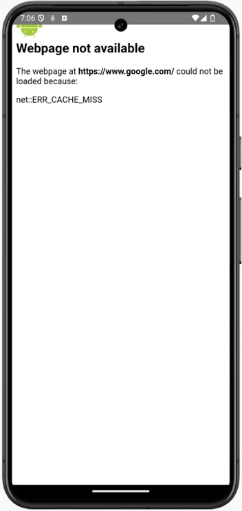

## Android Foundation

In Android, an activity represent a single screen in your app that a user can 
interact with.

The project configuration screen is as follow:


```
1. Name: This name will appear as the default name of your app when it's installed on a 
   phone and visible on Google Play.
2. Package name: This is the standard reverse domain name pattern to create a name.
   It will be used as an address identifier for source and assets in your app. **My
   Application(in lowercase with sapces removed), is appended to the application
   (com.example.myapplication).
3. Save location. By default, the project will be saved into a new folder with the
   name of the application with spaces removed. This results in a **MyApplication** 
   project folder being created.
4. Minimum SDK: Most of Android's new features are made backward compatible, so your 
   app will run fine an most older devices. However, if you do want to target new 
   devices, you should consider raising the minimum API level.
5. Build configuration language. The language used to build your app. Kepp this as
   Kotlin DSL(DSL stands for domain-specific language). A DSL is a programming 
   language used for a particular domain or specific set of tasks. 
```

## Setting up a virtual device and running your app

The Android software development kit(SKD) components includes a base emulator, which
you will configure to create and Android Virtual Device(AVD) to run Android apps. An 
emulator mimics the hardware and software features and configuration of a real device.

```
1. Android emulator: This is the base emulator, which we will configure to create 
   virtual devices of different makes and models.
2. Android SDK Build-Tools 36: Android Studio uses build tools to build your app. This 
   process involves compiling, and packaging your app to prepare it for installation on
   a device. The platform refers to the API level.
3. Android SDK Platform 36**: This is the version of the Android platform that you will
   use to develop your app.
4. Sources for Android 36**: When you are editing code, it is useful to see detailed 
   information on the Android SDK within the source files.
```

## The android manifest file

A typical manifest, in general terms, is a top-level file that describes the enclosed 
files or other data and associated metadata that form a group or unit.

Every Android app has an application class that allows yout to configure the app. After 
the **<application>** element opens, you define your app's components. When you've just 
created your app, you'll only look the first screen

```
<activity android:name=".MainActivity">
```
The next child XML node is

```
<intent-filter>
```

Android uses intents as a mechanism for interacting with apps ans system components. 
Intents get sent, and the intent filter registers your app's capability to react to these 
intents. **<android.intent.action.MAIN>** is the main entry point into your app, which, as 
it appears in the enclosing XML of **.MainActivity**, specifies that this screen will be 
started when the app is launched. **android.intent.category.LAUNCHER** states that your app 
will appear in the list of installed apps on your user's device.

as you have created your app from a template, it has a basic manifest that will launch the 
app and display an initial screen at startup through an **Activity** component. Depending 
on which other features you want to add to your app, you may need to add permissions in the 
Android manifest file.

Permissions are grouped into three different categories - normal, signature, and dangerous:

```
1. Normal: These permissions include accessing the network state, Wi-Fi, the internet, and 
   Bluetooh. These are usually permitted without asking for the user's consent at runtime.
2. Signature: These permissions are shared by the same group of apps that must be asigned 
   with the same certificate. This means these apps can share data freely, but other apps 
   don't have access.
3. Dangerous: These permissions are centered around the user and their privacy, such as 
   sending Short Message Service (SMS) text to access account and locations, and reading and 
   writing to the filesystem and contacts.
```

These permissions must be listed in the manifest, and in the case of dangerous permissions, 
from Android Marshmallow API 23 (Android 6 Marshmallow) onward, your must also ask the user 
to grant the permissions at runtime.

### Configuring the Android manifest internet permission

**setContent** function sets the layout of the UI you saw when you first ran the app in the 
virtual device.

```
import android.webkit.WebView
import androidx.compose.ui.viewinterop.AndroidView
class MainActivity : ComponentActivity() {
	override fun onCreate(savedInstanceState: Bundle?) {
		super.onCreate(savedInstanceState)
		setContent {
			val webView = WebView(this)
			webView.settings.javaScriptEnabled = true
			webView.loadUrl("https://www.google.com")
			AndroidView(
				modifier = Modifier.fillMaxSize(),
				factory = { context ->
					webView
				}
			)
		}
	}
}
```

This creates a **WebView** object and adds it to an **AndroidView** composable.

The **Val** keyword is a read-only property references, which can't be changed once it has 
been set. JavaScript needs to be enabled in the **WebView** object to execute JavaScript.
Then, we load the URL into the **WebView** object. 
The way to use XML views in Compose is to wrap them in an **AndroidView** embed the **WebView**
object. The preceding code adds a **WebView** object with the **factory** argument, which takes
a block of code of a legacy **View** and makes it available to use in Compose. The **modifier**
argument enables you to add specific styling and layout behavior to the composable. **context**
is an application-level abstract class that enables you to interact with the Android system.



The error ocurrs because there is no **INTERNET** permission added to your **AndroidManifest.xml**
file. (if you get the **net::ERR_CLEARTEXT_NOT_PERMITTED** error, this is because the URL you are 
loading into **WebView** is not HTTPS, and non-HTTPS traffic is disabled from API level 28, Android
9.0, and above.)

Add the following above the **<application>** tag to the AndroidManifest.xml file:

```
<uses-permission android:name="android.permission.INTERNET" />
```
