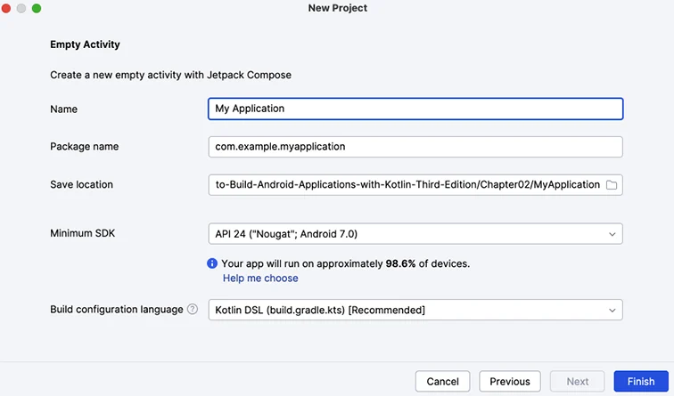

## Android Foundation

In Android, an activity represent a single screen in your app that a user can interact with.

The project configuration screen is as follow:

* **Name**: This name will appear as the default name of your app when it's installed
  on a phone and visible on Google Play.
* **Package name**: This is the standard reverse domain name pattern to create a name.
  It will be used as an address identifier for source and assets in your app. **My
  Application**(in lowercase with sapces removed), is appended to the application
  (com.example.myapplication).
* **Save location**. By default, the project will be saved into a new folder with the
  name of the application with spaces removed. This results in a **MyApplication** 
  project folder being created.
* **Minimum SDK: Most of Android's new features are made backward compatible, so your 
  app will run fine an most older devices. However, if you do want to target new 
  devices, you should consider raising the minimum API level.
* **Build configuration language**. The language used to build your app. Kepp this as
  Kotlin DSL(DSL stands for domain-specific language). A DSL is a programming language
  used for a particular domain or specific set of tasks. 

## Setting up a virtual device and running your app

The Android software development kit(SKD) components includes a base emulator, which you
will configure to create and Android Virtual Device(AVD) to run Android apps. An emulator
mimics the hardware and software features and configuration of a real device.

* **Android emulator**: This is the base emulator, which we will configure to create 
  virtual devices of different makes and models.
* **Android SDK Build-Tools 36**: Android Studio uses build tools to build your app. This 
  process involves compiling, and packaging your app to prepare it for installation on a
  device. The platform refers to the API level.
* **Android SDK Platform 36**: This is the version of the Android platform that you will
  use to develop your app.
* **Sources for Android 36**: When you are editing code, it is useful to see detailed 
  information on the Android SDK within the source files.
