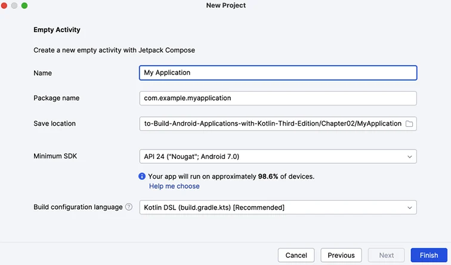
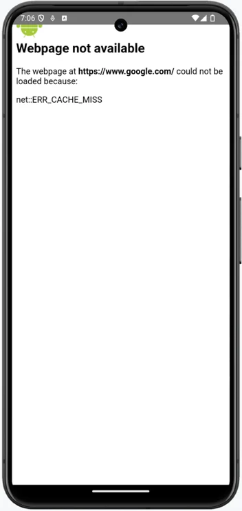

## Android Foundation

In Android, an activity represent a single screen in your app that a user can 
interact with.

The project configuration screen is as follow:



```
1. Name: This name will appear as the default name of your app when it's installed on a 
   phone and visible on Google Play.
2. Package name: This is the standard reverse domain name pattern to create a name.
   It will be used as an address identifier for source and assets in your app. **My
   Application(in lowercase with sapces removed), is appended to the application
   (com.example.myapplication).
3. Save location. By default, the project will be saved into a new folder with the
   name of the application with spaces removed. This results in a **MyApplication** 
   project folder being created.
4. Minimum SDK: Most of Android's new features are made backward compatible, so your 
   app will run fine an most older devices. However, if you do want to target new 
   devices, you should consider raising the minimum API level.
5. Build configuration language. The language used to build your app. Kepp this as
   Kotlin DSL(DSL stands for domain-specific language). A DSL is a programming 
   language used for a particular domain or specific set of tasks. 
```

## Setting up a virtual device and running your app

The Android software development kit(SKD) components includes a base emulator, which
you will configure to create and Android Virtual Device(AVD) to run Android apps. An 
emulator mimics the hardware and software features and configuration of a real device.

```
1. Android emulator: This is the base emulator, which we will configure to create 
   virtual devices of different makes and models.
2. Android SDK Build-Tools 36: Android Studio uses build tools to build your app. This 
   process involves compiling, and packaging your app to prepare it for installation on
   a device. The platform refers to the API level.
3. Android SDK Platform 36**: This is the version of the Android platform that you will
   use to develop your app.
4. Sources for Android 36**: When you are editing code, it is useful to see detailed 
   information on the Android SDK within the source files.
```

## The android manifest file

A typical manifest, in general terms, is a top-level file that describes the enclosed 
files or other data and associated metadata that form a group or unit.

Every Android app has an application class that allows yout to configure the app. After 
the **<application>** element opens, you define your app's components. When you've just 
created your app, you'll only look the first screen

```
<activity android:name=".MainActivity">
```
The next child XML node is

```
<intent-filter>
```

Android uses intents as a mechanism for interacting with apps ans system components. 
Intents get sent, and the intent filter registers your app's capability to react to these 
intents. **<android.intent.action.MAIN>** is the main entry point into your app, which, as 
it appears in the enclosing XML of **.MainActivity**, specifies that this screen will be 
started when the app is launched. **android.intent.category.LAUNCHER** states that your app 
will appear in the list of installed apps on your user's device.

as you have created your app from a template, it has a basic manifest that will launch the 
app and display an initial screen at startup through an **Activity** component. Depending 
on which other features you want to add to your app, you may need to add permissions in the 
Android manifest file.

Permissions are grouped into three different categories - normal, signature, and dangerous:

```
1. Normal: These permissions include accessing the network state, Wi-Fi, the internet, and 
   Bluetooh. These are usually permitted without asking for the user's consent at runtime.
2. Signature: These permissions are shared by the same group of apps that must be asigned 
   with the same certificate. This means these apps can share data freely, but other apps 
   don't have access.
3. Dangerous: These permissions are centered around the user and their privacy, such as 
   sending Short Message Service (SMS) text to access account and locations, and reading and 
   writing to the filesystem and contacts.
```

These permissions must be listed in the manifest, and in the case of dangerous permissions, 
from Android Marshmallow API 23 (Android 6 Marshmallow) onward, your must also ask the user 
to grant the permissions at runtime.

### Configuring the Android manifest internet permission

**setContent** function sets the layout of the UI you saw when you first ran the app in the 
virtual device.

```
import android.webkit.WebView
import androidx.compose.ui.viewinterop.AndroidView
class MainActivity : ComponentActivity() {
	override fun onCreate(savedInstanceState: Bundle?) {
		super.onCreate(savedInstanceState)
		setContent {
			val webView = WebView(this)
			webView.settings.javaScriptEnabled = true
			webView.loadUrl("https://www.google.com")
			AndroidView(
				modifier = Modifier.fillMaxSize(),
				factory = { context ->
					webView
				}
			)
		}
	}
}
```

This creates a **WebView** object and adds it to an **AndroidView** composable.

The **Val** keyword is a read-only property references, which can't be changed once it has 
been set. JavaScript needs to be enabled in the **WebView** object to execute JavaScript.
Then, we load the URL into the **WebView** object. 
The way to use XML views in Compose is to wrap them in an **AndroidView** embed the **WebView**
object. The preceding code adds a **WebView** object with the **factory** argument, which takes
a block of code of a legacy **View** and makes it available to use in Compose. The **modifier**
argument enables you to add specific styling and layout behavior to the composable. **context**
is an application-level abstract class that enables you to interact with the Android system.



The error ocurrs because there is no **INTERNET** permission added to your **AndroidManifest.xml**
file. (if you get the **net::ERR_CLEARTEXT_NOT_PERMITTED** error, this is because the URL you are 
loading into **WebView** is not HTTPS, and non-HTTPS traffic is disabled from API level 28, Android
9.0, and above.)

Add the following above the **<application>** tag to the AndroidManifest.xml file:

```
<uses-permission android:name="android.permission.INTERNET" />
```
### The app-level build.gradle.kts file 

```
plugins {
	alias(libs.plugins.android.application)
	alias(libs.plugins.kotlin.android)
	alias(libs.plugins.kotlin.compose)
}
android {
	namespace = "com.example.myapplication"
	compileSdk = 35
	defaultConfig {
		applicationId = "com.example.myapplication"
		minSdk = 24
		targetSdk = 35
		versionCode = 1
		versionName = "1.0"
		testInstrumentationRunner = "androidx.test.runner.AndroidJUnitRunner"
	}
	buildTypes {
		release {
			isMinifyEnabled = false
			proguardFiles(
				getDefaultProguardFile("proguard-android-optimize.txt"),
				"proguard-rules.pro"
			)
		}
	}
	compileOptions {
		sourceCompatibility = JavaVersion.VERSION_11
		targetCompatibility = JavaVersion.VERSION_11
	}
	kotlinOptions {
		jvmTarget = "11"
	}
	buildFeatures {
		compose = true
	}
}
dependencies {...}

```

* **namespace**: This is set from the package name you specified when creating the project. It will 
  be used for generating build and resource identifiers.
* **compileSdk**: This is used to define the API level the app has been compiled with, and the app
  can use the features of this API and lower.
* **defaultConfig**: This is the base configuration of your app.
* **applicationId**: This is set to your app's package and is the app identifier that is used on
  Google Play to uniquely identify your app. It can be changed to be different from the package name
  if required, but once you upload your app to the Google Play it is used to uniquely identify your 
  app and can't be changed.
* **minSdk**: This is the minimum API level your app supports.
* **targetSdk**: This is the API level your built app is intended to work on and has been tested 
  with.
* **versionCode**: This specifies the version code of your app. Every time an update need to the app,
  the version code needs to be increased by one or more.
* **versionName**: A user-friendly version name that usually follows semantic versioning of X.Y.Z, 
  where X is the major version, Y is the minur version, and Z is the path version, for example, 1.0.3.
* **testInstrumentationRunner**: This is the best runner to use for your UI tests.
* **buildTypes**: Under **buildTypes**, a release is added that configures to create a **release** 
  build. The **isMinifyEnabled** value, if set to **true**, will shrink your app size by removing 
  any unused code, as well as obfuscating your app. This obfuscating step changes the name of the 
  source code references to values such as **a.b.c()**. This makes your code less prone to reverse
  engineering and further reduces the size of the build app.
* **compileOptions**: This is the language level of the Java source code(**sourceCompatibility**) and
  byte code (**targetCompatibility**).
* **kotlinOptions**: This is the **jvm** library that the **kotlin gradle** plugin should use.
* **buildFeatures**: This is where you configure specifig parts of your build. In this case, we are
  specifying that we will use **compose** to create the UI rather than the legacy view system.
* The **Dependencies** blocks specifies the libraries your app uses on top of the Android platform
  SDK, as show here below:

```
dependencies {
	// Kotlin extensions denoted by .ktx
	// Android Kotlin language features
	implementation(libs.androidx.core.ktx)
	implementation(libs.androidx.lifecycle.runtime.ktx)
	// Jetpack Compose UI
	implementation(libs.androidx.activity.compose)
	// Jetpack Compose Versioning Library
	implementation(platform(libs.androidx.compose.bom))
	// All Android UI SDK and tooling
	implementation(libs.androidx.ui)
	implementation(libs.androidx.ui.graphics)
	implementation(libs.androidx.ui.tooling.preview)
	implementation(libs.androidx.material3)
	// Standard Test libraries for unit tests
	testImplementation(libs.junit)
	// UI Test runner
	androidTestImplementation(libs.androidx.junit)
	// Libraries for creating Android UI tests
	androidTestImplementation(libs.androidx.espresso.core)
	androidTestImplementation(libs.androidx.ui.test.junit4)
	// AndroidX Versioning Library
	androidTestImplementation(platform(
	libs.androidx.compose.bom))
	// Debugging Tooling
	debugImplementation(libs.androidx.ui.tooling)
	debugImplementation(libs.androidx.ui.test.manifest)
}

```

The dependencies listed above are a simplified version of the full details of the dependencies. This
is configured in a file called the **libs.version.toml** configuration file. Tom's Obvious, Minimal 
Language (TOML) files are standard industry files designed to make configuring complex dependencies 
as simple as possible.

**settings.gradle**, which initially looks like this:

```
pluginManagement {
	repositories {
		google {
			content {
				includeGroupByRegex("com\\.android.*")
				includeGroupByRegex("com\\.google.*")
				includeGroupByRegex("androidx.*")
			}
		}
		mavenCentral()
		gradlePluginPortal()
	}
}
dependencyResolutionManagement {
	repositoriesMode.set(RepositoriesMode.FAIL_ON_PROJECT_REPOS)
	repositories {
		google()
		mavenCentral()
	}
}
rootProject.name = "My Application"
include(":app")
```

When you first create a project with Android Studio, there will only be one app module, 
**include(:app,)**, you can add new modules that are dedicated to containing the source of a 
feature rather than packaging it in the main **app** module.

Settings the value of **RepositoriesMode.FAIL_ON_PROJECT_REPOS ensure that all dependencies 
repositories are defined here; otherwise, a build error will be triggered.

