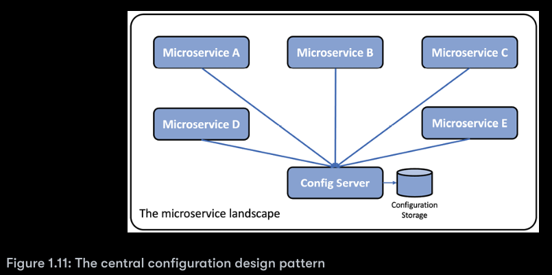
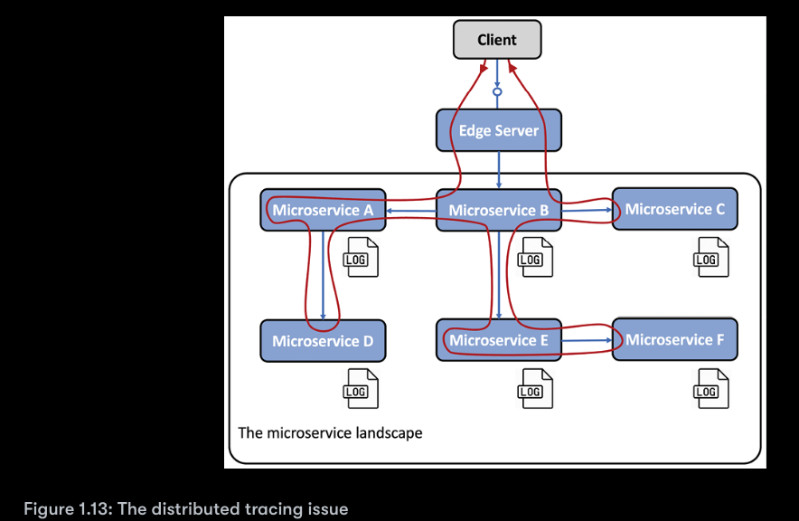

## Design patterns for microservices

The concept of design patterns is actually quite old; it was
invented Christopher Alexander back in 1977. In essence, 
a design pattern is about describing a reusable solution to a 
problem when given a specific context.

### Service Discovery

##### Problem

How can clients find microservices and their instances?. When 
running in containers. This makes it difficult for a 
client to make a request to a microservice that, for example,
exposes a REST API over HTTP. Consider the following diagram:

##### Solution

Add a new component - a **service discovery** service - to the
system landscape, which keeps track of currently available
microservices and the IP addresses of its instances.

##### Solution requirements

* Automatically register/unregister microservices and their
  instances as they come and go.
* The client must be able to make a request to a logical
  endpoint for the microservice. The request will be routed to
  one of the available microservice instances.
* Requests to a microservice must be load-balanced over
  the available instances.
* We must be able to detect instances that currently are
  unhealthy so that request will not be routed to them.

* **Client-side routing:** The client uses a library that
  communicates with the service discovery service to find
  out the proper instances to send the request to.
* **Server-side routing:** The infrastructure of the service
  discovery service also exposes a reverse proxy that all
  requests are sent to. The reverse proxy forward the 
  requests to a proper microservice instance on behalf of the
  client.

### Edge Server

##### Problem

In a system landscape of microservices, it is in many cases
desirable to expose some of the microservices to the outside of 
the system landscape and hide the remaining microservices from
external access. The exposed microservices must be protected
against requests from malicious clients.

##### Solution

Add a new component, an **edge server**, to the system landscape
that all incoming requests will go through:

**Implementation notes:** An edge server typically behaves like a 
reverse proxy and can be integrated with a discovery service to 
provide dynamic load-balancing capabilities.

##### Solution requirements

* Hide internal services that should not be exposed outside
  their context; that is, only route requests to microservices
  that are configured to allow external requests
* Expose external service and protect them from malicious
  requests; that is, use standard protocols and best practices
  such as OAuth, OIDC, JWT tokens, and API keys to ensure 
  that the clients are trustworthy

### Reactive microservices

##### Problem

As Java developers, we are used to implementing
synchronous communication using blocking I/O, for example, a
RESTful JSON API over HTTP. Using a blocking I/O means that a 
thread is allocated from the operating system for the length of
the request.

If the number of concurrent request goes up, a server might run
out of available threads in the operating system, causing
problems ranging from longer response times to crashing servers.
Using a microservice architecture typically makes this problem
even worse, where typically a chain of cooperating microservices
is used to serve a request. The more microservices involved in
serving a request, the faster the available threads will be drained.

##### Solution

Use non-blocking I/O to ensure that no threads are allocated 
while waiting for processing to occur in another service, that is, a
database or another microservice.

##### Solution requirements

* Whenever feasible, use an asynchronous programming
  model, sending messages without waiting for the receiver
  to process them.
* Use reactive frameworks that can execute synchronous
  requests using non-blocking I/O, without allocating a 
  thread while waiting for a response. This will make the 
  microservices easier to scale in order to handle an
  increased workload.
* Microservices must also be designed to be resilient and
  self-healing. Resilient meaning being capable of producing
  a response even if one of the services it depends on fails;
  self-healing meaning that once the failing service is
  operational again, the microservice must be able to resume
  using it.

##### Note

In 2013, key principles for designing reactive systems were 
established in The Reactive Manifesto https://www.reactivemanifesto.org/

### Central configuration

##### Problem

An application is,traditionally, deployed together with its configuration, for example, a set of
environment variables and/or files containing configuration information.

##### Solution

Add a new component, a **configuration server**, to the system landscape to store the configuration of all
the microservices, as illustrated by the following diagram:

##### Solution requirements

Make it possible to store configuration information for a group of microservices in one place, with
different settings for different environments (for example, **dev**, **test**, **qa** and **pro**).

### Centralized log analysis

##### Problem

Traditionally, an application writes log events to log files that are stored in the local filesystem of the
server that application runs on.

##### Solution

Add a new component that can manage **centralized logging** and is capable of the following:

- Detecting new microservice instances and collecting log events from them
- Interpreting and storing log events in a structured and searchable way in a central database
- Providing APIS and graphical tools for querying and analyzing log events

##### Solution requirements

Some solution requirements are as follows:

- Microservices stream log events to standard system output, **stdout**. This makes it easier for a log
  collector to find the log events compared to when log events are written to microservice-specific log files.
- Microservices tag the log events with the correlation ID described in the next section regarding the
  *Distributed tracing design pattern*
- A canonical log format is defined, so that log collectors can transform log events collected from
  the microservices to a canonical log format before log events are stored in the central database.
  Storing log events in a canonical log format is required to be able to query and analyze the
  collected log events.

### Distributed tracing

##### Problem
It must be possible to track requests and messages that flow between microservices while processing and external
request to the system landscape.

##### Solution

To track the processing between cooperating microservices, we need to ensure that all related requests and
messages are marked with a common **correlation ID** and that the correlation ID is part of all log events. Based on a
correlation ID, we can use the centralized logging service to find all related log events. If one of the log events also
includes information about a business-related identifier, for example, the ID of a customer, product, or order, we
can find all related log events log events for that business identifier using the correlation ID.

To be able to analyze delays in a call chain of cooperating microservices, we must be able to collect timestamps for
when request, responses, and messages enter and exit each microservice.

##### Solution requirements

- Assign unique correlation IDs to all incoming or new request and events in a well-known place, such as a
  header with a standardized name
- When a microservice makes an outgoing request or sends a message, it must add the correlation ID to the 
  request and message
- All log events must include the correlation ID in a predefined format so that the centralized logging service
  can extract the correlation ID from the log event and make it searchable
- Trace records must be created for when requests, responses, and messages both enter and exit a 
  microservice instance