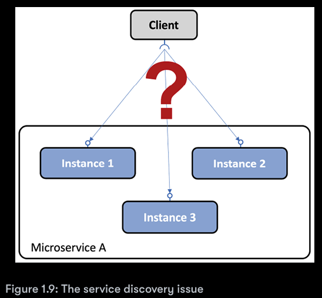
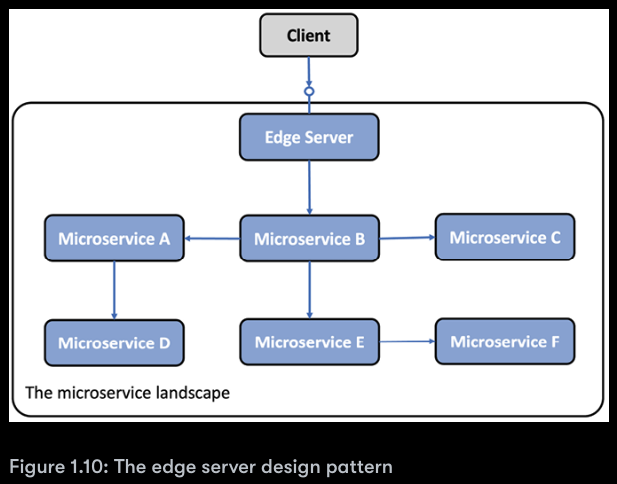

## Design patterns for microservices

The concept of design patterns is actually quite old; it was
invented Christopher Alexander back in 1977. In essence, 
a design pattern is about describing a reusable solution to a 
problem when given a specific context.

### Service Discovery

##### Problem

How can clients find microservices and their instances?. When 
running in containers. This makes it difficult for a 
client to make a request to a microservice that, for example,
exposes a REST API over HTTP. Consider the following diagram:

##### Solution

Add a new component - a **service discovery** service - to the
system landscape, which keeps track of currently available
microservices and the IP addresses of its instances.

##### Solution requirements

* Automatically register/unregister microservices and their
  instances as they come and go.
* The client must be able to make a request to a logical
  endpoint for the microservice. The request will be routed to
  one of the available microservice instances.
* Requests to a microservice must be load-balanced over
  the available instances.
* We must be able to detect instances that currently are
  unhealthy so that request will not be routed to them.

* **Client-side routing:** The client uses a library that
  communicates with the service discovery service to find
  out the proper instances to send the request to.
* **Server-side routing:** The infrastructure of the service
  discovery service also exposes a reverse proxy that all
  requests are sent to. The reverse proxy forward the 
  requests to a proper microservice instance on behalf of the
  client.

### Edge Server

##### Problem

In a system landscape of microservices, it is in many cases
desirable to expose some of the microservices to the outside of 
the system landscape and hide the remaining microservices from
external access. The exposed microservices must be protected
against requests from malicious clients.

##### Solution

Add a new component, an **edge server**, to the system landscape
that all incoming requests will go through:

**Implementation notes:** An edge server typically behaves like a 
reverse proxy and can be integrated with a discovery service to 
provide dynamic load-balancing capabilities.

##### Solution requirements

* Hide internal services that should not be exposed outside
  their context; that is, only route requests to microservices
  that are configured to allow external requests
* Expose external service and protect them from malicious
  requests; that is, use standard protocols and best practices
  such as OAuth, OIDC, JWT tokens, and API keys to ensure 
  that the clients are trustworthy

### Reactive microservices

##### Problem

As Java developers, we are used to implementing
synchronous communication using blocking I/O, for example, a
RESTful JSON API over HTTP. Using a blocking I/O means that a 
thread is allocated from the operating system for the length of
the request.

If the number of concurrent request goes up, a server might run
out of available threads in the operating system, causing
problems ranging from longer response times to crashing servers.
Using a microservice architecture typically makes this problem
even worse, where typically a chain of cooperating microservices
is used to serve a request. The more microservices involved in
serving a request, the faster the available threads will be drained.

##### Solution

Use non-blocking I/O to ensure that no threads are allocated 
while waiting for processing to occur in another service, that is, a
database or another microservice.

##### Solution requirements

* Whenever feasible, use an asynchronous programming
  model, sending messages without waiting for the receiver
  to process them.
* Use reactive frameworks that can execute synchronous
  requests using non-blocking I/O, without allocating a 
  thread while waiting for a response. This will make the 
  microservices easier to scale in order to handle an
  increased workload.
* Microservices must also be designed to be resilient and
  self-healing. Resilient meaning being capable of producing
  a response even if one of the services it depends on fails;
  self-healing meaning that once the failing service is
  operational again, the microservice must be able to resume
  using it.

##### Note

In 2013, key principles for designing reactive systems were 
established in The Reactive Manifesto https://www.reactivemanifesto.org/

