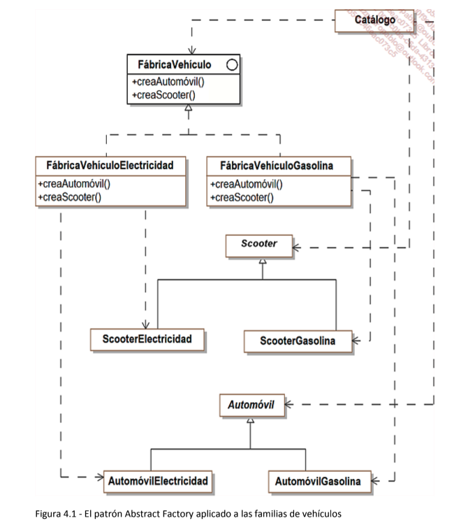
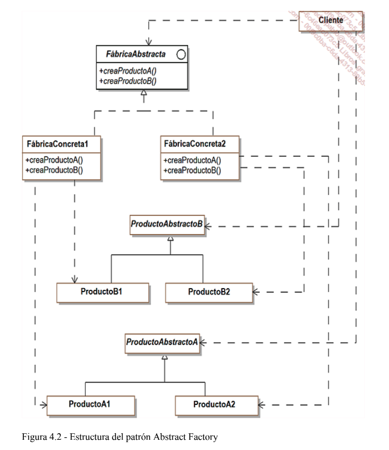
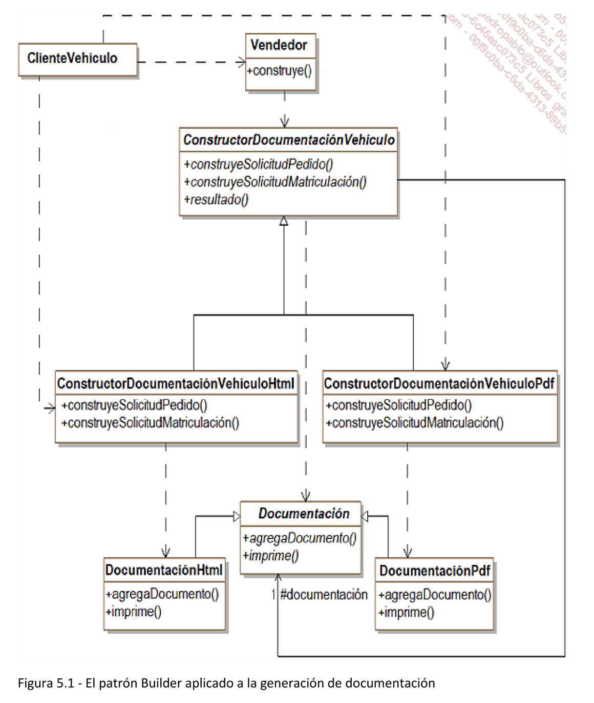
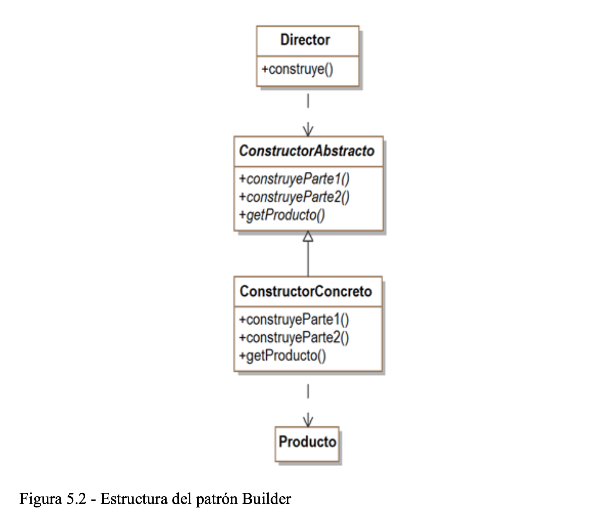
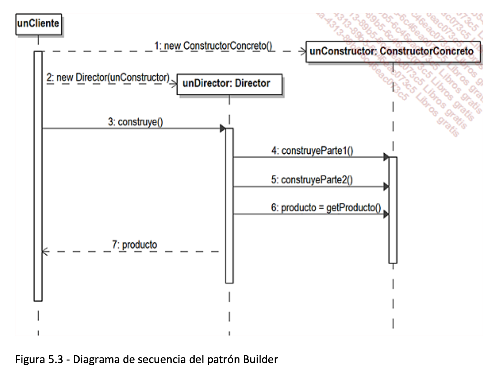

## Catálogo de patrones de diseño

* **Abstract Factory**: tiene como objetivo la creación de objetos reagrupados en 
  familias sin tener que conocer las clases concretas destinadas a la creación de 
  estos objetos.
* **Builder**: permite separar la construcción de objetos complejos de su
  implementación de modo que un cliente pueda crear estos objetos complejos con
  implementaciones diferentes.
* **Factory Method**: tiene como objetivo presentar un método abstracto para la 
  creación de un objeto reportando a las subclases concretas la creación efectiva.
* **Prototype**: permite crear nuevos objetos por duplicación de objetos existentes 
  llamados prototipos que disponen de la capacidad de clonación.
* **Singleton**: permite asegurar que de una clase concreta existe una única 
  instancia y proporciona un método único que la devuelve.
* **Adapter**: tiene como objetivo convertir la interfaz de una clase existente en la 
  interfaz esperada por los clientes también existentes para que puedan trabajar de
  forma conjunta.
* **Bridge**: tiene como objetivo seprar los aspectos conceptuales de una jerarquía
  de clases de su implementación.
* **Composite**: proporciona un marco de diseño de una composición de objetos con
  una profundidad de composición variable, basando el diseño en un árbol.
* **Decorator**: permite agregar dinámicamente funcionalidades suplementarias a un
  objeto.
* **Facade**: tiene como objetivo reagrupar las interfaces de un conjunto de objetos
  en una interfaz unificada que resulte más fácil de utilizar.
* **Flyweight**: facilita la compartición de un conjunto importante de objetos con 
  granularidad muy fina.
* **Proxy**: construye un objeto que se substituye por otro objeto y que controla su
  acceso.
* **Chain of responsibility**: crea una cadena de objetos tal que si un objeto de la
  cadena no puede responder a una petición, la pueda transmitir a sus sucesores
  hasta que uno de ellos responda.
* **Command**: tiene como objetivo trasformar una consulta e un objeto, 
  facilitando operaciones como la anulación, la actualización de consultas y su
  seguimiento.
* **Interpreter**: proporciona un marco para dar una representación mediante 
  objetos de la gramática de un lenguaje con el objetivo de evaluar,
  interpretándolas, expresiones escritas en este lenguaje.
* **Iterator**: proporciona un acceso secuencial a una colección de objetos sin que
  los clientes se preocupen de la implementación de esta colección.
* **Mediator**: construye un objeto cuya vocación es la gestión y el control de las
  interacciones en el seno de un conjunto de objetos sin que estos elementos se
  conozcan mutuamente.
* **Memento**: salvaguarda y restaura el estado de un objeto.
* **Observer**: construye una dependencia entre un sujeto y sus observadores de 
  modo que cada modificación del sujeto sea notificada a los observadores para
  que puedan actualizar su estado.
* **State**: permite a un objeto adaptar su comportamiento en función de su estado
  interno.
* **Strategy**: adapta el comportamiento y los algoritmos de un objeto en función de
  una necesidad concreta sin por ello cargar las interacciones con los clientes de
  este objeto.
* **Template Method**: permite reportar en las subclases ciertas etapas de una de las
  operaciones de un objeto, estando éstas descritas en las subclases.
* **Visitor**: construye una operación a realizar en los elementos de un conjunto de
  objetos. Es posible agregar nuevas operaciones sin modificar las clases de estos
  objetos.

## Introducción a los patrones de construcción
## Presentación

Los patrones de construcción tienen la vocación de abstraer los mecanismos de creación
de objetos. Un sistema que utilice estos patrones se vuelve independiente de la forma en
que se crean los objetos, en particular, de los mecanismos de instanciación de las clases
concretas.

## El patrón Abstract Factory
### Descripción
Su objetivo es la creación de objetos agrupados en familias sin tener que conocer las clases
concretas destinadas a la creación de estos objetos.

### Ejemplo

El sistema de venta de vehículos gestiona vehículos que funcionan con gasolina y
vehículos eléctricos. Esta gestión está delegada en el objeto Catálogo encargado de
crear tales objetos.

Para cada producto, disponemos de una clase abstracta, de una subclase concreta
derivando una versión del producto que funciona con gasolina y de una subclase
concreta derivando una versión del producto que funciona con electricidad. Por
ejemplo, en la figura 4.1, para el objeto Scooter, existe una clase abstracta Scooter y dos
subclases concretas ScooterElectricidad y ScooterGasolina.

El objeto Catálogo puede utilizar estas subclases concretas para instanciar los productos.
No obstante si fuera necesario incluir nuevas clases de familias de vehículos (diésel o
mixto gasolina-eléctrico), las modificaciones a realizar en el objeto Catálogo pueden ser
bastante pesadas.

El patrón Abstract Factory resuelve este problema introduciendo una interfaz
FábricaVehículo que contiene la firma de los métodos para definir cada producto. El
tipo de devuelto por estos métodos está constituido por una de las clases abstractas del 
producto. De este modo el objeto Catálogo no necesita conocer las subclases concretas y 
permanece desacoplado de las familias de producto.

Se incluye una subclase de implementación de FábricaVehículo por cada familia de 
producto, a saber las sabclases FábricaVehículoElectricidad y
FábricaVehículoGasolina. Dicha subclase implementa las operaciones de creación del
vehículo apropiado para la familia a la que está asociada.

El objeto Catálogo recibe como parámetro una instancia que responde a la interfaz
FábricaVehículo, es decir o bien una instancia de FábricaVehículoElectricidad, o bien
una instancia de FábricaVehículoGasolina. Con dicha instancia, el catálogo puede crear 
y manipular los vehículos sin tener que conocer las familias de vehículos y las clases
concretas de instanciación correspondientes.



#### Estructura

##### 1. Diagrama de clases

La figura 4.2 detalla la estructura genérica del patrón.



##### 2. Participantes

Los participantes del patrón son los siguientes:

* FábricaAbstracta (FábricaVehículo) es una interfaz que define las firmas de los 
  métodos que crean los distintos productos.
* FábricaConcreta1, FábricaConcreta2 (FábricaVehículoElectricidad, 
  FábricaVehículoGasolina) son las clases concretas que implementan los 
  métodos que crean los productos para cada familia de producto. Conociendo la
  familia y el producto, son capaces de crear una instancia del producto para esta
  familia.
* ProductoAbstractoA y ProductoAbstractoB (Scooter y Automóvil) son las clases
  abstractas de los productos independientemente de su familia. Las familias se
  introducen en las subclases concretas.
* Cliente es la clase que utiliza la interfaz de FábricaAbstracta.

##### 3. Colaboraciones
La clase Cliente utiliza una instancia de una de las fábricas concretas para crear sus
productos a partir de la interfaz FábricaAbstracta.

Normalmente sólo es necesario crear una instancia de cada fábrica concreta, que puede
compartirse por varios clientes.

#### Dominios de uso
El patrón se utiliza en los dominios siguientes:

* Un sistema que utiliza productos necesita ser independiente de la forma en que 
  se crean y agrupan estos productos.
* Un sistema está configurado según varias familias de productos que pueden
  evolucionar.

##### Ejemplo en Java
El código Java correspondiente a la clase abstracta Automovil y sus subclases 
aparece a continuación. Describe los cuatro atributos de los automóviles así como
el método mostrarCaracteristicas que permite visualizarlas.

```
public abstract class Automovil
{
  protected String modelo;
  protected String color;
  protected int potencia;
  protected double espacio;
  
  public Automovil(String modelo, String color, int potencia, double espacio) {
    this.modelo = modelo;
    this.color = color;
    this.potencia = potencia;
    this.espacio = espacio;
  }
  
  public abstract void mostrarCaracteristicas();
}
```

```
 public class AutomovilElectricidad extends Automovil {
  public AutomovilElectricidad(String modelo, String color, int potencia, double espacio) {
    super(modelo, color, potencia, espacio);
  }
  
  public void mostrarCaracteristicas() {
    System.out.println(
      "Automovil electrico de modelo: " + modelo + 
      " de color: " + color + " de potencia: " + 
      potencia + " de espacio: " + espacio);
  }
 }
```

```
public class AutomovilGasolina extends Automovil {
  public AutomovilGasolina(String modelo, String color, int potencia, double espacio) {
    super(modelo, color, potencia, espacio);
  }
  
  public void mostrarCaracteristicas() {
    System.out.println(
      "Automovil de gasolina de modelo: " + modelo +
      " de color: " + color + " de potencia: " +
      potencia + " de espacio: " + espacio);
  }
}
```

El código Java correspondiente a la clase abstracta Scooter y sus subclases
aparece a continuación. Es similar al de los automóviles, salvo por el atributo
espacio que no existe para las scooters.

```
public abstract class Scooter {
  protected String modelo;
  protected String color;
  protected int potencia;
  
  public Scooter(String modelo, String color, int potencia) {
    this.modelo = modelo;
    this.color = color;
    this.potencia = potencia;
  }
  
  public abstract void mostrarCaracteristicas();
}
```

```
public class ScooterElectricidad extends Scooter
{
  public ScooterElectricidad(String modelo, String color, int potencia) {
    super(modelo, color, potencia);
  }
  
  public void mostrarCaracteristicas() {
    System.out.println("Scooter electrica de modelo: " +
      modelo + " de coor: " + color +
      " de potencia: " + potencia);
  }
}
```

```
public class ScooterGasolina extends Scooter {
  public ScooterGasolina(String modelo, String color, int potencia) {
    super(modelo, color, potencia);
  }
  
  public void mostrarCaracteristicas() {
    System.out.println("Scooter de gasolina de modelo: " +
      modelo + " de color: " + color +
      " de potencia: " + potencia);
  }
}
```

Ahora podemos introducir la interfaz FábricaVehículo y sus dos clases de
implementación, una para cada familia(eléctrico/gasolina). Es fácil darse cuenta
de que sólo las clases de implementación utilizan las clases concretas de los 
vehículos.

```
public interface FabricaVehiculo {
  Automovil creaAutomovil(String modelo, String color, int potencia, double espacio);
  
  Scooter creaScooter(String modelo, String color, int potencia);
}
```

```
public class FabricaVehiculoElectricidad implements FabricaVehiculo {
  public Automovil creaAutomovil(String modelo, String color, int potencia, double espacio) {
    return new AutomovilElectricidad(modelo, color, potencia, espacio);
  }
  
  public Scooter creaScooter(String modelo, String color, int potencia) {
    return new ScooterElectricidad(modelo, color, potencia);
  }
}
```

```
public class FabricaVehiculoGasolina implements FabricaVehiculo {
  public Automovil creaAutomovil(String modelo, String color, int potencia, double espacio) {
    return new AutomovilGasolina(modelo, color, potencia, espacio);
  }
  
  public Scooter creaScooter(String modelo, String color, int potencia) {
    return new ScooterGasolina(modelo, color, potencia);
  }
}
```

El catálogo solicita al comienzo la fábrica que se quiere utilizar (electricidad o gasolina).
Esta fábrica debería proporcionarse como parámetro al catálogo.
El resto del programa es totalmente independiente de la familia de objetos,
respetando el objetivo del patrón Abstract Factory.

```
public class Catalogo {
  public static int nAutos = 3;
  public static int nScooters = 2;
  
  public static void main(String[] args) {
    Scanner reader = new Scanner(System.in);
    Automovil[] autos = new Automovil[nAutos];
    Scooter[] scooters = new Scooter[nScooters];
    
    System.out.print("Desea utilizar " + "vehiculos electricos (1) o a gasolina (2):");
    String eleccion = reader.next();
    
    if (eleccion.equals("1")) {
      fabrica = new FabricaVehiculoElectricidad();
    } else {
      fabrica = new FabricaVehiculoGasolina();
    }
    
    for (int index = 0; index < nAutos; index++) {
      autos[index] = fabrica.creaAutomovil("estandar", "amarillo", 6 + index, 3.2);
    }
    
    for (int index = 0; index < nScooters; index++) {
      scooters[index] = fabrica.creaScooter("clasico", "rojo", 2 + index);
    }
    
    for (Automovil auto: autos) {
      auto.mostrarCaracteristicas();
    }
    
    for (Scooter scooter: scooters) {
      scooter.mostrarCaracteristicas();
    }
  }
}
```

## El patrón Builder

### Descripción

El objetivo es abstraer la construcción de objetos complejos de su implementación, 
de modo que un cliente pueda crear objetos complejos sin tener que preocuparse de 
las diferencias en su implementación.

### Ejemplo:

Durante la compra de un vehículo, el vendedor crea todo un conjunto de documentos 
que contienen en especial la solicitud de pedido y la solicitud de matriculación del 
cliente. Es posible construir estos documentos en formato HTML o en formato PDF 
según la elección del cliente. En el primer caso, el cliente le provee una instancia de la
clase ConstructorDocumentaciónVehículoHtml y, en el segundo caso, una instancia de 
la clase ConstructorDocumentaciónVehículoPdf. El vendedor realiza, a continuación, la
solicitud de creación de cada documento mediante esta instancia.

De este modo el vendedor genera la documentación con ayuda de los métodos
construyeSolicitudPedido y construyeSolicitudMatriculación.

El conjunto de clase del patrón Builder para este ejemplo se detalla en la figura 5.1.
Esta figura muestra la jerarquía entre las clases ConstructorDocumentaciónVehículo y 
Documentación. El vendedor puede crear las solicitudes del pedido y las solicitudes de
matriculación sin conocer las subclases de ConstructorDocumentaciónVehículo ni las 
de Documentación.

Las relaciones de dependencia entre el cliente y las subclases de
ConstructorDocumentaciónVehículo se explican por el hecho de que el cliente crea una 
instancia de estas subclases.

La estructura interna de las subclases concretas de Documentación no se muestra (entre
ellas, por ejemplo, la relación de composición de la clase Documento).



### Estructura
#### 1. Diagrama de clases
La figura 5.2 detalla la estructura genérica del patrón



#### 2. Participantes

Los participantes del patrón son los siguientes:

* ConstructorAbstracto (ConstructorDocumentaciónVehículo) es la clase que
  define la firma de los métodos que construyen las distintas partes del producto
  así como la firma del método que permite obtener el producto, una vez
  construido
* ConstructorConcreto (ConstructorDocumentaciónVehículoHtml y 
  ConstructorDocumentaciónVehículoPdf) es la clase concreta que implementa
  los métodos del constructor abstracto.
* Producto (Documentación) es la clase que define el producto. Puede ser
  abstracta y poseer varias subclases concretas (DocumentaciónHtml y
  DocumentaciónPdf) en caso de implementaciones diferentes.
* Director es la clase encargada de construir el producto a partir de la interfaz del
  constructor abstracto.

#### 3. Colaboraciones

El cliente crea un constructor concreto y un director. El director construye, bajo
demanda del cliente, invocando al constructor y reenviando el resultado al cliente.

La figura 5.3 ilustra este funcionamiento con un diagrama de secuencia UML.



### Dominios de uso

El patrón se utiliza en los dominios siguientes:

* Un cliente necesita construir objetos complejos sin conocer su implementación.
* Un cliente necesita construir objetos complejos que tienen varias 
  representaciones o implementaciones.

### Ejemplo
Por motivos de simplicidad, los documentos son cadenas de caracteres para la
documentación en formato HTML y PDF. El método imprime muestra las distintas
cadenas de caracteres que representan los documentos.

```
public abstract class Documentacion {
  protected List<String> contenido = new ArrayList<String>();
  
  public abstract void agregaDocumento(String documento);
  public abstract void imprime();
}
```

```
public class DocumentacionHtml extends Documentacion {
  public void agregaDocumento(String documento) {
    if (documento.startsWith("<HTML>"))
      contenido.add(documento);
  }
  
  public void imprime() {
    System.out.println("Documentacion HTML");
    for (String s: contenido)
      System.out.println(s);
  }
}
```

```
public class DocumentacionPdf extends Documentacion {
  public void agregaDocumento(String documento) {
    if (documento.startWith("<PDF>"))
      contenido.add(documento);
  }
  
  public void imprime() {
    System.out.println("Documentacion PDF");
    for (String s: contenido)
      System.out.println(s);
  }
}
```

El código fuente de las clases que generan la documentación aparece a
continuación.

```
public abstract class ConstructorDocumentacionVehiculo {
  protected Documentacion documentacion;
  
  public abstract void construyeSolicitudPedido(String nombreCliente);
  public abstract void construyeSolicitudMatriculacion(String nombreSolicitante);
  
  public Documentacion resultado() {
    return documentacion;
  }
}
```

```
public class ConstructorDocumentacionVehiculoHtml extends ConstructorDocumentacionVehiculo {
  public ConstructorDocumentacionVehiculoHtml() {
    documentacion = new DocumentacionHtml();
  }
  
  public void construyeSolicitudPedido(String nombreCliente) {
    String documento;
    documento = "<HTML>Solicitud de pedido Cliente: " + nombreCliente + "</HTML>";
    documentacion.agregaDocumento(documento);
  }
  
  public void construyeSolicitudMatriculacion(String nombreSolicitante) {
    String documento;
    documento = "<HTML>Solicitud de Matriculacion Solicitante: " + nombreSolicitante + "</HTML>";
    documentacion.agregaDocumento(documento);
  }
}
```

```
public class ConstructorDocumentacionVehiculoPdf extends ConstructorDocumentacionVehiculo {
  public ConstructorDocumentacionVehiculoPdf() {
    documentacion = new DocumentacionPdf();
  }
  
  public void construyeSolicitudPedido(String nombreCliente) {
    String documento;
    documento = "<PDF>Solicitud de pedido Cliente: " + nombreCliente + "</PDF>";
    documentacion.agregaDocumento(documento);
  }
  
  public void construyeSolicitudMatriculacion(String nombreSolicitante) {
    String documento;
    documento = "<PDF>Solicitud de matriculacion Solicitante: " + nombreSolicitante + "</PDF>";
    documentacion.agregaDocumento(documento);
  }
}
```

La clase Vendedor se describe a continuación. Su constructor recibe como
parámetro una instancia de ConstructorDocumentacionVehiculo. Observe que el
método construye toma como parámetro la información del cliente, aquí limitada
al nombre del cliente.

```
public class Vendedor {
  protected ConstructorDocumentacionVehiculo constructor;
  
  public Vendedor(ConstructorDocumentacionVehiculo constructor) {
    this.constructor = constructor;
  }
  
  public Documentacion construye(String nombreCliente) {
    constructor.construyeSolicitudPedido(nombreCliente);
    constructor.construyeSolicitudMatriculacion(nombreCliente);
    Documentacion documentacion = constructor.resultado();
    
    return documentacion;
  }
}
```

Se proporciona el código Java del cliente del constructor, a saber la
clase ClienteVehiculo que constituye el programa principal. El inicio de
este programa solicita al usuario el constructor que debe utilizar, y se lo 
proporciona a continuación al vendedor.

```
public class ClienteVehiculo {
  public static void main(String[] args) {
    Scanner reader = new Scanner(System.in);
    ConstructorDocumentacionVehiculo constructor;
    System.out.print("Desea generar " + "documentacion HTML (1) o PDF (2):");
    String seleccion = reader.next();
    
    if (seleccion.equals("1")) {
      constructor = new ConstructorDocumentacionVehiculoHtml();
    } else {
      constructor = new ConstructorDocumentacionVehiculoPdf();
    }
    
    Vendedor vendedor = new Vendedor(constructor);
    Documentacion documentacion = vendedor.construye("Martin");
    documentacion.imprime();
  }
}
```
