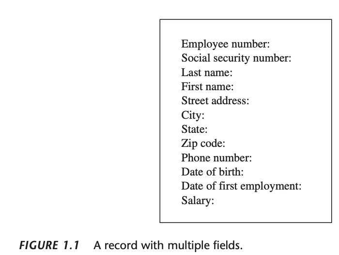
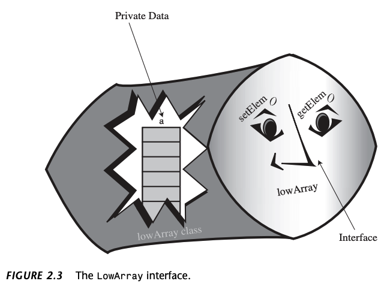
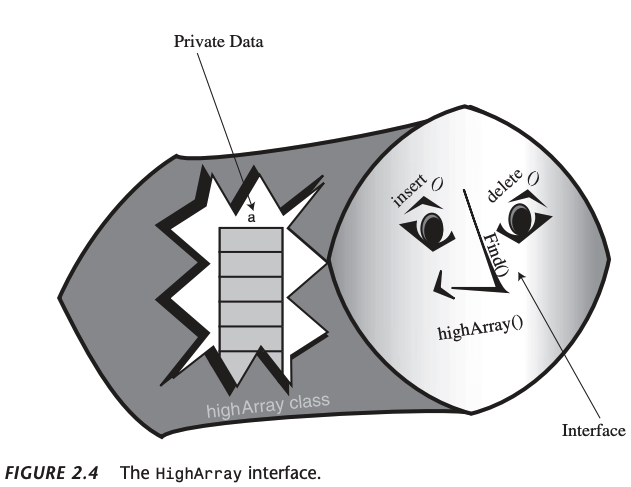
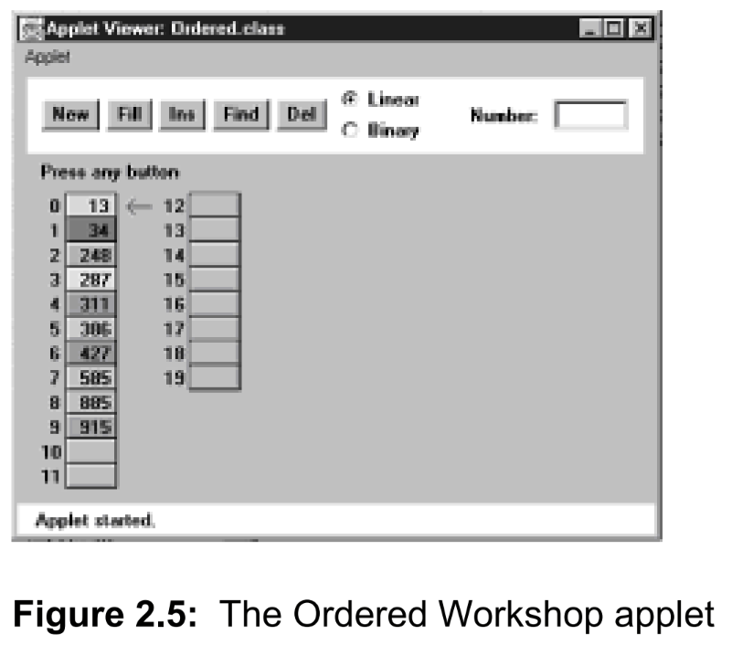

# 1 Overview

## What Are Data Structures and Algorithms Good For?

A *data structure* is an arrangement of data in a computer's
memory (or sometimes on a disk). Data structures include 
arrays, linked lists, stacks, binary trees, and hash tables,
among others. *Algorithms* manipulate the data in these 
structures in various ways, such as searching for a particu-
lar data item and sorting the data.

## Overview of Data Structures

Table 1.1 show the advantages and disadvantages of the 
various data structures described in this book.

**TABLE 1.1** Characteristics of Data Structures

| **Data Structure** | Advantages                                                                                     | Disadvantages                                                          |
|--------------------|------------------------------------------------------------------------------------------------|------------------------------------------------------------------------|
| Array              | Quick insertion, very fast access if index known.                                              | Slow search, slow deletion, fixed size.                                |
| Ordered array      | Quicker search than unsorted array.                                                            | Slow insertion and deletion, fixed size.                               |
| Stack              | Provides last-in, first-out access.                                                            | Slow access to other items.                                            | 
| Queue              | Provides first-in, first-out access.                                                           | Slow access to other items.                                            |
| Linked list        | Quick insertion, quick deletion.                                                               | Slow search.                                                           |
| Binary tree        | Quick search, insertion, deletion (if tree remains balanced).                                  | Deletion algorithm is complex.                                         |
| Red-black tree     | Quick search, insertion, deletion. Tree always balanced.                                       | Complex.                                                               |
| 2-3-4 tree         | Quick search, insertion, deletion. Three always balanced. Similar trees good for disk storage. | Complex.                                                               |
| Hash table         | Very fast access if key known. Fast insertion.                                                 | Slow deletion, access slow if key not known, inefficient memory usage. |
| Heap               | Fast insertion, deletion, access to largest item.                                              | Slow access to other items.                                            |
| Graph              | Models real-world situations.                                                                  | Some algorithms are slow and complex.                                  |

## Some Definitions

### Database

We'll use the term *database* to refer to all the data that will be dealt with in a particular
situations. As an example, if you create an address book using index cards, these cards contitute a
database. The term *file* is sometimes used in this sense.

### Record

*Records* are the units into which a database is divided. They provide a format for
storing information. In the index card analogy, each card represents a records. A 
record includes all the information about some entity, in a situation in which there
are many such entities. A record might correspond to a person in a personnel file, a
car part in an auto supply inventory, or a recipe in a cookbook file.

### Field

A record is usually divided into several *fields*. A field holds a particular kind of data.
On an index card for an address book, a person's name, address, or telephone
number is an individual field.

Figure 1.1 shows such a record, where each line represents a distinct field.

In Java, records are usually represented by *objects* of an appropriate class. Individual 
variables within an object represent data fields. Fields within a class object are called 
*fields* in Java



### Key

To search for a record within a database, you need to designate one of the record's
fields as a *key (or search key)*. You'll search for the record with a specific key.

## Object-Oriented Programming

To summarize:

* Objects contain both methods and fields (data).
* A class is a specification for any number of objects.
* To create an object, you use the keyword *new* in conjunction with the class
  name.
* To invoke a method for a particular object, you use the dot operator.

### An Array Example

Listing 2.1 show the old-fashioned version, called *array.java*

```
// array.java
// demostrates Java arrays
// to run this program: C>java arrayApp
////////////////////////////////////////////////////////////////
class ArrayApp {
    public static void main(String[] args) {
        long[] arr;                 // reference to array
        arr = new long[100];        // make array
        int nElems = 0;             // nmber of items
        int j;                      // loop couter
        long searchKey;             // key of item to search for
        
        arr[0] = 77;                // insert 10 items
        arr[1] = 99;
        arr[2] = 44;
        arr[3] = 55;
        arr[4] = 22;
        arr[5] = 88;
        arr[6] = 11;
        arr[7] = 00;
        arr[8] = 66;
        arr[9] = 33;
        nElems = 10;                // now 10 items in array
        //--------------------------------------------------------------
        for (j = 0; j < nElems; j++)// display items
            System.out.print(arr[j] + " ");
        System.out.println("");
        //--------------------------------------------------------------
        searchKey = 66;             // find item with key 66
        for (j = 0; j < nElems; j++)// for each element,
            if (arr[j] == searchKey)// found item?
                break;
            if (j == nElems)
                System.out.println("Can't find " + searchKey); // yes
            else
                System.out.println("Found " + searchKey);      // no
        //--------------------------------------------------------------
        searchKey = 55;            // delete item with key 55
        for(j = 0; j < nElems; j++)//look for it
            if (arr[j] == searchKey)
                break;
        for (int k = j; k < nElems - 1; k++)// move higher ones down
            arr[k] = arr[k + 1];
        nElems--;                           // decrement size
        //--------------------------------------------------------------
        for(j = 0; j < nElems; j++)// display items
            System.out.print(arr[j] + " ");
        System.out.println("");                    
    } // end main()
} // end class ArrayApp
```

We create an array called *arr*, place 10 data items (kid's numbers) in
it, search for the item with value 66 (the shotstop, Louisa), display all the items,
remoe the item with value 55 (Freddy, who had a dentist appointment), and then
display the remaining 9 items. The output of the program lokks like this:

```
77 99 55 22 88 11 0 66 33
Found 66
77 99 22 88 11 0 66 33
```

## Dividing a Program into Classes

In *array.java* we used an array as a data storage structure, but we treated it simply
as a language element. Now we'll encapsulate the array in a class, called *LowArray.java*
We'll also provide class methods by which objects of other classes (the *LowArrayApp
class in the case*) can access the array. These methods allow communication between 
*LowArray* and *LowArrayApp*.

**LISTING 2.2** The *losArray.java* Program

```
// lowArray.java
// demonstrates array class with low-level interface
// to run this program: C>java LowArrayApp
////////////////////////////////////////////////////////////////

class LowArray {
    private long[] a;                           // ref to array a
    //--------------------------------------------------------------
    public LowArray(int size) {                 // constructor
        a = new long[size];                     // create array
    }
    //--------------------------------------------------------------
    public void setElem(int index, long value) {// set value
        a[index] = value;
    }
    //--------------------------------------------------------------
    public long getElem(int index) {            // get value
        return a[index];
    }
    //--------------------------------------------------------------
}   // end class LowArray
////////////////////////////////////////////////////////////////
class LowArrayApp {
    public static void main(String[] args) {
        LowArray arr;                           // reference
        arr = new LowArray(100);                // create LowArray object
        int nElems = 0;                         // number of items in array
        int j;                                  // loop variable
        
        arr.setElem(0, 77);                     // insert 10 items
        arr.setElem(1, 99);
        arr.setElem(2, 44);
        arr.setElem(3, 55);
        arr.setElem(4, 22);
        arr.setElem(5, 88);
        arr.setElem(6, 11);
        arr.setElem(7, 00);
        arr.setElem(8, 66);
        arr.setElem(9, 33);
        nElems = 10;                            // now 10 items in array
        
        for (j = 0; j < nElems; j++)            // display items
            System.out.println(arr.getElem(j) + " ");
        System.out.println("");
        
        int searchKey = 26;                     // search for data item
        for (j = 0; j < nElems; j++)            // for each element,
            if (arr.getElem(j) == searchKey)    // foud item?
              break;
        if (j == nElems)
            System.out.println("Can't find " + searchKey);
        else
            System.out.println("Found " + searchKey);
            
        for (j = 0; j < nElems; j++)            // delete value 55
            if (arr.getElem(j) == 55)
                break;
        for (int k = j; k < nElems; k++)        // higher ones down
            arr.setElem(k, arr.getElem(k + 1);
        nElems--;                               // decrement size
        
        for (j = 0; j < nElems; j++)            // display items
            System.out.print(arr.getElem(j) + " ");
        System.out.println("");
    } // end main()
} // end class LowArrayApp
////////////////////////////////////////////////////////////////
```

The output from the *lowArray.java* program is similar to that from *array.java*,
except that we try to fine a non-existent key value (26) before deleting the item with
the key value 55:

```
77 99 44 55 22 88 11 0 66 33
Can't find 26
77 99 44 22 88 11 0 66 33
```

## Class Interfaces

The way taht a class user relates to the class is called the class *inter-
face*. Because class fields are typically private, when we talk about the interface, we
usually mean the class methods-- what they do and what their arguments are. By 
calling these methods, a class user interacts with an object of the class. Figure 2.3 is a
fanciful interpretation of the *LowArray* interface.



### Not So Convenient

The interface to the LowArray class in *lowArray.java* is not particularly convenient.
The methods *setElem()* and *getElem()* operate on a low conceptual level, perform-
ing exactly the same task as the [] operator in an ordinary java array. 

Let's see how to redistribute responsabilities between the classes to obtain more of 
the advantages of OOP.

### The *highArray.java* exmaple

Out next example program show an improved interface for the storage structure
class, calld *HighArray*. Using this interface, the classs user (the *HighArrayApp* class)
no longer needs to think about index number. The setElem() and getElem()
methods are gone; They're replaced by *insert()*, *find()*, and *delete()*. These new
methods don't require an index number as an argument because the class takes
responsibility for handling index numbers.

Figure 2.4 shows the *HighArray* interface, and Listing 2.3 shows the *highArray.java* 
program.



**LISTING 2.3** The highArray.java program

```
// highArray.java
// demonstrates array class with high-level interface
// to run this program: C>java HighArrayApp
////////////////////////////////////////////////////////////////
class HighArray {
    private long[] a;                         // ref to array a
    private int nElems;                       // number of data items
    //-----------------------------------------------------------
    public HighArray(int max) {               // constructor
        a = new long[max];                    // create the array
        nElems = 0;                           // no items yet
    }
    //-----------------------------------------------------------
    public boolean find(long searchKey) {     // find specified value
        int j;
        for (j = 0; j < nElems; j++)          // for each element,
            if (a[j] == searchKey)            // found item?
                break;                        // exit loop before end
        if (j == nElems)                      // gone to end?
            return false;                     // yes, can't find it
        else
            return true;                      // no, found it
    } // end find()
    //-----------------------------------------------------------
    public void insert(long value) {          // put element into array
        a[nElems] = value;                    // insert it
        nElems++                              // increment size
    }
    //-----------------------------------------------------------
    public boolean delete(long value) {
        int j;
        for (j = 0; j < nElems; j++)          // look for it
            if (value == a[j])
                break;
        if (j == nElems)                      // can't find it
            return false;
        else {
            for (int k = j; k < nElems; k++)  // move higher ones downs
                a[k] = a[k + 1];
            nElems--;
            return true;
        }
    } // end delete()
    //-----------------------------------------------------------
    public void display() {
        for (int j = 0; j < nElems; j++)      // for each element,
            System.out.println(a[j] + " ");   // display it
        System.out.println("");
    }
} // end class HighArray
////////////////////////////////////////////////////////////////
class HighArrayApp {
    public static void main(String[] args) {
        int maxSize = 100;                    // array size
        HighArray arr;                        // reference to array
        arr = new HighArray(maxSize);         // create the array
        
        arr.insert(77);                       // insert 10 items
        arr.insert(99);
        arr.insert(44);
        arr.insert(55);
        arr.insert(22);
        arr.insert(88);
        arr.insert(11);
        arr.insert(00);
        arr.insert(66);
        arr.insert(33);
        arr.display();                        // display items
        
        int searchKey = 35;                   // search for item
        if (arr.find(searchKey))
            System.out.println("Found " + searchKey);
        else
            System.out.println("Can't find " + searchKey);
        
        arr.delete(00);                       // delete 3 items
        arr.delete(55);
        arr.delete(99);
        
        arr.display();                        // display items again
    } // end main()
} // end class HighArrayApp
////////////////////////////////////////////////////////////////
```

The *HighArray* class is now wrapped around the array. In main(), we create an array
of this class and carry out almos the same operations as in the *lowArray.java*
program: We insert 10 items, searchh for an item--one that isn't there--and display
the array contents. Because deleting is so easy, we delete 3 items (0, 55 and 99)
instead of 1 and finally display the contents again. the output:

```
77 99 44 55 22 88 11 0 66 33
Can't find 35
77 44 22 88 11 66 33
```
### Abstraction

The process of separating the *how* from the *what*-- how an operation is performed
inside a class, as opposed to what's visible to the class user--is called *abstraction*.

### The Ordered Workshop Apple

Imagine an array in which the data items are arranged in order of ascending key values; that is,
with the smallest value at index 0, and each cell holding a value larger than the cell below. Such
an array is called an *ordered array*.

When we insert an item into this array, the correct location must be found for the insertion: just
above a smaller value and just below a larger one. Then all the larger values must be moved up to
make room.

Why would we want to arrange data in order? One advantage is that we can speed up search times 
dramatically using a *binary search*.




### Binary Search
### The Guess-a-Number Game

Binary search uses the same approach you did as a kid. In this game, a friend asks you to guess
a number she's thinking of between 1 and 100. When you guess a number, she'll tell you one of 
three things: your guess is larger than the number she's thinking of, it's smaller, or you guessed 
correctly.

To find the number in the fewest guesses, you should always start by guessing 50, If she says you
your guess is too low, you deduce the number the number is between 51 and 100, so your next guess
should be 75 (halfway between 51 and 100). If she say it's too high, you deduce the number is 
between 1 and 49, so your next guess should be 25.

In a binary search each guess divides the range of possible values in half, so the number of guesses
required is far fewer. Table 2.2 show a game session when the number to be guesses is 33.

| Step Number | Number Guesses | Result   | Range of Possible Values |
|-------------|----------------|----------|--------------------------|
| 0           |                |          | 1-100                    |
| 1           | 50             | Too high | 1-49                     |
| 2           | 25             | Too low  | 26-49                    |
| 3           | 37             | Too high | 26-36                    |
| 4           | 31             | Too low  | 32-36                    |
| 5           | 34             | Too high | 32-33                    |
| 6           | 32             | Too low  | 33-33                    |
| 7           | 33             | Correct  |             |
