## Creating React components

React is component-based, and the components are independent and reusable.


The components can then be arranged in a **tree hierarchy**.


The **root component** has two **child component**: the search component and the table component.
The table component has one child component: the table row component. The important thing to
understand with React is that the data flow goes from a parent component to a child component.

React uses the **virtual document object model (VDOM)** for selective re-rendering of the UI. The 
**document object model (DOM)** is a programming interface for web documents that represent the web
page as a structured tree of objects. Each object in a tree corresponds to a part of the document.
The VDOM is lightweight copy of the DOM, and manipulation of the VDOM is much faster than it is whith the
real DOM. After the VDOM is updated, React compares it to a snapshot that was taken of the VDOM before
updates were run. After the comparison, React will know which parts have been changed, and only these 
parts will be updated to the real DOM.

A React component can be defined either by using a JavaScript function - a **functional component**
or the ES6 JavaScript class - a **class component**.

JavaScript function
```
// Using JavaScript function
function App() {
    return <h1>Hello World</h1>;
}
```

ES6 to create a component
```
// Using ES6 class
class App extends React.Component {
    render() {
        return <h1>Hello World</h1>;
    }
}
```

The class component contains the required render() method, which shows and updates the rendered output of the component.
If you compare the functional and class App components, you can see that the render() method is not needed in the 
functional component. Before React version 16.8, you had to use class components to be able to use states. Now, you can
use hooks to create states with functional components as well.

The name of the React component should start with a capital letter. It is also recommended to use the PascalCase naming
convention.

If your component returns multiple elements, you have to wrap these inside one parent element. Such as a div.

```
// Wrap elements inside the div
function App() {
    return (
        <div>
            <h1>Hello World</h1>
            <h2>This is my first React component</h2>
        </div>
    );
}
```

You can also use a React **fragment**. Fragments don't add any extra nodes to the DOM tree:

```
// Using fragments
function App() {
    return (
        <React.Fragment>
            <h1>Hello World</h1>
            <h2>This is my first React component</h2>
        </React.Fragment>
    );
}
```

```
// Using fragments short syntax
function App() {
    return (
        <>
            <h1>Hello World</h1>
            <h2>This is my first React component</h2>
        </>
    );
}
```

The react-dom package provides DOM-specific methods for us.

main.jsx file

```
import React from 'react'
import ReactDOM from 'react-dom/client'
import App from './App'
import './index.css'

ReactDOM.createRoot(document.getElementById('root')).render(
    <React.StrictMode>
        <App />
    </React.StrictMode>
)
```

The react-dom package provides DOM-specific methods for us. To render the React component to the DOM, we can use the 
render method from the react-dom package. React.StrictMode is used to find potential problems in your React app and these
are printed in the browser console. Strict Mode only runs in development mode.

The **root API** is used to render React components inside a browser DOM node. we first create a root by passing the DOM
element to the createRoot method. The root calls the render method to render an element to the root.

```
import ReactDOM from 'react-dom/client';
import App from './App';

const container = document.getElementById('root');

// Create a root
const root = ReactDOM.createRoot(container);

// Render an element to the root
root.render(<App />);
```

The container in the root API is the <div id="root"></div> can be found in the index.html

```
<!DOCTYPE html>
<html lang="en">
    <head>
        <meta charset="UTF-8" />
        <link rel="icon" type="image/svg+iml" href="/vite.svg" />
        <meta name="viewport" content="width=device-width, initial-scale=1.0" />
        <title>Vite + React</title>
    </head>
    <body>
        <div id="root"></div>
        <script type="module" src="/src/main.jsx"></script>
    </body>
</html>
```

At the end of the source code, there is an export default statement that exports the component, and it can be made 
available to other components by using the import statement

```
import {useState} from 'react'
import reactLogo from './assets/react.svg'
import viteLogo from '/vite.svg'
import './App.css'

function App() {
    const [count, setCount] = useState(0)
    
    return (
        <div className="App">
            <div>
                <a href="https://vitejs.dev" target="_blank">
                    
                </a>
                <a href="https://reactjs.org" target="_blank">
                    
                </a>
            </div>
            <h1>Hello React</h1>
            <div className="card">
                <button onClick={() => setCount((count) => count + 1)}>
                    count is {count}
                </button>
                <p>
                    Edit <code>src/App.jsx</code> and save to test HMR
                </p>
            </div>
            <p className="read-the-docs">
                Click on the Vite and React logos to learm more
            </p>
        </div>
    )
}

export default App
```

There can only be one export default statement per file, but there can be multiple named export statements. Default exports
are commonly used to export React components. Named exports are commonly used to export specific functions or objects from
module.

```
import React from 'react' // Import default value
import { name } from ... // Import named value
```

```
export default React // Default export
export { name } // Named export
```

### Const and variables

Constants, or immutable variables, can be defined by using a **const** keyword. When using the const keyword, the variable
content cannot be reassigned:

```
contst PI = 3.14159;
```

The const is block-scoped. This means that the const variable can only be used inside the block in which it is defined.
If const is defined outside of any function or block, it becomes a global variable, and you should try to avoid this
situation. 

```
let count = 10;

if (count > 5) {
    const total = count * 2;
    console.log(total); // Prints 20 to console
}

console.log(total); // Error, outside the scope
```

The following example demonstrates what happens when const is an object or array:

```
const myObj = {foo: 3};
myObj.foo = 5; // This is ok
```

When const is an object or array, its properties or elements can be updated.
The **let** keyword allow you to decalre **mutable** block-scoped variables. The variables declared using **let** can be
used inside the block in which it is declared(it can also be used inside sub-blocks).

### Arrow functions

The traditional way of defining a function in JavaScript is by using a **function** keyword.

```
function(x) {
    return x * 2;
}
```

When we use the ES6 arrow function, the function look like this:

```
x => x * 2
```

The function is a so-called **anonymous function**, and we can't call it. Anonymous function are often used as an argument
for other functions. In JavaScript, functions are *first-class citizens* and you can store functions in variables.

```
const calc = x => x * 2;
```

Now, you can use the variable name to call the function

```
calc(5);
```

When you have more than one argument, you have to wrap the arguments in parenthesis and separate the arguments with a 
comma to use the arrow function effectively.

```
const calcSum = (x, y) => x + y
// function call
calcSum(2, 3); // return 5;
```

If the function body is an expression, then you don't need to use the **return** keyword. When you have multiple lines
in the function body, you have to use curly brackets and a **return** statement.

```
const calcSum = (x , y) => {
    console.log('Calculating sum');
    return x + y;
}
```

If the function doesn't have any arguments, then you should use the empty parenthesis.

```
const sayHello = () => "Hello"
```

### Template literals

Template literals can be used to concatenate strings. You have to use backticks(``) instead of single or double quotes:

```
let person = {firstName: 'John', lastName: 'Johnson'};
let greeting = `Hello ${person.firstName} ${person.lastName}`;
```

### Object destructuring

Object destructuring feature allows you to extract values from an object and assign them to a variable.

```
conts person = {
    firstName: 'John',
    lastName: 'Johnson',
    email: 'j.johnson@mail.com'
};
```

You can destructure it using the following statement:

```
const { firstName, lastName, email } = person;
```

It creates three variables , firstName, lastName, and email, which get their values from the person object.

### Classes and inheritance

The keyword for defining classes is **class**. A class can have fields, constructors, and class methods.

```
class Person {
    constructor(firstName, lastName) {
        this.firstName = firstName;
        this.lastName = lastName;
    }
}
```

Inheritance is performed with an **extends** keyword. The following sample code shows an **Employee** class that inherits
a **Person** class. This means that it inherits all fields from the parent class andd can have its own fields that are 
specific to **Employee**. In the constructor, we first call the parent class constructor by using the **super** keyword.
That call is required by the rest of the code, and you will get an error if it is missing:

```
class Employee extends Person {
    constructor(firstName, lastName, title, salary) {
        super(firstName, lastName);
        this.title = title;
        this.salary = salary;
    }
}
```

**Babel** is a JavaScript compiler that is used to compile ES6 (or newer versions) to an older version that is compatible
with all browsers.

### JSX and styling

JavaScript XML (JSX) is the syntax extension for JavaScript. JSX prevents injection attacks because all values are escaped
in JSX before they are rendered. You can embed JavaScript expressions in JSX by wrapping them with curly brackets.

```
function App(props) {
    return <h1>Hello World {props.user}</h1>;
}
```

You can also pass a JavaScript expressions as props.

```
<Hello count={2+2} />
```

You can use both inline and external styling with React JSX elements. This first one defines the style inside the **div**
element:

```
<div style={{ height: 20, width: 200 }}>
    Hello
</div>
```

The second creates a style object first, which is then used in the **div** element. The object name should use the 
**camelCase** naming convention:

```
const divStyle = { color: 'red', height: 30 };

const MyComponent = () => (
    <div style={divStyle}>Hello</div>
);
```

You can import a style sheet into a React component. To reference classes from an external CSS file, you should use a
**className** attribute.

```
import './App.js';
...
<div className="App-header"> This is my app</div>
```

## Props and state
**Props** and **state** are the input data for rendering a component.
### Props
**Props** are inputs to components, and they are a mechanism to pass data from a parent component to its child component.
Props are JavaScript objects, so they can contain multiple key-value pairs.

Props are inmutable, so a component cannot change its props. A component can access props through the props object that is
passed to the function component as a parameter.

```
function Hello() {
    return <h1>Hello John</h1>;
}
```

Instead of using a hardcoded name, we can pass a name to the Hello component by using props.

```
function Hello(props) {
    return <h1>Hello {proprs.user}</h1>;
}
```

The parent component can send props to the Hello component

```
<Hello user="John" />
```

You can also pass multiple props to a component

```
<Hello firstName="John" lastName="Johnson" />
```

Now, you can access both props in the component using the props object.

```
function Hello(props) {
    return <h1>Hello {props.firstName} {props.lastName}</h1>;
}
```

You can also use object destructuring to destructure a props object

```
function Hello({ firstName, lastName }) {
    return <h1>Hello {firstName} {lastName}</h1>;
}
```

### State

The component **state** is an internal data store that holds information that can change over time. The state also 
affects the rendering of the component. When the state is updated, React schedules a re-render of the component. When
the component re-renders, the state retains its latest values. State allows components to be dynamic and responsive to
user interactions or other events.

The state is created using the useState hook function. It takes one argument, which is the initial value of the state,
and returns an array of two elements. The first element is the name of the state, and the second element is a function
that is used to update the state value. 

```
const [state, setState] = React.useState(initialValue);
```

The next code creates a state variable called name, and the initial value is Jim:

```
const [name, setName] = React.useState('Jim');
```

You can also import the useState function from React

```
import React, { useState } from 'react';
```

Then, you don't need to type the React keyword

```
const [name, setName] = useState('Jim');
```

The value of the state can now be updated by using the setName function. This is the only way to modify the state value

```
setName('John');
```

You should never update the state value directly using the = operator. You will also get an error because you cannot
reassign the const variable.

```
// Don't do this, UI won't re-render
name = 'Jonh';
```

You can also define state using an object

```
const [name, setName] = useState({
    firstName: 'John',
    lastName: 'Johnson'
});
```

You can update both the firstName and lastName state object parameters using the setName function

```
setName({ firstName: 'Jim', lastName: 'Palmer' })
```

If you want to do a partial update of the object, you can use the **spread operator**. It clones the name state object
and updates the firstName value to be Jim

```
setName({ ...name, firstName: 'Jim' })
```

A state can be accessed by using the state name. The scope the state is the component, so it cannot be used outside 
the component.

```
// Renders Hello John
import React, { useState } from 'react';

function MyComponent() {
    const [firstName, setFirstName] = useState('John');
    
    return <div>Hello {firstName}</div>
}
```

If you state is an object, then you can access it in the following way:

```
const [name, setName] = useState({
    firstName: 'John',
    lastName: 'Johnson'
});

return <div>Hello {name.firstName}</div>;
```

### Stateless components

The React **stateless component** is just a pure JavaScript function that takes props as an argument and return a React
element 

```
function HeaderText(props) {
    return (
        <h1>
            {props.text}
        </h1>
    )
}

export default HeaderText;
```

This is also called a **pure component**. React provides React.demo(), which optimizes the performance of pure functional
components.

```
import React, { memo } from 'react';

function HeaderText(props) {
    return (
        <h1>
            {props.text}
        </h1>
    )
}

export default memo(HeaderText);
```

React renders a memorized result if the props are not changed. The React.memo() phrase also has a second argument, 
**arePropsEquals()**, which you can use to customize rendering conditions. 

### Conditional rendering 

This feature can be used, for example, to show or hide some elements, handle authentication, and so on.

```
function MyComponent(props) {
    const isLoggedin = props.isLoggedin;
    
    if (isLoggedin) {
        return (
            <Logout />
        )
    }
    
    return (
        <Login />
    )
}
```

You can also implement this by using condition ? true : false logical operators.

```
function MyComponent(props) {
    const isLoggedin = props.isLoggedin;
    return (
        <>
            { isLoggedin ? <Logout /> : <Login /> }
        </>
    );
}
```

### React hooks

**Hooks** allow you to use state and some other React features in functional components. You should always call hooks
at the top level in your React function component. You shouldn't call hooks inside loops, conditional statement, or
nested functions. Hook names begin with the word use, followed by the purpose they serve.

#### useState


1. We create a Counter component and declare a state called count with the initial value 0. The value of the counter
 state can be updated using the setCount function.

```
import { useState } from 'react';

function Counter() {
    // Count state with initial value 0
    const [count, setCount] = useState(0);
    
    return <div></div>;
};

export default Counter;
```

2. We render a button element that increment the state by 1. We use the onClick event attribute to call the setCount
function, and the new value is the current value plus 1. We will also render the counter state value.

```
import { useState } from 'react';

function Counter() {
    const [cound, setCount] = useState(0);
    
    return (
        <div>
            <p>Counter = {count}</p>
            <button onClick={() => setCount(count + 1)}>
                Incremnt
            </button>
        </div>
    );
};

export default Counter;
```

When the state is updated, React re-renders the component and we can see the new count value.

Note that the function must be *passed*  to an event handler, and then React will call the function only when the user
clicks the button. If you call the function **in** the event handler, then the function is called when the component is
rendered, which can cause an infinite loop:

```
// Correct -> Function is called when button is pressed
<button onClick={() => setCount(count + 1)}>

// Wrong -> Function is called in render -> Infinite loop
<button onClick={setCount(count + 1)}>
```

States updates are asynchronous, so you have to be careful when a new state value depends on the current state value.
To be sure that the latest value is used, you can pass a function to the update function. 

```
setCount(preventCount => prevCount + 1)
```

Now, the previous value is passed to the function, and the updated value is returned and saved to the count state.

### Batching

React uses **batching** in state updates to reduce re-renders. 

```
import { useState } from 'react';

function App() {
    const [count, setCount] = useState(0);
    const [count2, setCount2] = useState(0);
    
    const increment = () => {
        setCount(count + 1); // No re-rendering yet
        setCount2(count2 + 1); // Component re-renders after all state updates
    }
    
    return (
        <>
            <p>Counters: {count} {count2}</p>
            <button onClick={increment}>Increment</button>
        </>
    );
};

export default App;
```

From React version 18 onward, all state updates will be batched. If you don't want to use batch updates in some cases,
you can use the react-dom library's flushSync API to avoid batching. For example, you might have a case where you want 
to update some state before updating the next one. It can be useful when incorporating third-party code, such a browser
APIs.

```
import { flushSync } from "react-dom";

const increment = () => {
    flushSync( () => {
        setCount(count + 1); // No batch update
    });
}
```

You should use flushSync only if it is needed, because it can affect the performance of your React app.

#### useEffect

Can be used to perform side effects in the React function component. The side effect can be, for example, a *fetch* request.
The useEffect hook takes two arguments, as shown here:

```
useEffect(callback, [dependencies])
```

The callback function contains side-effect logic, and [dependencies] is optional array of dependencies.

We have added the useEffect hook. Now, when the button is pressed, the *count* state value increases, and the component
is re-rendered. After each render, the useEffect callback function is invoked and we can see **Hello from useEffect**
in the console.

```
import { useEffect, useEffect } from 'react';

function Counter() {
    const [count, setCount] = useState(0);
    
    // Called after every render
    useEffect(() => {
        console.log('Hello from useEffect');
    });
    
    return (
        <>
            <p>{count}</p>
            <button onClick={() => setCount(count + 1)}>Increment</button>
        </>
    );
};

export default Counter;
```

We can see what the console now looks like, and we can see that the *useEffect* callback is invoked after each render.
The first log row is printed after the initial render, and the rest are printed after the button is pressed two time and 
the component is re-rendered due to state updates:


The *useEffect* hook has a second optional argument (a dependency array) that you can use to prevent it from running in 
every render. In the following code snippet, we define that if the **count state** value is changed (meaning that the 
previous and current value differ), the **useEffect** call-back function will be invoked. We can also define multiple states
in the second argument. If any of these state values are changed, the **useEffect** hook will be invoked:

```
//Runs when count value is changed and component is re-rendered
useEffect(() => {
    console.log('Counter value is now ' + count);
}, [count]);
```

If you pass an empty array as the second argument, the **useEffect** callback function runs only after the first render.

```
// Runs only after the first render
useEffect(() => {
    console.log('Hello from useEffect')
}, []);
```

Now, you can see that **Hello from useEffect** is printed only once after the initial render, and if you press the button,
the text is not printed. The message is printed twice after the first render due to **React Strict Mode**. Strict Mode 
renders you component twice in development mode to find bugs and does not impact the production build:


The **useEffect** function can also return a cleanup function that will run before every effect, as shown in the following
code snippet. Whit this mechanism, you can clean up each effect from the previous render before running the effect next
time. It is useful when you are setting up subscription, timers, or any resource that needs to be cleaned up prevent 
unexpected behavior. The cleanup function is also executed after you component is removed from the page (or **unmounted**):

```
useEffect(() => {
    console.log('Hello from useEffect');
    return () => {
        console.log('Clean up function');
    });
}, [count];
```

The component is rendered twice at the beginning due to Strict Mode. After the initial render, the component is unmounted
(removed from the DOM), and therefore, the cleanup function is called:


#### useRef

The useRef hook returns a mutable ref object that can be used, for example, to access DOM nodes.

```
const ref = useRef(initialValue)
```

Teh ref object returned has a *current* property that is initialized with the argument passed (initialValue). In the next
example, we create a ref object called *inputRef* and initialize it to null. Then, we use the JSX element's ref property
and pass our ref object to it. Now, it contains our input element , and we can use the current property to execute the 
input element's focus function. Now when the button is pressed, the input element is focused:

```
import { useRef } from 'react';
import './App.css';

function App() {
    const inputRef = useRef(null);
    
    return (
        <>
            <input ref={inputRef} />
            <button onClick={() => inputRef.current.focus()}>
                Focus input
            </button>
        </>
    );
}

export default App;
```

### Custom hooks

You can build your own hooks in React. Custom hooks can also call others hooks. 

1. We will create a useTitle hook that can be used to update a document title. We will define it in its own file called
**useTitle.js**. First, we define a function, and it gets one argument named title.

```
// useTitle.js
function useTitle(title) {
}
```

2. Next, we will use useEffect hook to update the document title each time the title arguments is changed

```
import { useEffect } from 'react';

function useTitle(title) {
    useEffect(() => {
        document.title = title;
    }, [title]);
}

export default useTitle;
```

3. Now, we can start to use our custom hook. Let's use it in our counter example and print the current counter value into
the document title. First, we have to import the useTitle hook into our Counter component.

```
import useTitle from './useTitle';

function Counter() {
    return (
        <>
        </>
    );
};

export default Counter;
```

4. We will use the useTitle hook to print the count state value into the document title. We can call our hook function in
the top level of the Counter component function, and every time the component is rendered, the useTitle hook function is
called and we can see the current count value in the document title.

```
import  React, { useState } from 'react';
import useTitle from './useTitle';

function App() {
    const [count, setCount] = useEstate(0);
    useTitle(`You clicked ${count} times`);
    
    return (
        <>
            <p>Counter = {count}</p>
            <button onClick={ () => setCount(count +1) }>
                Increment
            </button>
        </>
    );
};

export default App;
```

5. If you click the button, the count state value is also shown in the document title using custom hook.


### The context API

Passing data using props can be cumbersome if your component tree is deep and complex. **The context API** solves this 
problem, and it is recommended for use with *global* data that you might need in multiple components throughout your
component tree - for example, a theme or authenticated user.

**Context** is created using the *createContext* method, which takes an argument that defines the default value. You can
create your own file for the context.

```
import React from 'react';

const AuthContext = React.createContext('');

export default AuthContext;
```

We will use a context provider component, which makes our context available for other components. The context provider 
component has a *value* prop that will be passed to consuming components. In the following example, we have wrapped 
<MyComponent /> using the context provider component, so the userName value is available in our component tree under
<MyComponent />:

```
import React from 'react';
import AuthContext from './AuthContext';
import MyComponent from './MyComponent';

function App() {
    // User is authenticated and we get the username
    const userName = 'john';
    
    return (
        <AuthContext.Provider value={userName}>
            <MyComponent />
        </AuthContext.Provider>
    );
};

export default App;
```

Now, we can access the value provided in any component in the component tree by using the useContext() hook.

```
import React from 'react';
import AuthContext from './AuthContext';

function MyComponent() {
    const authContext = React.useContext(AuthContext);
    
    return(
        <>
            Welcome {authContext}
        </>
    );
}

export default MyComponent;
```

### Handling list with React

JavaScript map() method is useful when you have to manipulate a list. The map() method creates a new array containing the
results of calling a function on each element in the original array.

```
const arr = [1, 2, 3, 4];
const resArr = arr.map(x => x * 2); // resArr = [2, 4, 6, 8]
```

The following example code demonstrates a component that transform an array of integers into an array of list items and 
renders these the *ul* element

```
import React from 'react';

function MyList() {
    const data = [1, 2, ,3 ,4, 5];
    
    return (
        <>
            <ul>
                {
                    data.map((number) => 
                        <li>Listitem {number}</li>)
                }
            </ul>
        </>
    );
};

export default MyList;
```

The following screenshot shows what the component looks like when it is rendered. If you open the console, you can see 
a warning (**Each child in a list should have a unique "key" prop):

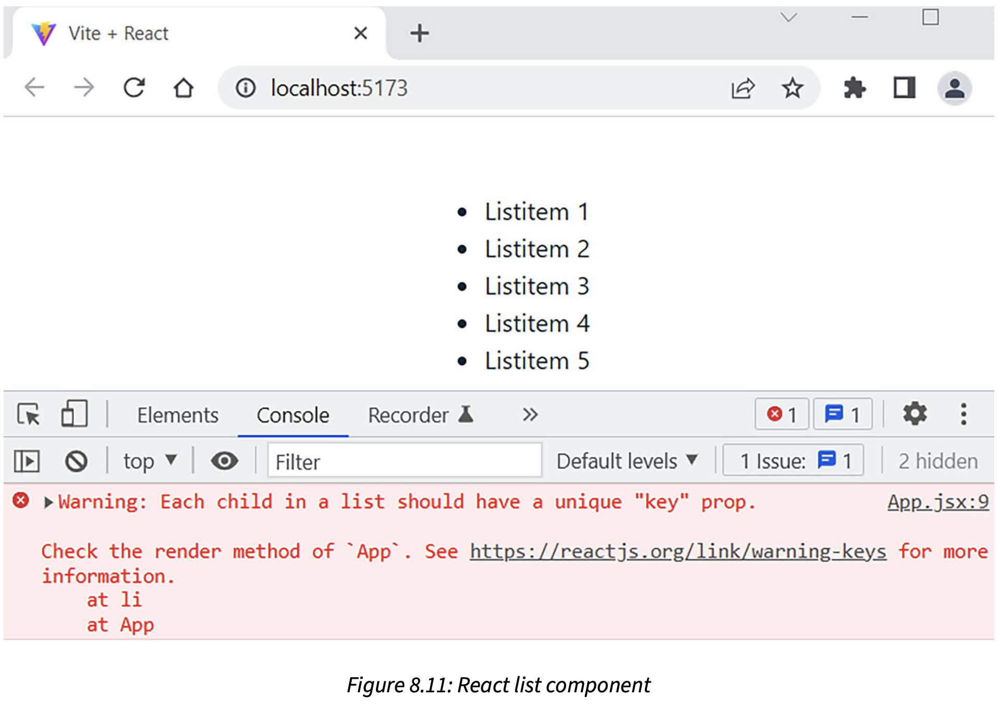

List items in React need a **unique key** that is used to detect rows that have been updated, added, or deleted. The map()
method also has a index as a second argument, which we use to handle the warning:

```
function MyList() {
    const data = [1, 2, 3, 4, 5];
    
    return (
        <>
            <ul>
                {
                    data.map((number, index) => 
                        <li key={index}>Listitem {number}</li>)
                }
            </ul>
        </>
    );
};

export default MyList;
```

```
The usage of index is not recommended because it can cause bugs  if the list is reordered of if you add or delete list
items. Instead of that, you should use a unique key from the data if that exists. There are also libraries available that
you can use to generate unique IDs, like uuid(https://github.com/uuidjs/uuid).
```

If the data is an array of objects, it would be nicer to present it in a table format. We do this in roughly the same 
way as we did with the list, but now we just map the array to table rows (tr elements) and render these inside the table
element, as shown in the following component code Now we have a unique ID in the data so we can use it as a key:

```
function MyTable() {
    const data = [
        {id: 1, brand: 'Ford', model: 'Mustang'},
        {id: 2, brand: 'VW', model: 'Beetle'},
        {id: 3, brand: 'Tesla', model: 'Model S'}];
        
    return (
        <>
            <table>
                <tbody>
                    {
                        data.map((item) =>
                            <tr>
                                <td>{item.brand}</td><td>{item.model}</td>
                            </tr>)
                    }
                </tbody>
            </table>
        </>
    );
};

export default MyTable;
```

The following screenshot shows what the component looks like when it is rendered.

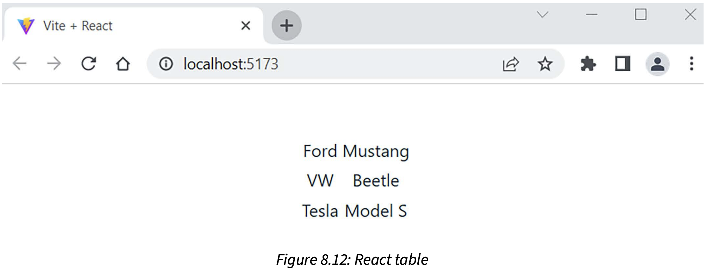

### Handling events with React

The difference compared to HTML event handling is that even naming uses *camelCase* in React. The following sample 
component code adds an event listener to a button and shows an alert message when the button is pressed:

```
function MyComponent() {
    // This is called when the button is pressed
    const handleClick = () => {
        alert('Button pressed');
    }
    return (
        <>
            <button onClick={handleClick}>Press Me</button>
        </>
    );
};

export default MyComponent;
```

You have to pass a function to the event handler instead of calling it. Now, the handleClick function is defined outside 
the return statement, and we can refer to it using the function name

```
// Correct
<button onClick={handleClick}>Press Me</button>

// Wrong
<button onClick={handleClick()}>Press Me</button>
```

In React, you cannot return *false* from the event handler to prevent the default behavior. Instead, you should call the
event object's preventDefault() method. In the following example, we are using a form element, and we want to prevent
from submission:

```
function MyForm() {
    // This is called when the form is submitted
    const handleSubmit = (event) => {
        event.preventDefault(); // Prevents default behaivor
        alert('Form submit');
    }
    
    return (
        <form onSubmit={handleSubmit}>
            <input type="submit" value="Submit" />
        </form>
    );
};

export default MyForm;
```

When you press the **Submit** button, you can see the alert and the form will not be submitted.

### Handling forms with React

An HTML form will navigate to the next page when it is submitted. In React, often, we want to invoke a JavaScript 
function that has access to form data after submission, and avoid navigating to the next page. We already covered how
to avoid submission with *preventDefault()*.

We create a form with one input field and **Submit** button. In order to get the value of the input field, we use the 
*onChange* event handler. We use the *useState* hook to create a state variable called text. When the value of the input
field is changed, the new value will be saved to the state. This component is called a **controlled component** because
form data is handled by React. In an uncontrolled component, the form data is handled only by the DOM.

The setText(event.target.value) statement gets the value from the input field and saves it to the state.

```
import { useState } from 'react';

function MyForm() {
    const [text, setText] = useState('');
    
    // Save input element value to state whe it has been changed
    const handleChange = (event) => {
        setText(event.target.value);
    }
    
    const handleSubmit = (event) => {
        alert(`You typed: ${text}`);
        event.preventDefault();
    }
    
    return (
        <form onSubmit={handleSubmit}>
            <input type="text" onChange={handleChange} value={text}/>
            <input type="submit" value="Press me" />
        </form>
    );
};

export default MyForm;
```

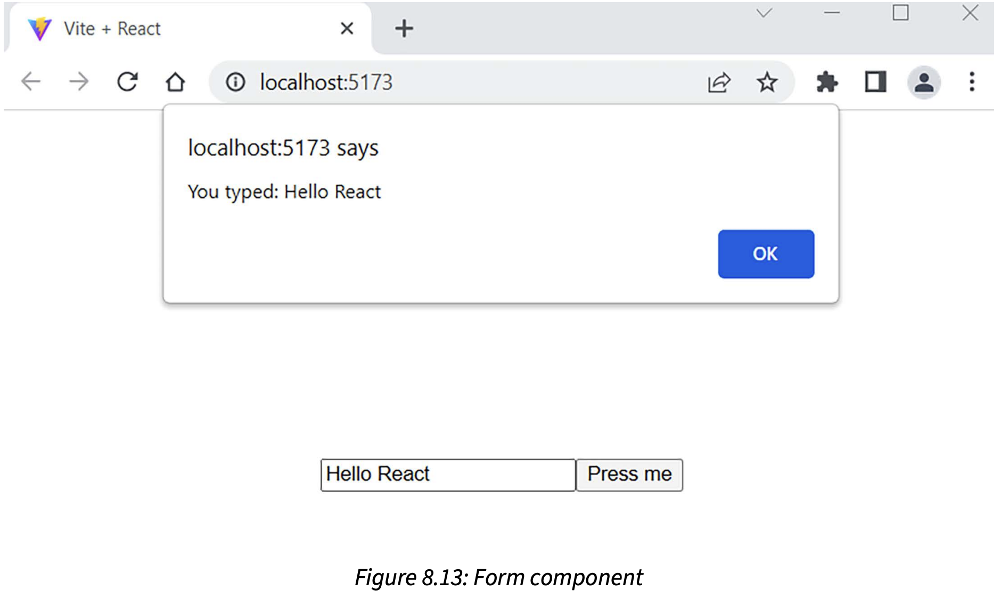

You can also write in inline onChange handler function using JSX.

```
return (
    <form onSubmit={handleSubmit}>
        <input type="text" onChange={event => setText(event.target.value)} value={text} />
        <input type="submit" value="Press me" />
    </form>
);
```

If we open the React Developer Tools **Components** tab with our React form app, we can inspect the current value of 
both props and the state.

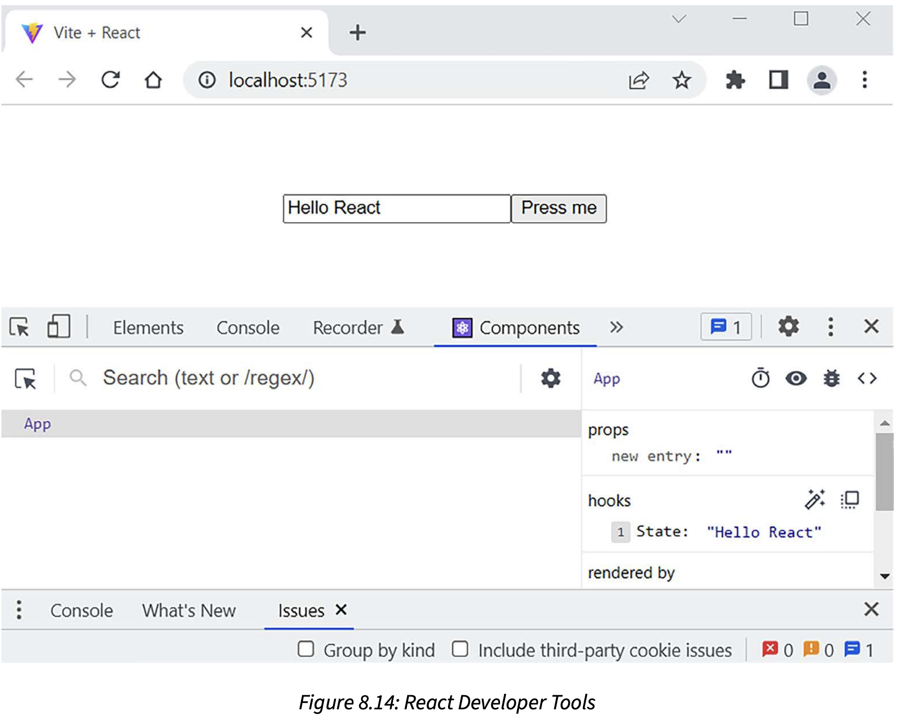

Let's look at how we can handle that using and object state. First, we introduce a state called user using the useState
hook.

```
const [user, setUser] = useState({
    firstName: '',
    lastName: '',
    email: ''
});
```

We add name attributes to our input fields. We can utilize these in the change handler to identify which input field triggers
the change handler. The *name* attribute value of the input element must be the same as the name of the state object 
property in which we want to save the value, and the value attribute should be object.property.

```
<input type="text" name="lastName" onChange={handleChange} value={user.lastName} />
```

If the input field that triggers the handler is the last name field, then event.target.name is lastName, and the typed value
will be saved to the object's lastName field. Here, we will also use the object spread notation that was introduced in the
**Props and state** section. In this way, we can handle all input fields with the one change handler:

```
const handleChange = (event) => {
    setUser({...user, [event.target.name]: event.target.value});
}
```

Full source

```
import { useState } from 'react';

function MyForm() {
    const [user, setUser] = useState({
        firstName: '',
        lastName: '',
        email: ''
    });
    
    // Save input box value to state when it has been changed
    const handleChange = (event) => {
        setUser({...user, [event.target.name]: event.target.value});
    }
    
    const handleSubmit = (event) => {
        alert(`Hello ${user.firstName} ${user.lastName}`);
        event.preventDefault();
    }
    
    return (
        <form onSubmit={handleSubmit}>
            <label>First name</label>
            <input type="text" name="firstName" onChange={handleChange} value={user.firstName} /><br />
            <label>Last name</label>
            <input type="text" name="firstName" onChange={handleChange} value={user.lastName} /><br />
            <label>Email </label>
            <input type="email" name="email" onChange={handleChange} value={user.email} /><br />
            <input type="submit" value="Submit" />
        </form>
    );
};

export default MyForm;
```

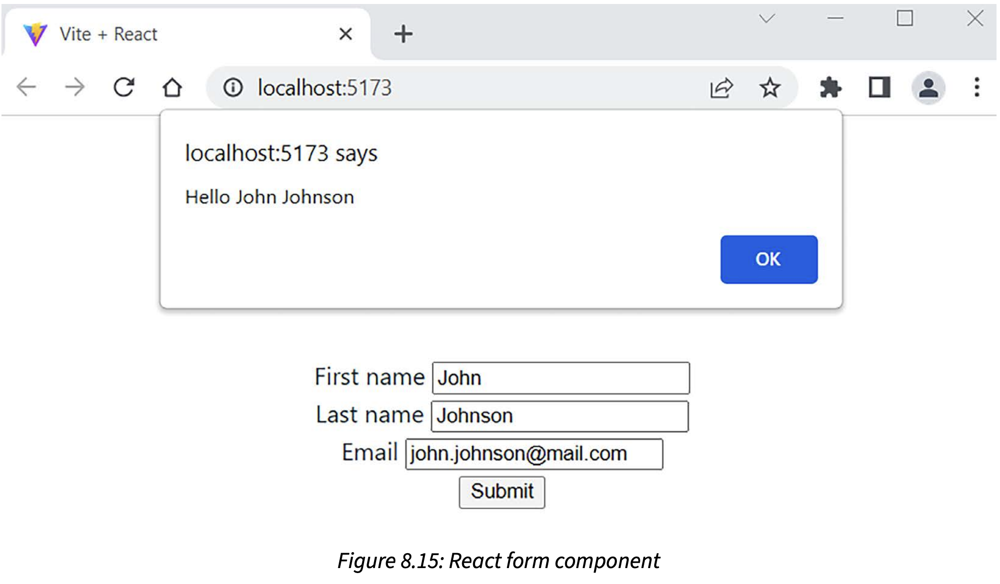

It could also be implemented using separate states instead of one state and object. Now, we have three states, and in the
input element's onChange event handler, we call the correct update function to save values into the states. In this case,
we don't need the name input element's name attribute:

```
import { useState } from 'react';

function MyForm() {
    const [firstName, setFirstName] = useState('');
    const [lastName, setLastName] = useState('');
    const [email, setEmail] = useState('');
    
    const handleSubmit = (event) => {
        alert(`Hello ${firstName} ${lastName}`);
        event.preventDefault();
    }
    
    return (
        <form onSubmit={handleSubmit}>
            <label>First name </label>
            <input onChange={e => setFirstName(e.target.value)} value={firstName} /><br />
            <label>Last name </label>
            <input onChange={e => setLastName(e.target.value)} value={lastName} /><br />
            <label>Email </label>
            <input onChange={e => setEmail(e.target.value)} value={email} /><br />
            <input type="submit" value="Press me" />
        </form>
    );
};

export default MyForm;
```

## 9 Introduction to TypeScript

### Common types

TypeScript will automatically define the type of a variable when you initialize it. This is called **type inference**. In
the following example, we declare a message variable and assign it to a string value. If we try to reassign it with 
another type, we get and error, as shown in the following image:


TypScript has the following primitive types: string, number, and boolean. The number type represents both integer and 
floating-point numbers. You can also set an explicit type for a variable using the following  syntax:

```
let variable_name: type;

let email: string;
let age: number;
let isActive: boolean;
```

The variable's type can be checked using the **typeof** keyword, which return a string representing the type of the variable

```
// Check variable type
console.log(typeof email); // Output is "string"
typeof email === "string"; // true
typeof age === "string"; //false
```

If you don't know the type of a variable, you can use the *unknown* type.

```
let externalValue: unknown;
```

```
TypeScript also provides the **any** type. If you define a variable using the any type, TypeScript doesn't perform a type 
check or inference on that variable. 
```

**Arrays** can be declared in the same way, but you have to define the type of the elements in the array.

```
let arrayOfNums: number[] = [1, 2, 3, 4];
let animals: string[] = ["Dog", "Cat", "Tiger"];
```

You can also use the Array generic type (Array<TypeOfElement>)

```
let arrayOfNums: Array<number> = [1, 2, 3, 4];
let animals: Array<string> = ["Dog", "Cat", "Tiger"];
```

Type inference also works with objects. If you create the following object, TypeScript creates an object with these inferred
types: id: number, name: string, and email: string.

```
const student = {
    id: 1,
    name: "Lisa Smith",
    email: "lisa.s@mail.com",
};
```

You can also define an object using the **interface** or **type** keyword, which describe the object's shape.

```
// Using interface
interface Student {
    id: number;
    name: string;
    email: string;
};

// Or using type

type Student = {
    id: number,
    name: string,
    email: string;
};
```

Then, you can declare an object that conforms to the Student interface or type:

```
const myStudent: Student = {
    id: 1,
    name: "Lisa Smith ",
    email: "lisa.s@mail.com",
};
```

You can define optional properties by using the question mark (?) at the end of the property name.

```
type Student = {
    id: number,
    name: string,
    email?: string;
};
// Student object without email
const myStudent: Student = {
    id: 1,
    name: "Lisa Smith"
}
```

The **optional chaining operator(?.) can be used to safely access object properties and methods that can be null or undefined
without causing an error.

```
type Person = {
    name: string,
    email: string,
    address?: {
        street: string,
        city: string;
    }
}
```

You can create an object based on the Person type that doesn't have the address property defined.

```
const person: Person = {
    name: "John Johnson",
    email: "j.j@mail.com"
}
```

If you try to access the address property, un error is thrown.

```
console.log(person.address.stree);
```

However, if you use optional chaining, the value undefined is printed

```
console.log(person.address?.street);
```

You can use the | operator to create a **union type**, a type that handles different types.

```
type InputType = string | number;
// Use your type
let name: InputType = "Hello";
let age: InputType = 12;
```

You can also use union types to defines sets of string or numbers.

```
type Fuel = "diesel" | "gasoline" | "electric";
type NoOfGears = 5 | 6 | 7;

type Car = {
 brand: string;
 fuel: Fuel;
 gears: NoOfGears;
}
```

### Functions

```
function sayHello(name: string) {
    console.log("Hello " + name);
}
```

You can also use union types in function parameters.

```
function checkId(id: string | number) {
  if (typeof id  === "string")
      // do something
  else
      // do something else
}
```

A function's return type can be declared in the following way:

```
function calcSum(x: number, y: number): number {
  return x + y;
}
```

Arrow function work in the same way in TypeScript.

```
const calcSum = (x:number, y:number): number => x + y;
```

If the arrow function returns nothing, you can use the **void** keyword

```
const sayHello = (name: string): void => console.log("Hello " + name);
```

### Using TypeScript features with React
### State and props
In React, you have to define the type of components props, so we can use type or interface to define the prop type.

```
function HelloComponent({ name, age }) {
  return (
    <>
      Hello {name}, you are {age} years old!
    </>
  );
}

export default HelloComponent;
```

Now, we can render our HelloComponent and pass props to it:

```
// imports...
function App() {
  return (
    <HelloComponent name="Mary" age={12} />
  )
}

export default App;
```

If we use TypeScript, we can first create a type that describe our props:

```
type HelloProps = {
  name: string,
  age: number,
};
```

Then, we can use our HelloProps type in the component props:

```
function HelloComponent({ name, age } : HelloProps) {
  return (
    <>
      Hello {name}, you are {age} years old!
    </>
  );
}

export default HelloComponent;
```

If there are optional props, you can mark these using the question mark in your type when you define the props

```
type HelloProps = {
  name: string;
  age?: number;
};
```

Now, you can use your component with or without age props

If you want to pass a function using the props, you can define it in your type.

```
// Function without parameters
type HelloProps = {
  name: string;
  age: number;
  fn: () => void;
};

// Function with parameters
type HelloProps = {
  name: string;
  age: number;
  fn: (msg: string) => void;
};
```

Quite often, you will want to use the same type in multiple files in your app. It is a good practice to extract 
types into their own file and export them:

```
// types.ts file
export type HelloProps = {
  name: string;
  age: number;
};
```

Then, you can import the type into any component where you need it:

```
// Import type and use it in your component
import { HelloProps } from ./types;

function HelloComponent({ name, age }: HelloProps) {
  return(
    <>
      Hello {name}, you are {age} years old!
    </>
  );
}

export default HelloComponent;
```

There is a standard React type, FC (**function component**), that we can use with arrow functions. This type takes a generic
argument that specifies the prop type, which is HelloProps in our case:

```
import React from 'react';
import { HelloProps } from './types';

const HelloComponent: React.FC<HelloProps> = ({ name, age }) => {
  return(
    <>
      Hello {name}, you are {age} years old!
    </>
  );
};

export default HelloComponent;
```

If you want to initialize your state to null or undefined, you can use the union operator, and the syntax is the 
following

```
const [message, setMessage] = useState<string | undefined>(undefined);
```

If you want to allow null values, you can use a union to allow either a User object or a null value:

```
type User = {
  id: number;
  name: string;
  email: number;
};

// Use type with state, the initial value is an empty User object
const [user, setUser] = useState<User>({} as User);

// If null values are accepted
const [user, setUser] = useState<User | null>(null);
```

## Consuming the REST API with React
### Promises
The traditional way to handle an asynchronous operation is to use callback functions for the success or failure of the 
operation.

```
function doAsyncCall(success, failure) {
  // Do some API call
  if (SUCCEED)
    success(resp);
  else
    failure(err);
}

success(response) {
  // Do something with response
}

failure(error) {
  // Handle error
}

doAsyncCall(success, failure);
```

A promise is an object that represents the result of an asynchronous operation. Promises are non-blocking.

With promises, we can execute asynchronous calls if the API or library we are using to send requests supports promises.
In the following example, an asynchronous call is made. When the response is returned, the callback function inside the 
**then** method is executed, taking the response as an argument.

```
doAsyncCall()
  .then(response => // Do something with the response)
```

The **then** method returns a promise. A promise can be in one of three states:

```
- Pending: Initial state
- Fullfilled (or Resolved): Successful operation
- Rejected: Failed operation
```

The following code demonstrates a simple object, where **setTimeout** simulates an asynchronous operation.

```
const myPromise = new Promise((resolve, reject) => {
  setTimeout(() => {
    resulve("Hello");
  }, 500);
});
```

The promise is in the pending state when the promise object is created and while the timer is running. After 500 milliseconds,
the **resolve** function is called with the value **"Hello"** and the promise enters the fulfilled state. If there is an error,
the promise state changes to rejected, and that can be handled using the **catch()** function.

You can chain many instances of **then** together, which means that you can run multiple asynchronous operations one after another:
```
doAsyncCall()
  .then(response => // Get some data from the response)
  .then(data => // Do something with the data);
```

You can also add error handling to promises by using **catch()**. The **catch()** is executed if any error occurs in the 
preceding **then** chain

```
doAsyncCall()
  .then(response => // Get some data from the response)
  .then(data => // Do something with data)
  .catch(error => console.error(error))  
```

### Async and wait
The **async/await** method is based on promises. To use **async/await**, you must define **async()** function that can 
contain **await** expressions

```
const doAsyncCall = async () => {
  const response = await fetch('http://someapi.com');
  const data = await response.json();
  // Do something with the data
}
```

The **fetch()** function returns a promise, but now it is handled using **await** instead of the **then** method.

For error handling, you can use **try...catch** with **async/await**.

```
const doAsyncCall= async () => {
  try {
    const response = await fetch('http://someapi.com');
    const data await response.json();
    // Do something with the data 
  }
  catch(err) {
    console.error(err);
  }
}
```

### Using the fetch API
The idea of the **fetch** API is similar to the traditional **XMLHttpRequest** or Query Ajax API, but the **fetch** API
also support promises. You don't have to install any libraries if you are using **fetch** and it is supported by modern
browsers natively.

The **fetch** API provides a **fetch()** method that has one mandatory argument: the path of the resource you are calling.

```
fetch('https://someapi.com')
.then(response => response.json())
.then(data => console.log(data))
catch(error => console.log(error))
```

The **fetch()** method returns a promise that contains the response. You can use the **json()** method to extract the 
JSON data from a response, and this method also returns a promise.

The **response** that is passed to the first **then** statement is an object that contains the properties **ok** and 
**status**, which can use to check whether the request was successful. 

```
fetch('http://someapi.com')
  .then(response => {
    if (response.ok)
      // Successful request -> Status 2XX
    else 
      // Something went wrong -> Error response
  })
  .then(data => console.log(data))
  .catch(error => console.log(error))
```

To use another HTTP method, such as **POST**, you must define it in the second argument of the **fetch()** method. The
second argument is an object where you can define multiple request settings.

```
fetch('http://someapi.com', {method: 'POST'})
  .then(response => response.json())
  .then(data => console.log(data))
  .catch(error => console.log(error))
```

You can also add headers inside the second argument. The following **fetch()** call contains the 
**'Content-Type': 'application/json'** header.

```
fetch('http://someapi.com',
  {
    method: 'POST',
    headers: {'Content-Type':'application/json'}
  }
.then(response => response.json))
.then(data => console.log(data))
.catch(error => console.log(error))
```

If you have to send JSON-encoded data inside the request body.

```
fetch('http://someapi.com',
  {
    method: 'POST',
    headers: {'Content-Type':'application/json'},
    body: JSON.stringify(data)
  }
.then(response => response.json())
.then(data => console.log(data))
.catch(error => console.log(error))
```

## Useful third-party Components for React
### Installing third-party React components

One good site to search for components on is JS.coach (https://js.coach/). Another good source for React components is
**awesome-react-components:https://github.com/brillout/awesome-react-components.

If you want to install a specific version of a component, you can use the following command:

```
npm install component_name@version
```

And if you want to remove an installed component from your React app, you can use the following command:

```
npm uninstall component_name
```

You can see what components are outdated by using the following command in your project root directory. If the output is
empty, all components are in the latest version:

```
npm outdated
```

You can update all outdated components 

```
npm update
```

You can get the list of your project dependencies by using the following **npm** command:

```
npm list
```

### Working with AG Grid
AG Grid (https://www.ag-grid.com/) is a flexible data grid component for React apps. It is
like a spreadsheet that you can use to present your data.

1. To install the **ag-grid** community component.

```
npm install ag-grid-community ag-grid-react
```

2. Open the **App.tsx** file and remove the **table** element inside the **return** statement.

```
import { useState } from 'react';
import axios from 'axios';
import './App.css';

type Repository = {
 id: number;
 full_name: string;
 html_url: string;
};

function App() {
 const [keyword, setKeyword] = useState('');
 const [repodata, setRepodata] = useState<Repository[]>([]);
 const handleClick = () => {
   
   axios.get<{ items: Repository[] }>(`https://api.gitub.com/search/repositories?q=${keyword})
    .then(response => setRepodata(response.data.items))
    catch(err => console.error(err));
 }
 
 return  (
  <>
   <iput value={keyword} onChange={e => setKeyword(e.target.value)} />
   <button onClick={handleClick}>Fetch</button>
  </>
 );
}

export default App;
```

3. Import the **ag-grid** component and stylesheets by adding the following lines in 
**App.tsx** file.

```
import { AgGridReact } from 'ag-grid-react';
import 'ag-grid-community/styles/ag-grid.css';
import 'ag-grid-community/styles/ag-theme-material.css';
```

4. We will add the imported **AgGridRect** component to the **return** statement. To fill
the **ag-grid** component with data, you have to pass the **rowData** prop to the component.

```
return (
 <div className="App">
  <input value={keyword} onChange={e => setKeyword(e.target.value)} />
  <button onClick={fetchData}>Fetch</button>
  <div className="ag-theme-material" style={{height:500, width:850}}>
   <AgGridReact rowData={repository} />
  </div>
 </div>
);
```

5. We will define columns for the **ag-grid**. We will define a state called **columnDefs**, which
is an array of column definition objects. **ag-grid** provides a **ColDef** type that we can use here.
In a column object, you have to define the data accessor by using the required **field** props. The
**field** value is the property name in the REST API response data that the column should display:

```
import { ColDef } from 'ag-grid-community';
const [columnDefs] = useState<ColDef[]>([
 {field: 'id'},
 {field: 'full_name'},
 {field: 'html_url'},
]);
```

6. Finally, we will use the AG Grid **columnDefs** prop to define these columns.

```
<AgGridReact
 rowData={data}
 columnDefs={columnDefs}
```

### Managing routing with React Router

React Router (https://github.com/ReactTraining/react-router) provides a package called **react-router-dom**.
React Router uses URL-based routing, which means that we can define which component is rendered
based on the URL.

```
npm install react-router--dom@6
```

The **react-router-dom** library provides components that are used to implement routing. **BrowserRouter** 
is the router for web-based applications. The **Route** component renders the defined component if the
given locations match.


8. Sorting and filtering can be enabled using the **sortable** and **filter** props in **ag-grid** columns.

```
const [columnDefs] = useState<ColDef[]>([
 {field: 'id', sortable: true, filter: true},
 {field: 'full_name', sortable: true, filter: true},
 {field: 'html_url', sortable: true, filter: true}
]);
```

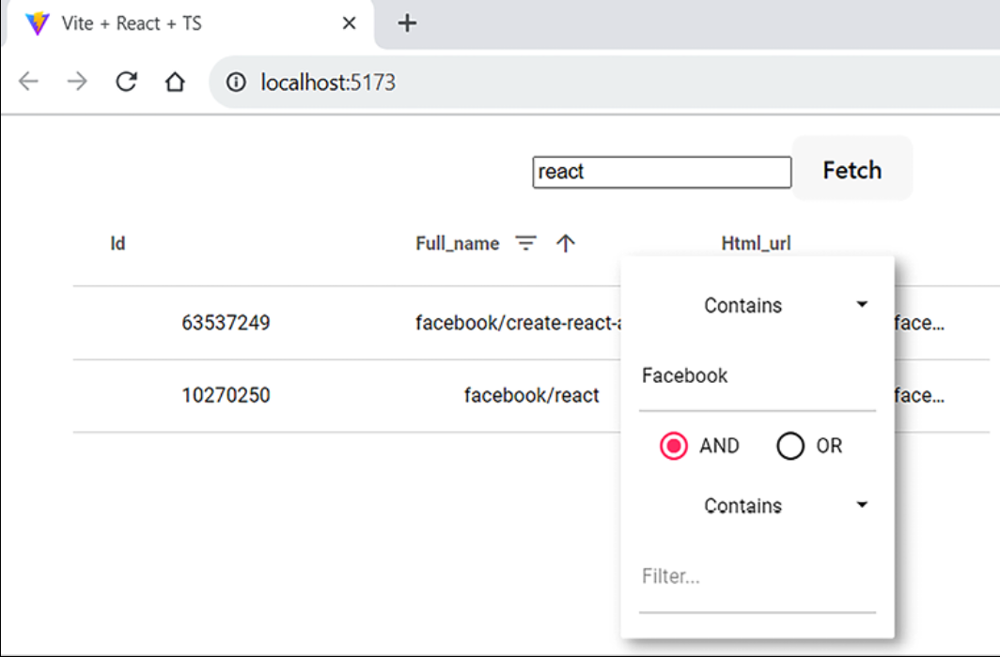

9. You can also enable paging and set the page size in **ag-grid** by using the
**pagination** and **paginationPageSize** props

```
<AgGridReact
 rowData={data}
 columnDefs={columnDefs}
 pagination={true}
 paginationPageSize={8}
/>
```

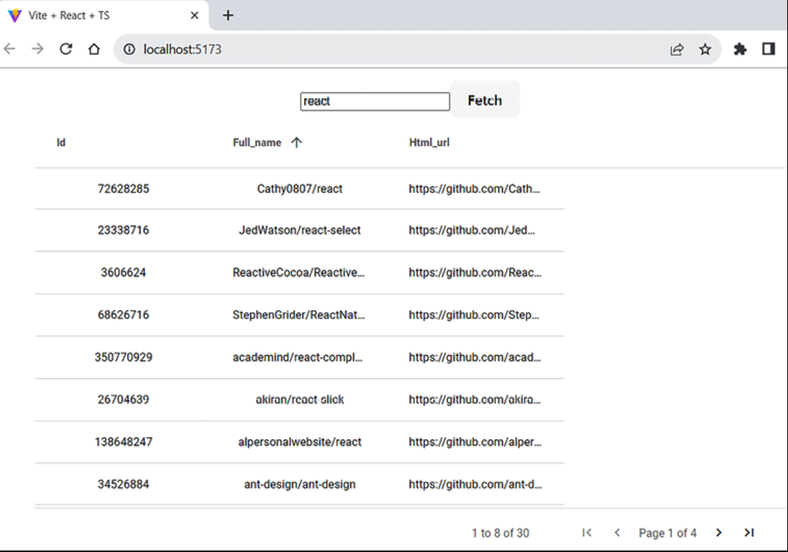

10. The **cellRenderer** prop can be used to customize the content of a table cell. The
following example shown how you can render a button in a grid cell

```
// Import ICellRendererParams
import { ICellRendererParams } from 'ag-grid-community';
// Modify columnDefs
const columnDefs = useState<ColDef[]>([
  {field: 'id', sortable: true, filter: true},
  {field: 'full_name', sortable: true, filter: true},
  {field: 'html_url', sortable: true, filter: true},
  {
    field: 'full_name',
    cellRenderer: (params: ICellRendererParams) => (
      <button
        onClick={() => alert(params.value)}>
        Press me
      </button>
    ),
  },
]);
```

The function in the cell renderer accepts params as an argument. The **param.value** will be the value of the **full_name**
cell, which is defined in the **field** property of the column definition. If you need access to all values in a row, 
you can use **params.row**, which is the whole row object.

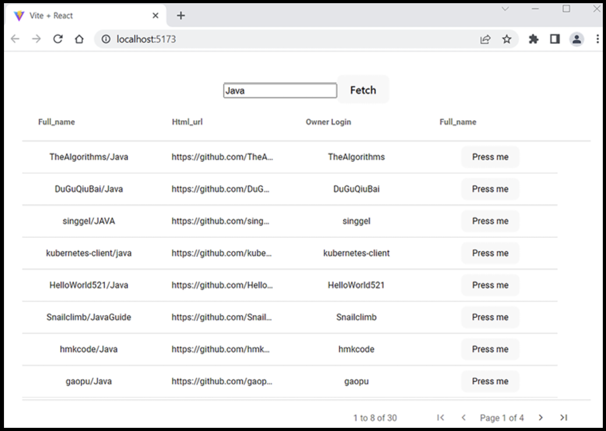

### Using the Material UI component library

Material UI (https://mui.com/), or MUI, is the React component library that implements
Google's Material Design language (https://m2.material.io/design).  

A small shopping list app and style the UI using MUI components.

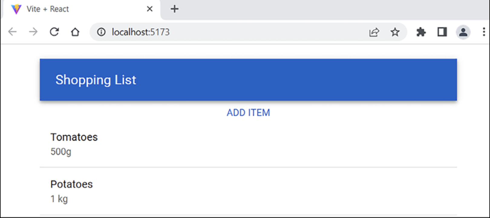

1. Create a new React app called **shoppinglist**

```
npm create vite@latest
cd shoppinglist
npm install
```

2. Install MUI in the project root folder

```
npm install @mui/material @emotion/react @emotion/styled
```

To use Roboto fonts, add the following line inside the **head** element of your **index.html** file:

```
<link
rel="stylesheet"
href="https://fonts.googleapis.com/css?family=\
          Roboto:300,400,500,700&display=swap"
/>
```

4. Open the **App.tsx** file and remove all the code inside the fragment(**<></>**).

```
// App.tsx
import './App.css'
function App() {
  return (
    <>
    </>
  );
}
```

5. MUI provides different layout components, and the basic layout component is **Container**. You can
specify the maximum width of a container using the **maxWidth** prop; the default value is **lg**(large).

```
import Container from '@mui/material/Container';
import './App.css';
function App() {
  return (
    <Container>
    </Container>
  );
}
export default App;
```

6. Remove the **index.css** file import from the **main.tsx** file so that we get full screen for our app.

```
// main.tsx
import React from 'react'
import ReactDOM from 'react-dom/client'
import App from './App.jsx'
import './index.css' // REMOVE THIS LINE
ReactDOM.createRoot(document.getElementById('root')).render(
  <React.StrictMode>
    <App />
  </React.StrictMode>
)
```

7. Import the **AppBar**, **ToolBar**, and **Typography** components into your **App.tsx** file.

```
import { useState } from 'react';
import Container from '@mui/material/Container';
import AppBar from '@mui/material/AppBar';
import Toolbar from '@mui/material/Toolbar';
import Typography from '@mui/material/Typography';
import './App.css'
```

8. Render the **AppBar** by adding the following code to your **App** component's **return** statement.

```
function App() {
  return (
    <Container>
      <AppBar position='static'>
        <Toolbar>
          <Typography variant="h6">
            Shopping List
          </Typography>
        </Toolbar>
      </AppBar>
    </Container>
  );
}
```

9. It should now look like this:

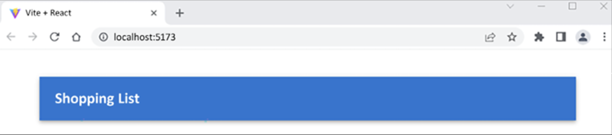

10. We need one array state to save the shopping list items. We have to create a type for
for the shopping items, **Items**.

```
// App.tsx
export type Item = {
  product: string;
  amount: string;
}
```

11. Create a state called **items**, whose type is an array of **items** types:

```
const [items, setItems] = useState<Item[]>([]);
```

12. Then, create a function that adds a new item to the **items** state. We will use spread notation
(...) to add a new item at the beginning of an existing array:

```
const addItem = (item: Item) => {
  setItems([item, ...items]);
}
```

13. Create a new file called AddItem.tsx in the root folder of the app. The **AddItem**
component function receives **props** from its parent component.

```
function AddItem(props) {
  return(
    <></>
  );
}
export default AddItem;
```

We'll add two input fields, **product** and **amount**, and a button that calls the **App**
component's **addItem** function. To be able to call the **addItem** function, which is in the
**App** component, we have to pass it in **props** when rendering the **AddItem** component.
Outside the modal **Dialog** component, we'll add a button that opens the model form where the
use can enter a new shopping item.

14. Add the following imports to your **AddItem.tsx** file:

```
import Button from '@mui/material/Button';
import TextField from '@mui/material/TextField';
import Dialog from '@mui/material/Dialog';
import DialogActions from '@mui/material/DialogActions';
import DialogContent from '@mui/material/DialogContent';
import DialogTitle from  '@mui/material/DialogTitle';
```

We will declare one state called **open** and two functions to open and close the modal dialog (**handleOpen** and **handleClose**).

```
// AddItem.tsx
// Import useState
import { useState } from 'react';
// Add state, handleOpen and handleClose functions
const [open, setOpen] = useState(false);
const handleOpen = () => {
  setOpen(true);
}

const handleClose = () => {
  setOpen(false);
}
```

We have one button the dialog that will be visible when the component is rendered for the first time.
When the button is pressed, it calls the **handleOpen** function, which opens the dialog.

```
return (
  <>
    <Button onClick={handleOpen}>
      Add Item
    </Button>
    <Dialog open={open} onClose={handleClose}>
      <DialogTitle>New Item</DialogTitle>
      <DialogContent>
      </DialogContent>
      <DialogActions>
        <Button onClick={handleClose}>
          Cancel
        </Button>
        <Button onClick={addItem}>
          Add
        </Button>
      </DialogActions>
    </Dialog>
  </>
);
```

17. To collect data from a user, we have to declare one more state. This state is use to store
a shopping item that the user enters.

```
// Add the following import to AddItem.tsx
import { Item } from './App';
```

18. The type of the state is **Item**, and we initialize it to an empty **Item** object

```
// item state
const [item, setItem] = useState<Item>({
  product: '',
  amount: '',
});
```

19. Inside the **DialogContent** component, we'll add two inputs to collect data from the user. We'll
use the **TextField** MUI Component. The **Value** props of the text fields must be the same as the state
where we want to save the typed value. The **onChange** event listener saves the typed value to the **item**
state when the user types something into the text fields. In the **product** field, the value is saved to the
**item.product** property, and in the **amount** field, value is saved to the **item.amount** property.

```
<DialogContent>
  <TextField value={ item.product} margin="dense" onChange={e => setItem({...item, product: e.target.value}) } label="Product" fullWidth />
  <TextField value={ item.amount} margin="dense" onChange={e => setItem({...item, amount: e.target.value}) } label="Amount" fullWidth />
</DialogContent>
```

20. We have to create a function that calls the **addItem** function that we receive in the props. The function takes a 
new shopping item as an argument. First, we define a type for the props. The **addItem** function that is passed from the
**App* component accepts one argument of the type **Item**, and the function doesn't return anything.

```
// AddItem.tsx
type AddItemProps = {
  addItem: (item: Item) => void;
}
function AddItem(props:AddItemProps) {
  const [open, setOpen] = useState(false);
  // Continues...
}
```

21. Since we get the **Item** function from the props, we can call it using the **props** keyword. We'll also call the 
**handleClose** function.

```
// Calls addItem function and passes item state into it
const addItem = () => {
  props.addItem(item);
  // Clear text fields and close modal dialog
  setItem({ product: '', amount: '' });
  handleClose();
}
```

22. We have to import it into our App.tsx file and render it there.

```
import AddItem from './AddItem';
```

23. Add the AddItem component to the return statement in the **App.tsx** file. Pass the **addItem** function in a prop to
the **AddItem** component.

```
// App.tsx
return (
  <Container>
    <AppBar position="static">
      <Toolbar>
        <Typography variant="h6">
          Shopping List
        </Typography>
      </Toolbar>
    </AppBar>
    <AddItem addItem={addItem} />
  </Container
);
```

24. You will see the modal from opening, and you can type in a new item, as illustrated in the following screenshot.

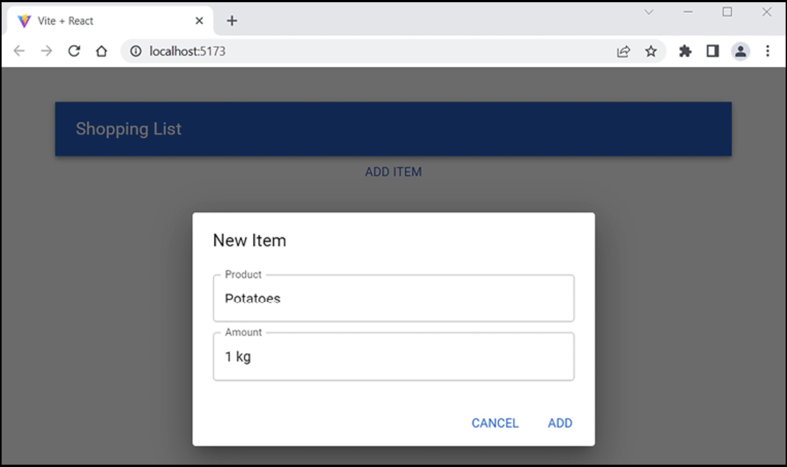

25. We'll add a list to the **App** component that shows the shopping items.

```
// App.tsx
import List from '@mui/material/List';
import ListItem from '@mui/material/ListItem';
import ListItemText from '@mui/material/ListItemText';
```

26. We'll render the **List** component. 

```
// App.tsx
return (
  <Container>
    <AppBar position="static">
      <Toolbar>
        <Typography variant="h6">
          Shopping List
        </Typography>
      </Toolbar>
    </AppBar>
    <AddItem addItem={addItem} />
    <List>
      {
        items.map((item, index) =>
          <ListItem key={index} divider>
            <ListItemText primary={item.product} secondary={item.amount} />
          </ListItem>
        )
      }
    </List>
  </Container>
);
```

27. The UI looks like this:

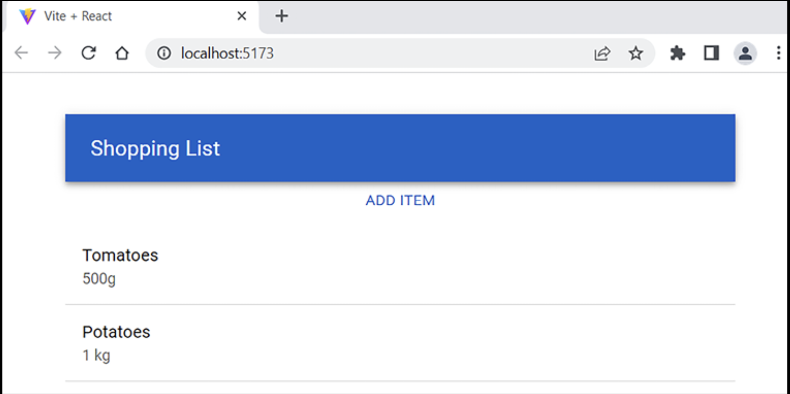