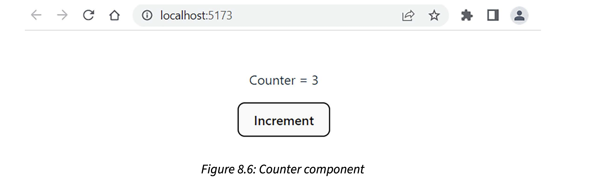
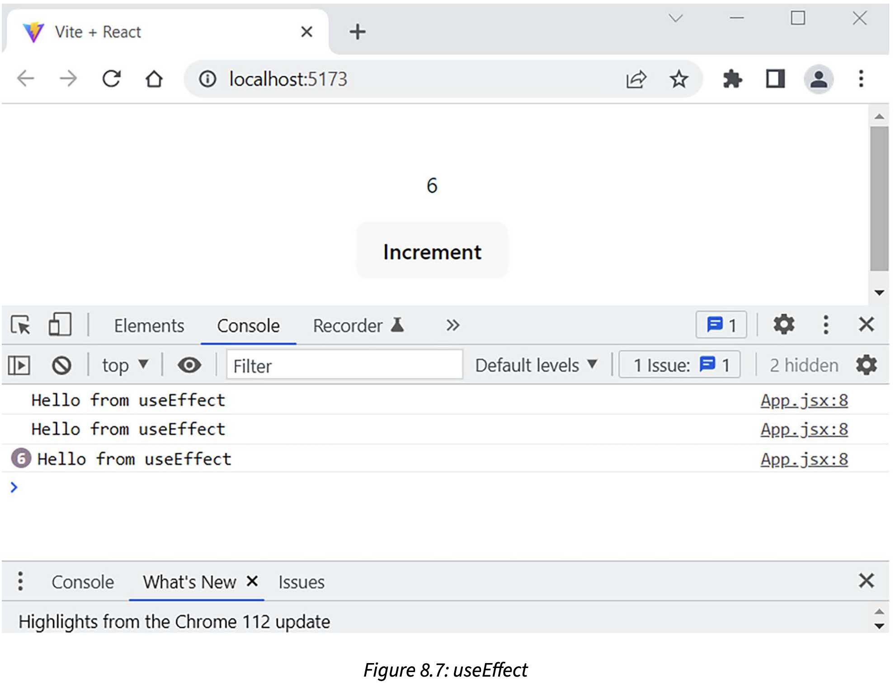
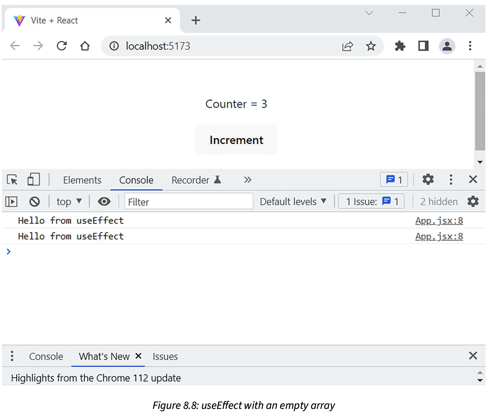
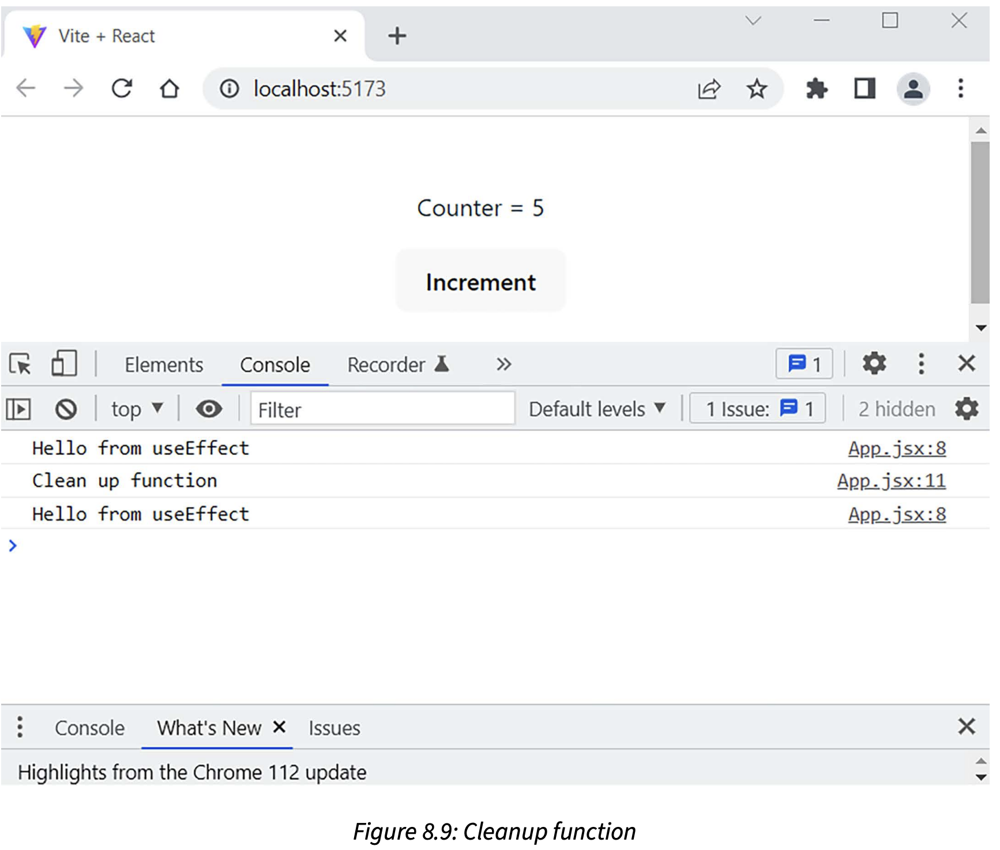
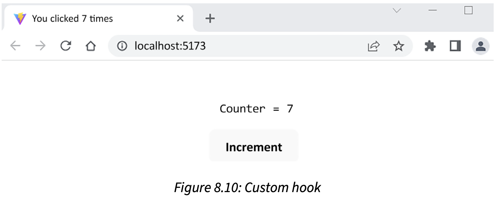

## Creating React components

React is component-based, and the components are independent and reusable.


The components can then be arranged in a **tree hierarchy**.


The **root component** has two **child component**: the search component and the table component.
The table component has one child component: the table row component. The important thing to
understand with React is that the data flow goes from a parent component to a child component.

React uses the **virtual document object model (VDOM)** for selective re-rendering of the UI. The 
**document object model (DOM)** is a programming interface for web documents that represent the web
page as a structured tree of objects. Each object in a tree corresponds to a part of the document.
The VDOM is lightweight copy of the DOM, and manipulation of the VDOM is much faster than it is whith the
real DOM. After the VDOM is updated, React compares it to a snapshot that was taken of the VDOM before
updates were run. After the comparison, React will know which parts have been changed, and only these 
parts will be updated to the real DOM.

A React component can be defined either by using a JavaScript function - a **functional component**
or the ES6 JavaScript class - a **class component**.

JavaScript function
```
// Using JavaScript function
function App() {
    return <h1>Hello World</h1>;
}
```

ES6 to create a component
```
// Using ES6 class
class App extends React.Component {
    render() {
        return <h1>Hello World</h1>;
    }
}
```

The class component contains the required render() method, which shows and updates the rendered output of the component.
If you compare the functional and class App components, you can see that the render() method is not needed in the 
functional component. Before React version 16.8, you had to use class components to be able to use states. Now, you can
use hooks to create states with functional components as well.

The name of the React component should start with a capital letter. It is also recommended to use the PascalCase naming
convention.

If your component returns multiple elements, you have to wrap these inside one parent element. Such as a div.

```
// Wrap elements inside the div
function App() {
    return (
        <div>
            <h1>Hello World</h1>
            <h2>This is my first React component</h2>
        </div>
    );
}
```

You can also use a React **fragment**. Fragments don't add any extra nodes to the DOM tree:

```
// Using fragments
function App() {
    return (
        <React.Fragment>
            <h1>Hello World</h1>
            <h2>This is my first React component</h2>
        </React.Fragment>
    );
}
```

```
// Using fragments short syntax
function App() {
    return (
        <>
            <h1>Hello World</h1>
            <h2>This is my first React component</h2>
        </>
    );
}
```

The react-dom package provides DOM-specific methods for us.

main.jsx file

```
import React from 'react'
import ReactDOM from 'react-dom/client'
import App from './App'
import './index.css'

ReactDOM.createRoot(document.getElementById('root')).render(
    <React.StrictMode>
        <App />
    </React.StrictMode>
)
```

The react-dom package provides DOM-specific methods for us. To render the React component to the DOM, we can use the 
render method from the react-dom package. React.StrictMode is used to find potential problems in your React app and these
are printed in the browser console. Strict Mode only runs in development mode.

The **root API** is used to render React components inside a browser DOM node. we first create a root by passing the DOM
element to the createRoot method. The root calls the render method to render an element to the root.

```
import ReactDOM from 'react-dom/client';
import App from './App';

const container = document.getElementById('root');

// Create a root
const root = ReactDOM.createRoot(container);

// Render an element to the root
root.render(<App />);
```

The container in the root API is the <div id="root"></div> can be found in the index.html

```
<!DOCTYPE html>
<html lang="en">
    <head>
        <meta charset="UTF-8" />
        <link rel="icon" type="image/svg+iml" href="/vite.svg" />
        <meta name="viewport" content="width=device-width, initial-scale=1.0" />
        <title>Vite + React</title>
    </head>
    <body>
        <div id="root"></div>
        <script type="module" src="/src/main.jsx"></script>
    </body>
</html>
```

At the end of the source code, there is an export default statement that exports the component, and it can be made 
available to other components by using the import statement

```
import {useState} from 'react'
import reactLogo from './assets/react.svg'
import viteLogo from '/vite.svg'
import './App.css'

function App() {
    const [count, setCount] = useState(0)
    
    return (
        <div className="App">
            <div>
                <a href="https://vitejs.dev" target="_blank">
                    
                </a>
                <a href="https://reactjs.org" target="_blank">
                    
                </a>
            </div>
            <h1>Hello React</h1>
            <div className="card">
                <button onClick={() => setCount((count) => count + 1)}>
                    count is {count}
                </button>
                <p>
                    Edit <code>src/App.jsx</code> and save to test HMR
                </p>
            </div>
            <p className="read-the-docs">
                Click on the Vite and React logos to learm more
            </p>
        </div>
    )
}

export default App
```

There can only be one export default statement per file, but there can be multiple named export statements. Default exports
are commonly used to export React components. Named exports are commonly used to export specific functions or objects from
module.

```
import React from 'react' // Import default value
import { name } from ... // Import named value
```

```
export default React // Default export
export { name } // Named export
```

### Const and variables

Constants, or immutable variables, can be defined by using a **const** keyword. When using the const keyword, the variable
content cannot be reassigned:

```
contst PI = 3.14159;
```

The const is block-scoped. This means that the const variable can only be used inside the block in which it is defined.
If const is defined outside of any function or block, it becomes a global variable, and you should try to avoid this
situation. 

```
let count = 10;

if (count > 5) {
    const total = count * 2;
    console.log(total); // Prints 20 to console
}

console.log(total); // Error, outside the scope
```

The following example demonstrates what happens when const is an object or array:

```
const myObj = {foo: 3};
myObj.foo = 5; // This is ok
```

When const is an object or array, its properties or elements can be updated.
The **let** keyword allow you to decalre **mutable** block-scoped variables. The variables declared using **let** can be
used inside the block in which it is declared(it can also be used inside sub-blocks).

### Arrow functions

The traditional way of defining a function in JavaScript is by using a **function** keyword.

```
function(x) {
    return x * 2;
}
```

When we use the ES6 arrow function, the function look like this:

```
x => x * 2
```

The function is a so-called **anonymous function**, and we can't call it. Anonymous function are often used as an argument
for other functions. In JavaScript, functions are *first-class citizens* and you can store functions in variables.

```
const calc = x => x * 2;
```

Now, you can use the variable name to call the function

```
calc(5);
```

When you have more than one argument, you have to wrap the arguments in parenthesis and separate the arguments with a 
comma to use the arrow function effectively.

```
const calcSum = (x, y) => x + y
// function call
calcSum(2, 3); // return 5;
```

If the function body is an expression, then you don't need to use the **return** keyword. When you have multiple lines
in the function body, you have to use curly brackets and a **return** statement.

```
const calcSum = (x , y) => {
    console.log('Calculating sum');
    return x + y;
}
```

If the function doesn't have any arguments, then you should use the empty parenthesis.

```
const sayHello = () => "Hello"
```

### Template literals

Template literals can be used to concatenate strings. You have to use backticks(``) instead of single or double quotes:

```
let person = {firstName: 'John', lastName: 'Johnson'};
let greeting = `Hello ${person.firstName} ${person.lastName}`;
```

### Object destructuring

Object destructuring feature allows you to extract values from an object and assign them to a variable.

```
conts person = {
    firstName: 'John',
    lastName: 'Johnson',
    email: 'j.johnson@mail.com'
};
```

You can destructure it using the following statement:

```
const { firstName, lastName, email } = person;
```

It creates three variables , firstName, lastName, and email, which get their values from the person object.

### Classes and inheritance

The keyword for defining classes is **class**. A class can have fields, constructors, and class methods.

```
class Person {
    constructor(firstName, lastName) {
        this.firstName = firstName;
        this.lastName = lastName;
    }
}
```

Inheritance is performed with an **extends** keyword. The following sample code shows an **Employee** class that inherits
a **Person** class. This means that it inherits all fields from the parent class andd can have its own fields that are 
specific to **Employee**. In the constructor, we first call the parent class constructor by using the **super** keyword.
That call is required by the rest of the code, and you will get an error if it is missing:

```
class Employee extends Person {
    constructor(firstName, lastName, title, salary) {
        super(firstName, lastName);
        this.title = title;
        this.salary = salary;
    }
}
```

**Babel** is a JavaScript compiler that is used to compile ES6 (or newer versions) to an older version that is compatible
with all browsers.

### JSX and styling

JavaScript XML (JSX) is the syntax extension for JavaScript. JSX prevents injection attacks because all values are escaped
in JSX before they are rendered. You can embed JavaScript expressions in JSX by wrapping them with curly brackets.

```
function App(props) {
    return <h1>Hello World {props.user}</h1>;
}
```

You can also pass a JavaScript expressions as props.

```
<Hello count={2+2} />
```

You can use both inline and external styling with React JSX elements. This first one defines the style inside the **div**
element:

```
<div style={{ height: 20, width: 200 }}>
    Hello
</div>
```

The second creates a style object first, which is then used in the **div** element. The object name should use the 
**camelCase** naming convention:

```
const divStyle = { color: 'red', height: 30 };

const MyComponent = () => (
    <div style={divStyle}>Hello</div>
);
```

You can import a style sheet into a React component. To reference classes from an external CSS file, you should use a
**className** attribute.

```
import './App.js';
...
<div className="App-header"> This is my app</div>
```

## Props and state
**Props** and **state** are the input data for rendering a component.
### Props
**Props** are inputs to components, and they are a mechanism to pass data from a parent component to its child component.
Props are JavaScript objects, so they can contain multiple key-value pairs.

Props are inmutable, so a component cannot change its props. A component can access props through the props object that is
passed to the function component as a parameter.

```
function Hello() {
    return <h1>Hello John</h1>;
}
```

Instead of using a hardcoded name, we can pass a name to the Hello component by using props.

```
function Hello(props) {
    return <h1>Hello {proprs.user}</h1>;
}
```

The parent component can send props to the Hello component

```
<Hello user="John" />
```

You can also pass multiple props to a component

```
<Hello firstName="John" lastName="Johnson" />
```

Now, you can access both props in the component using the props object.

```
function Hello(props) {
    return <h1>Hello {props.firstName} {props.lastName}</h1>;
}
```

You can also use object destructuring to destructure a props object

```
function Hello({ firstName, lastName }) {
    return <h1>Hello {firstName} {lastName}</h1>;
}
```

### State

The component **state** is an internal data store that holds information that can change over time. The state also 
affects the rendering of the component. When the state is updated, React schedules a re-render of the component. When
the component re-renders, the state retains its latest values. State allows components to be dynamic and responsive to
user interactions or other events.

The state is created using the useState hook function. It takes one argument, which is the initial value of the state,
and returns an array of two elements. The first element is the name of the state, and the second element is a function
that is used to update the state value. 

```
const [state, setState] = React.useState(initialValue);
```

The next code creates a state variable called name, and the initial value is Jim:

```
const [name, setName] = React.useState('Jim');
```

You can also import the useState function from React

```
import React, { useState } from 'react';
```

Then, you don't need to type the React keyword

```
const [name, setName] = useState('Jim');
```

The value of the state can now be updated by using the setName function. This is the only way to modify the state value

```
setName('John');
```

You should never update the state value directly using the = operator. You will also get an error because you cannot
reassign the const variable.

```
// Don't do this, UI won't re-render
name = 'Jonh';
```

You can also define state using an object

```
const [name, setName] = useState({
    firstName: 'John',
    lastName: 'Johnson'
});
```

You can update both the firstName and lastName state object parameters using the setName function

```
setName({ firstName: 'Jim', lastName: 'Palmer' })
```

If you want to do a partial update of the object, you can use the **spread operator**. It clones the name state object
and updates the firstName value to be Jim

```
setName({ ...name, firstName: 'Jim' })
```

A state can be accessed by using the state name. The scope the state is the component, so it cannot be used outside 
the component.

```
// Renders Hello John
import React, { useState } from 'react';

function MyComponent() {
    const [firstName, setFirstName] = useState('John');
    
    return <div>Hello {firstName}</div>
}
```

If you state is an object, then you can access it in the following way:

```
const [name, setName] = useState({
    firstName: 'John',
    lastName: 'Johnson'
});

return <div>Hello {name.firstName}</div>;
```

### Stateless components

The React **stateless component** is just a pure JavaScript function that takes props as an argument and return a React
element 

```
function HeaderText(props) {
    return (
        <h1>
            {props.text}
        </h1>
    )
}

export default HeaderText;
```

This is also called a **pure component**. React provides React.demo(), which optimizes the performance of pure functional
components.

```
import React, { memo } from 'react';

function HeaderText(props) {
    return (
        <h1>
            {props.text}
        </h1>
    )
}

export default memo(HeaderText);
```

React renders a memorized result if the props are not changed. The React.memo() phrase also has a second argument, 
**arePropsEquals()**, which you can use to customize rendering conditions. 

### Conditional rendering 

This feature can be used, for example, to show or hide some elements, handle authentication, and so on.

```
function MyComponent(props) {
    const isLoggedin = props.isLoggedin;
    
    if (isLoggedin) {
        return (
            <Logout />
        )
    }
    
    return (
        <Login />
    )
}
```

You can also implement this by using condition ? true : false logical operators.

```
function MyComponent(props) {
    const isLoggedin = props.isLoggedin;
    return (
        <>
            { isLoggedin ? <Logout /> : <Login /> }
        </>
    );
}
```

### React hooks

**Hooks** allow you to use state and some other React features in functional components. You should always call hooks
at the top level in your React function component. You shouldn't call hooks inside loops, conditional statement, or
nested functions. Hook names begin with the word use, followed by the purpose they serve.

#### useState



1. We create a Counter component and declare a state called count with the initial value 0. The value of the counter
 state can be updated using the setCount function.

```
import { useState } from 'react';

function Counter() {
    // Count state with initial value 0
    const [count, setCount] = useState(0);
    
    return <div></div>;
};

export default Counter;
```

2. We render a button element that increment the state by 1. We use the onClick event attribute to call the setCount
function, and the new value is the current value plus 1. We will also render the counter state value.

```
import { useState } from 'react';

function Counter() {
    const [cound, setCount] = useState(0);
    
    return (
        <div>
            <p>Counter = {count}</p>
            <button onClick={() => setCount(count + 1)}>
                Incremnt
            </button>
        </div>
    );
};

export default Counter;
```

When the state is updated, React re-renders the component and we can see the new count value.

Note that the function must be *passed*  to an event handler, and then React will call the function only when the user
clicks the button. If you call the function **in** the event handler, then the function is called when the component is
rendered, which can cause an infinite loop:

```
// Correct -> Function is called when button is pressed
<button onClick={() => setCount(count + 1)}>

// Wrong -> Function is called in render -> Infinite loop
<button onClick={setCount(count + 1)}>
```

States updates are asynchronous, so you have to be careful when a new state value depends on the current state value.
To be sure that the latest value is used, you can pass a function to the update function. 

```
setCount(preventCount => prevCount + 1)
```

Now, the previous value is passed to the function, and the updated value is returned and saved to the count state.

### Batching

React uses **batching** in state updates to reduce re-renders. 

```
import { useState } from 'react';

function App() {
    const [count, setCount] = useState(0);
    const [count2, setCount2] = useState(0);
    
    const increment = () => {
        setCount(count + 1); // No re-rendering yet
        setCount2(count2 + 1); // Component re-renders after all state updates
    }
    
    return (
        <>
            <p>Counters: {count} {count2}</p>
            <button onClick={increment}>Increment</button>
        </>
    );
};

export default App;
```

From React version 18 onward, all state updates will be batched. If you don't want to use batch updates in some cases,
you can use the react-dom library's flushSync API to avoid batching. For example, you might have a case where you want 
to update some state before updating the next one. It can be useful when incorporating third-party code, such a browser
APIs.

```
import { flushSync } from "react-dom";

const increment = () => {
    flushSync( () => {
        setCount(count + 1); // No batch update
    });
}
```

You should use flushSync only if it is needed, because it can affect the performance of your React app.

#### useEffect

Can be used to perform side effects in the React function component. The side effect can be, for example, a *fetch* request.
The useEffect hook takes two arguments, as shown here:

```
useEffect(callback, [dependencies])
```

The callback function contains side-effect logic, and [dependencies] is optional array of dependencies.

We have added the useEffect hook. Now, when the button is pressed, the *count* state value increases, and the component
is re-rendered. After each render, the useEffect callback function is invoked and we can see **Hello from useEffect**
in the console.

```
import { useEffect, useEffect } from 'react';

function Counter() {
    const [count, setCount] = useState(0);
    
    // Called after every render
    useEffect(() => {
        console.log('Hello from useEffect');
    });
    
    return (
        <>
            <p>{count}</p>
            <button onClick={() => setCount(count + 1)}>Increment</button>
        </>
    );
};

export default Counter;
```

We can see what the console now looks like, and we can see that the *useEffect* callback is invoked after each render.
The first log row is printed after the initial render, and the rest are printed after the button is pressed two time and 
the component is re-rendered due to state updates:



The *useEffect* hook has a second optional argument (a dependency array) that you can use to prevent it from running in 
every render. In the following code snippet, we define that if the **count state** value is changed (meaning that the 
previous and current value differ), the **useEffect** call-back function will be invoked. We can also define multiple states
in the second argument. If any of these state values are changed, the **useEffect** hook will be invoked:

```
//Runs when count value is changed and component is re-rendered
useEffect(() => {
    console.log('Counter value is now ' + count);
}, [count]);
```

If you pass an empty array as the second argument, the **useEffect** callback function runs only after the first render.

```
// Runs only after the first render
useEffect(() => {
    console.log('Hello from useEffect')
}, []);
```

Now, you can see that **Hello from useEffect** is printed only once after the initial render, and if you press the button,
the text is not printed. The message is printed twice after the first render due to **React Strict Mode**. Strict Mode 
renders you component twice in development mode to find bugs and does not impact the production build:



The **useEffect** function can also return a cleanup function that will run before every effect, as shown in the following
code snippet. Whit this mechanism, you can clean up each effect from the previous render before running the effect next
time. It is useful when you are setting up subscription, timers, or any resource that needs to be cleaned up prevent 
unexpected behavior. The cleanup function is also executed after you component is removed from the page (or **unmounted**):

```
useEffect(() => {
    console.log('Hello from useEffect');
    return () => {
        console.log('Clean up function');
    });
}, [count];
```

The component is rendered twice at the beginning due to Strict Mode. After the initial render, the component is unmounted
(removed from the DOM), and therefore, the cleanup function is called:



#### useRef

The useRef hook returns a mutable ref object that can be used, for example, to access DOM nodes.

```
const ref = useRef(initialValue)
```

Teh ref object returned has a *current* property that is initialized with the argument passed (initialValue). In the next
example, we create a ref object called *inputRef* and initialize it to null. Then, we use the JSX element's ref property
and pass our ref object to it. Now, it contains our input element , and we can use the current property to execute the 
input element's focus function. Now when the button is pressed, the input element is focused:

```
import { useRef } from 'react';
import './App.css';

function App() {
    const inputRef = useRef(null);
    
    return (
        <>
            <input ref={inputRef} />
            <button onClick={() => inputRef.current.focus()}>
                Focus input
            </button>
        </>
    );
}

export default App;
```

### Custom hooks

You can build your own hooks in React. Custom hooks can also call others hooks. 

1. We will create a useTitle hook that can be used to update a document title. We will define it in its own file called
**useTitle.js**. First, we define a function, and it gets one argument named title.

```
// useTitle.js
function useTitle(title) {
}
```

2. Next, we will use useEffect hook to update the document title each time the title arguments is changed

```
import { useEffect } from 'react';

function useTitle(title) {
    useEffect(() => {
        document.title = title;
    }, [title]);
}

export default useTitle;
```

3. Now, we can start to use our custom hook. Let's use it in our counter example and print the current counter value into
the document title. First, we have to import the useTitle hook into our Counter component.

```
import useTitle from './useTitle';

function Counter() {
    return (
        <>
        </>
    );
};

export default Counter;
```

4. We will use the useTitle hook to print the count state value into the document title. We can call our hook function in
the top level of the Counter component function, and every time the component is rendered, the useTitle hook function is
called and we can see the current count value in the document title.

```
import  React, { useState } from 'react';
import useTitle from './useTitle';

function App() {
    const [count, setCount] = useEstate(0);
    useTitle(`You clicked ${count} times`);
    
    return (
        <>
            <p>Counter = {count}</p>
            <button onClick={ () => setCount(count +1) }>
                Increment
            </button>
        </>
    );
};

export default App;
```

5. If you click the button, the count state value is also shown in the document title using custom hook.



### The context API

Passing data using props can be cumbersome if your component tree is deep and complex. **The context API** solves this 
problem, and it is recommended for use with *global* data that you might need in multiple components throughout your
component tree - for example, a theme or authenticated user.

**Context** is created using the *createContext* method, which takes an argument that defines the default value. You can
create your own file for the context.

```
import React from 'react';

const AuthContext = React.createContext('');

export default AuthContext;
```

We will use a context provider component, which makes our context available for other components. The context provider 
component has a *value* prop that will be passed to consuming components. In the following example, we have wrapped 
<MyComponent /> using the context provider component, so the userName value is available in our component tree under
<MyComponent />:

```
import React from 'react';
import AuthContext from './AuthContext';
import MyComponent from './MyComponent';

function App() {
    // User is authenticated and we get the username
    const userName = 'john';
    
    return (
        <AuthContext.Provider value={userName}>
            <MyComponent />
        </AuthContext.Provider>
    );
};

export default App;
```

Now, we can access the value provided in any component in the component tree by using the useContext() hook.

```
import React from 'react';
import AuthContext from './AuthContext';

function MyComponent() {
    const authContext = React.useContext(AuthContext);
    
    return(
        <>
            Welcome {authContext}
        </>
    );
}

export default MyComponent;
```
