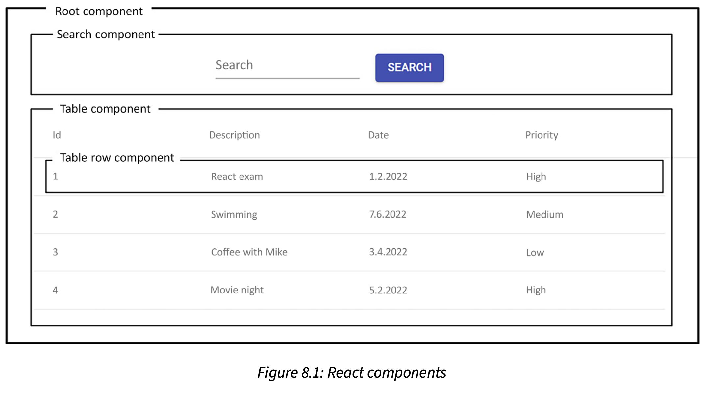
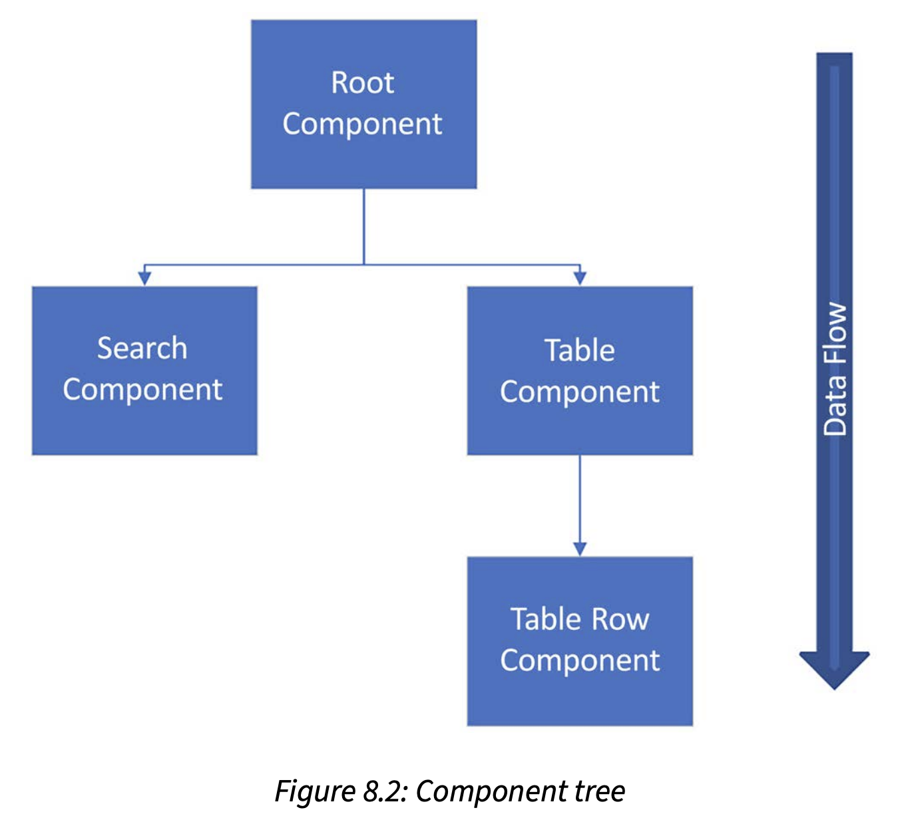

## Creating React components

React is component-based, and the components are independent and reusable.



The components can then be arranged in a **tree hierarchy**.



The **root component** has two **child component**: the search component and the table component.
The table component has one child component: the table row component. The important thing to
understand with React is that the data flow goes from a parent component to a child component.

React uses the **virtual document object model (VDOM)** for selective re-rendering of the UI. The 
**document object model (DOM)** is a programming interface for web documents that represent the web
page as a structured tree of objects. Each object in a tree corresponds to a part of the document.
The VDOM is lightweight copy of the DOM, and manipulation of the VDOM is much faster than it is whith the
real DOM. After the VDOM is updated, React compares it to a snapshot that was taken of the VDOM before
updates were run. After the comparison, React will know which parts have been changed, and only these 
parts will be updated to the real DOM.

A React component can be defined either by using a JavaScript function - a **functional component**
or the ES6 JavaScript class - a **class component**.

JavaScript function
```
// Using JavaScript function
function App() {
    return <h1>Hello World</h1>;
}
```

ES6 to create a component
```
// Using ES6 class
class App extends React.Component {
    render() {
        return <h1>Hello World</h1>;
    }
}
```

The class component contains the required render() method, which shows and updates the rendered output of the component.
If you compare the functional and class App components, you can see that the render() method is not needed in the 
functional component. Before React version 16.8, you had to use class components to be able to use states. Now, you can
use hooks to create states with functional components as well.

The name of the React component should start with a capital letter. It is also recommended to use the PascalCase naming
convention.

If your component returns multiple elements, you have to wrap these inside one parent element. Such as a div.

```
// Wrap elements inside the div
function App() {
    return (
        <div>
            <h1>Hello World</h1>
            <h2>This is my first React component</h2>
        </div>
    );
}
```

You can also use a React **fragment**. Fragments don't add any extra nodes to the DOM tree:

```
// Using fragments
function App() {
    return (
        <React.Fragment>
            <h1>Hello World</h1>
            <h2>This is my first React component</h2>
        </React.Fragment>
    );
}
```

```
// Using fragments short syntax
function App() {
    return (
        <>
            <h1>Hello World</h1>
            <h2>This is my first React component</h2>
        </>
    );
}
```

The react-dom package provides DOM-specific methods for us.
