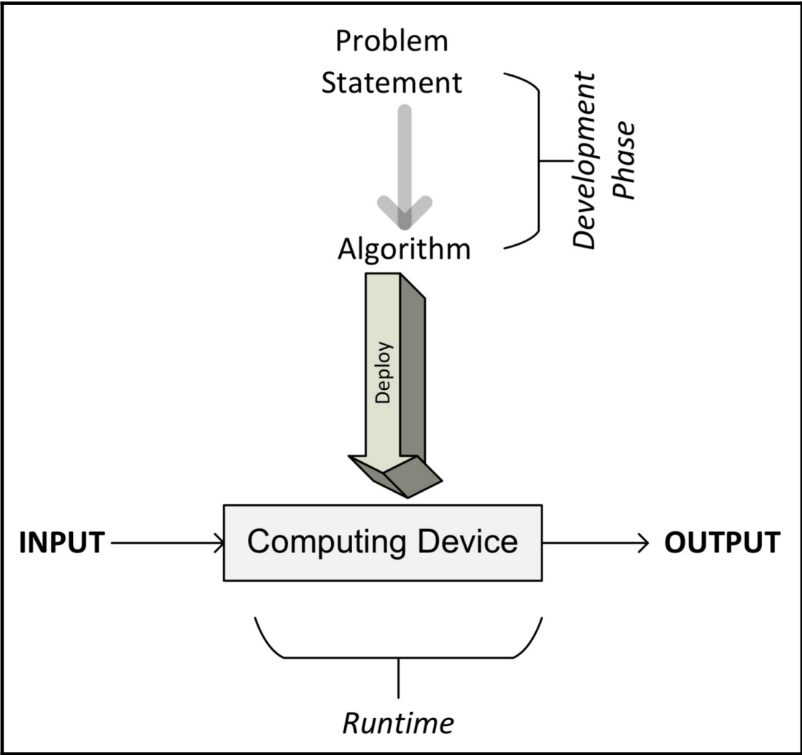

# 40 Algorithms Every Programmer Should Know

## Overview of Algorithms

### What is an algorithms?

"An algorithms is a finite set of unambiguous instructions that, given some set of initial conditions, can be performed in a prescribed sequence to achieve a certain goal and that has a recognizable set of end conditions"

### The phases of an algorithm

The different phases of developing, deploying, and finally using and algorithm are illustrated in the following diagram:

As we can see, the process start with understanding the requirements from a problem statement that detail what needs to be done. Once the problem is clearly stated, it leads us to the development phase.

The development phase consists of two phases:

* **The design phase**: The architecture, logic, and designing an algorithm, we keep both accuracy and performance in mind. The design phase of an algorithm is an iterative process that involves comparing different candidate algorithms.

* **The coding phase**: The designed algorithm is converted into a computer program. It is important that the actual program implements all the logic and architecture suggested in the design phase. 

Once designed and implemented in a programming language of your choice, the code of algorithm is ready to be deployed.

### Understanding pseudocode

The simplest way to specify the logic for an algorithm is to write the higher-level description of an algorithm in a semi-structured way, called **pseudocode**. Before writing the logic in pseudocode, it is helpful to first describe its main flow by writing the main steps in plain English. Then, this English description is converted into pseudocode, which is a structured way of writing this English description that closely

