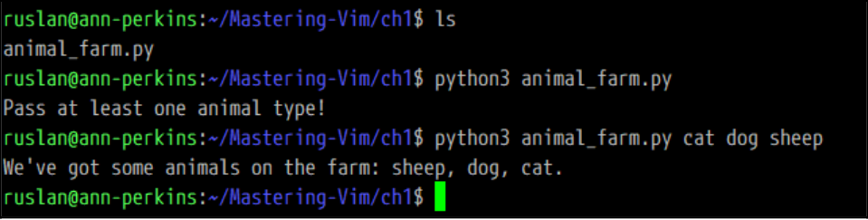
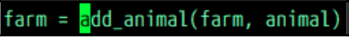
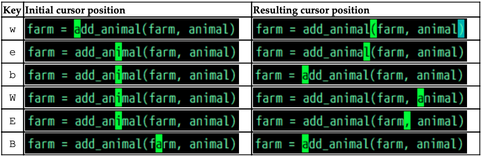
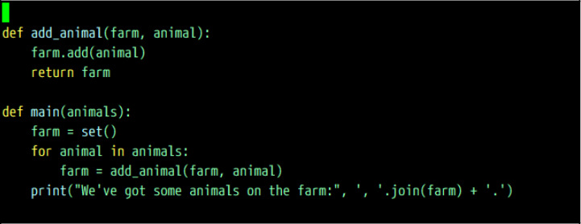

# Installation

## Seting up on Linux

Linux machines com with Vim installed. Vim 8 introduces some much-needed optimizations, run the following code:

>     git clone https://github.com/vim/vim.git
>     cd vim/src
>     make
>     sudo make install

#### TIP

If you're running into issues as you're installing Vim, you might be missing some dependencies. If you're using Debian-based distribution, the following command should add common missing dependencies: 

>     $ sudo apt-get install make build-essential libncurses5-dev libncursesw5-dev --fix-missing

If you don't care for being on the cutting edge, you can also update Vim using a package manager of your choice. Different Linux distributions use different package managers;

| Distribution                        | Command to install the latest version of Vim|
|-------------------------------------|-------------------------------------|
| Debian-based (Debian, Ubuntu, Mint) | $ sudo apt-get update, $ sudo apt-get install vim-gtk |
| CentOs (and Fedora prior to Fedora 22 | $ sudo yum check-update, $ sudo yum install vim-enhanced |
| Fedora 22+ | $sudo dnf check-update, $ sudo dnf install vim-enhanced |
| Arch | $ sudo pacman -Syum $ sudo pacman -S gvim |
| FreeBSD | $ sudo pkg update, $ sudo pgk install vim |

#### TIP

Vim uses package names for different repositories. Package like *vim-gtk* on Debian-based distributions or *vim-enhanced* on CentOs come with more features enabled (like GUI support for instance).

You can start the editor by typing the following command:

>     vim

On modern systems, you can also start Vim by invoking *vi*. There are no reason to use Vi over Vim, unless, for some reason, you're unable to install the latter.

## Setting up on MacOs

MacOs comes prepackaged with Vim, but the version can be outdated. There are a few ways to install a fresh version of Vim. First, you can install Vim using Homebrew, a package manager for MacOs. Second, you can download a .dmg image of MacVim. This experience would be more familiar because Mac users are used to the visual interface.

### Using Homebrew

Homebrew are available on *https://brew.sh*, and, consist of a single line executed in the following Command line:

>     /usr/bin/ruby -e "$(curl -fsSL https://raw.githubusercontent.com/Homebrew/install/master/install)"

#### TIP

If you don't have XCode installed (which is often a prerequisite for any kind of development-related activity on Mac), you'll get an Xcode installation pop-up.

This should take a while to run, but you'll have Homebrew installed by the end: a fantastic tool you can use to install a lot more than Vim!.

Let's install a new version of Vim now using the following command:

>     brew install vim

Homebrew will install all the necesarry dependencies too, so you won't have to worry about a thing.

If you already have Homebrew installed, and you have installed Vim in the past, the preceding command will produce an error. You may want to make sure you have the last version of Vim, though, so run the following command:

>     brew upgrade vim

You should now be ready to enjoy Vim; let's try opening it with the following command:

>     vim

### Downloading a .dmg image

Navigate to *https://github.com/macvim-dev/macvim/releases/latest* and download *MacvIM.dmg*. 

## Setting up on Windows

Windows provides two primary routes for using Vim: setting up *Cygwin* and providing a more Unix-like command-line experience, or installing **gVim--a graphical version of Vim**(which support working with *cmd.exe* on Windows). gVim feels slightly more at home on Windows, while Cygwin might feel more at home if you're used to the Unix shell.

### Unix-like experience with Cywin

Cygwin is a Unix-like environment and a command-line interface for Windows. It aims to bring powerfull Unix shell and supporting tools to a Windonws machine.

#### Installing Cygwin

To begin the installation process, navigate to *https://cygwin.com/install.html* and download either *setup-x86_64.exe* or *setup-x86.exe* depending on the version of Windows you're using(64 bit or 32 bit respectively).

### Visual Vim with gVim

Navigate to *www.vim.org/download.php#pc* in your browser and download an executable installer. 

#### Verifying and troubleshooting the installation

Regardless of the platform you used to install Vim, it's good to make sure that, with Vim, all the right features enabled. On a command line, run the following command:

>     vim --version

You will see the output, with a set of features having a *+* and a *-* in front of them.

If your Vim is compiled with Python 2 support(+python) instead of Python 3 support(-python3). To correct the issue, I'd have to either recompile Vim with +python3 enabled or find a package which distributes a compiled version of Vim with +python3 enabled.

If we wanted to recompile Vim 8.1 with Python 3 support on Linux, we would do the following:

>     git clone https://github.com/vim/vim.git
>     cd vim/src
>     ./configure --with-features=huge --enable-python3interp
>     make
>     sudo make install

## Configuring Vim with your .vimrc

Vim reads configuration from a *.vimrc* file. 

In Linux and MacOs, .vimrc is located in your *user* directory(the full path would be */home/<username>/.vimrc*). You can also find out your *user* directory by opening a Command Prompt and running the following command:

>     echo $HOME

Windows does not allow periods in file names, so the file is named *_vimrc*. It's usually located in *C:\Users\<username>\_vimrc*, but you can also locate it by opening the Windows Command Prompt and running the following command:

>     echo %USERPROFILE%

syntax on                 " Enable syntax highlighting.
filetype plugin indent on  " Enable file type based indentation.
set autoindent             " Respect indentation when starting a new line.
set expandtab              " Expand tabs to spaces. Essential in Python.
set tabstop=4              " Number of spaces tab is counted for.
set shiftwidth=4           " Number of spaces to use for autoindent.

set backspace=2            " Fix backspace behavior on most terminals.

colorscheme murphy         " Change a colorscheme.

Lines starting with a double quote " are comments and are ignored by Vim. These settings bring in some sensible defaults, like syntax highlighting and consistent indentation.

#### TIP

When working with Vim configuration, you can try things out before adding them to your .vimrc file to do that, type : followed by a command, for example, :set autoindent. If you ever want to know the value of a setting, add ? at the end of the comand: for example :set tabstop? will tell you the current *tabstop* value.

#### TIP

Vim 8 comes prepackaged with the following color themes: blue, darkblue, default, delek, desert, elflord, evening, industry, koehler, morning, murphy, pablo, peachpuff, ron, shine, slate, torte, zellner. You can try out a color theme by typing :colorscheme <name>. 

## Common operations(or how to exit Vim)

### Opening files

For simplicity's sake, let's make a simple square root calculator. Run the following command:

>     vim animal_farm.py

This open a file named *animal_farm.py*. If the file existed. you'd see its contents, but since it doesn't, we're greeted by an empty screen.

You can tell that the file doesn't exist by the *[New File]* text next to a file name in the status line at the bottom of the screem.

#### TIP

If you're using gVim--you can open a file by going into a **File** menu and choosing **Open**. Sometimes graphical interface is exactly what you need!

#### TIP

Vim's status line often contains a lot of useful information. That's the primary way for Vim to communicate with a user, so do keep an eye out for messages in the status line!

If you already have Vim open-- you can load a file by typing the following, and hitting Enter:

>     :e animal_farm.py

Pressing colon character : enters a command-line mode, which lets you enter a line of text which Vim will interpret as a command. Commands are terminated by hitting the *Enter* key, which allows you to perform various complex operations. Command *:e* stands for *edit*

#### TIP
Vim help often refers to the *Enter* key as a <CR>, which stands for carriage return.

## Changin text

Hit *i* on your keyboard to enter an insert mode. This will display **-- INSERT --** in a status line (at the bottom).

#### TIP

Three of Vim's modes: command-line mode, normal mode, and insert mode.

Let's create our Python application by typing the following code.

>     #!/usr/bin/python3
>     """Our own little animal farm."""
>     import sys
>     def add_animal(farm, animal):
>       farm.add(animal):
>       return farm
>
>     def main(animals):
>       farm = set()
>       for animal in animals:
>         farm = add_animal(farm, animal)
>       print("We've got some animals on the farm", ', '.join(farm) + '.')
>
>     if __name__ == '__main__':
>       if len(sys.argv) == 1:
>         print('Pass at least one animal type!)
>         sys.exit(1)
>       main(sys.argv[1:])

To get back to normal mode in Vim, hit *Esc* on your keyboard. You'll see that *-- INSERT --* has disappeared from the status line. Now, Vim is ready to take commands from you!

## Saving and closing files

To save a file execute the following command:

>     :w

:w stands for *write*

#### TIP

The write command can also be followed by a filename, making it possible to write to a different file, other than the one that is open(:w animal_farm_2.py). To change the current open file to a new one when saving, use *:saveas* command *:saveas animal_farm_2.py*

Let's exit Vim and check if the file was indeed created *:q* stands for *quit*. You can also combine write and quit commands to write and exit by executing :wq.

>     :q

If you mae changes to a file and want to exit Vim without saving the changes, you'll have to use :q! to fore Vim to quit. Exclamation mark at the end of the command forces its execution.

#### TIP

Many commands in Vim have shorter and longer versions. For instance, :e, :w, and :q are short versions of :edit, :write, and :quit. In the Vim manual, the optional part of the command is often annotated in square brackets([]). For example, :w[rite] or :e[dit].

Let's check the contents of a current directory.

>     ls
>     python3 animal_farm.py
>     python3 animal_farm.py cat dog sheep

#### TIP

In Unix, *ls* lists contents of a current directory.*python3 animal_farm.py* executes the script using a Python 3 interpreter, and *python3 animal_farm.py cat dog sheep* passes three arguments(cat, dog, sheep) to our script.

The following screenshot shows what the three preceding commands should output:

## A word about swap files

By default, Vim keeps track of the changes you make to files in swap files. The swap files are created as you edit the files, and are used to recover the contents of your files in case either Vim, your SSH session, or you machine crashes.

You can either hit *r* to recover the swap file contents, or *d* to delete the swap file and dismiss the changes. If you decide to recover the swap file, you can prevent the same message from showing up next time you open the file in Vim by reopening a file and running *:e*, and pressing *d* to delete the swap file.

By default, Vim creates files like *<filename>.swp* and *.<filename>.swp* in the same directory as the original file. You can change this behavior by telling Vim to place all the swap files in a single directory. To do so, add the following to your *.vimrc*:

>     set directory=$HOME/.vim/swap//

#### TIP

If you're on Windows, you should use *set directory=%USERDATA%\.vim\swap//(note the directions of the las two slashes).

You can also choose to disable the swap files completely by adding *set noswapfile* to your *.vimrc*.

## Moving around: talk to your editor

You can move your cursor around character by characte by using arrow keys or letter *h*, *j*, *k*, and *l*.

|Key|Alternative key|     Action      |
|---|---------------|-----------------|
| h |Left arrow     |Move cursor left |
| j |Down arrow     |Move cursor down |
| k |Up arrow       |Move cursor up   |
| l |Right arrow    |Move cursor right|

Calculating the exact number of characters you would like to move is pretty hard, so there's a way to move by words. Use *w* to move to the beginning of the next **word**, and use *e* to get to the **end** of the closset word. To move **backwards** to the beginning of the word, hit *b*.

#### TIP

Vim has two kinds of word objects: referred to as lowercase **"word"** and uppercase **"WORD"**. In Vim world, word is a sequence of letters, digits, and underscores separated by white space. WORD is a sequence of any non-blank charaters separated by white space.

Let's take the following line of code form our example:

#### TIP

Notice the cursor position, it's hovering over the first character of *add_animal*.

Hitting *w* will move the cursor to beginning of the word *add_animal*, while hitting *W* will take you to the beginning of *animal*. Capitalized W, E, and B will treat any characters bundled together and seprated by a space as their own words. 

|Key|Action                                     |
| w |Move forward by word                       |
| e |Move forward until the end of the word     |
| W |Move forward by WORD                       |
| E |Move forward until the end of the WORD     |
| b |Move backwards to the beginning of the word|
| B |Move backwards to the beginning of the WORD|

The following screenshot shows more examples of how each command behaves:

It's also really useful to move in paragraphs. Everything separated by at least two new lines is considered a paragraph, which also means each code block is a paragraph, as can be seen in the following example:

The functions *add_animal* and *main* are two separate paragraphs. Use a closing curly brace *}* to move forward, and an opening curly brace *{* to move backwards.

|Command|Action                       |
|{      |Move back by one paragraph   |
|}      |Move forward by one paragraph|

Don't forget to combine these two with numbers if you need to move by more than one paragraph.

